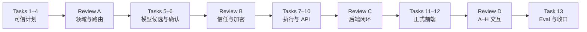

# Semantic Turn Routing Phase 2 Implementation Plan

> **For agentic workers:** REQUIRED SUB-SKILL: Use `subagent-driven-development` (recommended) or `executing-plans` to implement this plan task-by-task. Steps use checkbox (`- [ ]`) syntax for tracking.

**Goal:** Replace the single-task routing authority with a validated per-turn semantic task graph that supports real multi-task execution, confirmation, clarification, partial success, provenance, and the approved A–H frontend states.

**Architecture:** Add a deep `answer.routing` module with one public `TurnRouter` façade and one `SemanticTurnCoordinator`. Optional model classification only proposes candidates; deterministic compilation and validation produce the trusted plan. `/api/v2/answers` exposes an additive `agentTurn` contract while legacy fields remain projections, and the frontend consumes display-only DTOs derived from the approved prototype.

**Tech Stack:** Java 21, Spring Boot, Jakarta Validation, Jackson, JDK AES-GCM/HMAC/SHA-256, Maven, Vue 3, TypeScript, Vitest, Vue Test Utils, Playwright.

## Global Constraints

- Read `AGENTS.md`, `docs/04-项目代码约束.md`, the approved Spec, and the backend contract before implementation.
- Runtime reads only reviewed public data under `backend/src/main/resources/public-data/`; no private knowledge base, credentials, raw reports, or unreviewed assets.
- Production and test Java must not use `var`, `record`, or Lombok.
- Value objects are explicit immutable `final class` types with constructor validation, defensive collection copies, `equals`, `hashCode`, and redacted `toString`.
- `answer.routing.domain` and `answer.routing.service` must not import Portfolio Domain, Repository, concrete Provider, Retriever, or tool implementations.
- Use TDD for every behavior: RED, GREEN, REFACTOR. Never write production code before observing the targeted test fail.
- Do not persist or log questions, answers, goal labels, subjects, plan/task IDs, fingerprints, confirmation envelopes, tokens, prompts, model candidates, or evidence text.
- `SemanticTurnPlan` contains 1–6 user-visible semantic tasks. More than six produces a split clarification; it is never truncated.
- ASK uses at most one semantic classifier call. Deterministic, global-boundary, and CONFIRM_PLAN paths use zero classifier calls.
- `agentTurnContract=stp-v1` is independent from the existing Preset contract field whose accepted format is `pcv1-` plus sixteen lowercase hexadecimal characters.
- Confirmation TTL is exactly ten minutes and uses authenticated encryption; Base64 plaintext JSON is forbidden.
- Provider defaults and the reviewed public factual scope do not change.
- Preserve all user-owned dirty-tree changes. Do not reset, restore, stage, commit, or push without explicit authorization.
- If the user authorizes commits, use Chinese commit subjects and stage only files listed in the completed task.
- At implementation start, prefer an isolated worktree using `using-git-worktrees`; account for the currently untracked approved Spec/contract/plan before switching workspaces.

## Approved Sources

- Spec: `docs/superpowers/specs/2026-08-10-semantic-turn-routing-design.md`
- Backend contract: `docs/superpowers/prototypes/2026-08-10-semantic-turn-routing-backend-contract.md`
- Prototype design: `docs/superpowers/prototypes/2026-08-10-semantic-turn-routing-prototype-design.md`
- Prototype: `design/prototypes/semantic-turn-routing-prototype.html`
- Roadmap: `docs/13-Agent对话体验与智能编排改造路线图.md`

## File Map

### Backend routing domain

- Create `backend/src/main/java/com/portfolio/agent/answer/routing/domain/SemanticRoutingTypes.java`: authoritative closed vocabulary.
- Create `backend/src/main/java/com/portfolio/agent/answer/routing/domain/SubjectReference.java`: validated public subject/result identity.
- Create `backend/src/main/java/com/portfolio/agent/answer/routing/domain/SemanticContext.java`: canonical structured turn context.
- Create `backend/src/main/java/com/portfolio/agent/answer/routing/domain/SemanticTaskParameters.java`: typed task parameter variants.
- Create `backend/src/main/java/com/portfolio/agent/answer/routing/domain/TaskConfidence.java`: overall and field confidence.
- Create `backend/src/main/java/com/portfolio/agent/answer/routing/domain/SemanticTask.java`: one user-visible goal.
- Create `backend/src/main/java/com/portfolio/agent/answer/routing/domain/TaskDependency.java`: typed graph edge and origin.
- Create `backend/src/main/java/com/portfolio/agent/answer/routing/domain/PlanExclusion.java`: normalized user exclusion.
- Create `backend/src/main/java/com/portfolio/agent/answer/routing/domain/SemanticTurnPlan.java`: immutable candidate plan.
- Create `backend/src/main/java/com/portfolio/agent/answer/routing/domain/ValidatedSemanticTurnPlan.java`: validator-issued trusted wrapper.
- Create `backend/src/main/java/com/portfolio/agent/answer/routing/domain/SemanticTurnInput.java`: action-aware domain input.
- Create `backend/src/main/java/com/portfolio/agent/answer/routing/domain/ExecutionSelection.java`: safe/deferred/blocked task partition.
- Create `backend/src/main/java/com/portfolio/agent/answer/routing/domain/ClarificationRequest.java`: local/critical structured clarification.
- Create `backend/src/main/java/com/portfolio/agent/answer/routing/domain/SemanticTurnDecision.java`: mutually exclusive routing decision.
- Create `backend/src/main/java/com/portfolio/agent/answer/routing/domain/PlanConfirmation.java`: confirmation identity/challenge/submission values.
- Create `backend/src/main/java/com/portfolio/agent/answer/routing/domain/TaskResultPayload.java`: section/recommendation/synthesis result variants.
- Create `backend/src/main/java/com/portfolio/agent/answer/routing/domain/TaskResultProvenance.java`: direct/synthesized provenance.
- Create `backend/src/main/java/com/portfolio/agent/answer/routing/domain/TaskOutcome.java`: task status/result aggregate.
- Create `backend/src/main/java/com/portfolio/agent/answer/routing/domain/SemanticTurnOutcome.java`: plan-level outcome and counts.

### Backend routing services and gateways

- Create `backend/src/main/java/com/portfolio/agent/answer/routing/service/TurnRouter.java`: public routing interface.
- Create `backend/src/main/java/com/portfolio/agent/answer/routing/service/DefaultTurnRouter.java`: staged pipeline façade.
- Create `backend/src/main/java/com/portfolio/agent/answer/routing/service/GlobalBoundaryGate.java`: deterministic pre-model boundary.
- Create `backend/src/main/java/com/portfolio/agent/answer/routing/service/LegacySemanticContextAdapter.java`: existing context conversion/conflict check.
- Create `backend/src/main/java/com/portfolio/agent/answer/routing/service/RoutingContextResolver.java`: canonical context and subject resolution.
- Create `backend/src/main/java/com/portfolio/agent/answer/routing/service/SemanticSignalCollector.java`: explicit task/order/negation signals.
- Create `backend/src/main/java/com/portfolio/agent/answer/routing/service/SemanticPlanCompiler.java`: candidate compilation.
- Create `backend/src/main/java/com/portfolio/agent/answer/routing/service/SemanticPlanValidator.java`: closed-set and graph validation.
- Create `backend/src/main/java/com/portfolio/agent/answer/routing/service/SemanticRoutingPolicy.java`: task and confirmation thresholds.
- Create `backend/src/main/java/com/portfolio/agent/answer/routing/service/TurnDecisionPolicy.java`: disposition and execution selection.
- Create `backend/src/main/java/com/portfolio/agent/answer/routing/service/PlanFingerprintService.java`: canonical SHA-256 fingerprint.
- Create `backend/src/main/java/com/portfolio/agent/answer/routing/service/PlanConfirmationService.java`: issue/verify/re-sign/replan decisions.
- Create `backend/src/main/java/com/portfolio/agent/answer/routing/service/SemanticTurnCoordinator.java`: stable topological execution.
- Create `backend/src/main/java/com/portfolio/agent/answer/routing/gateway/SemanticClassifierPort.java`: optional candidate classifier.
- Create `backend/src/main/java/com/portfolio/agent/answer/routing/gateway/PlanCryptographyPort.java`: authenticated plan sealing/opening.
- Create `backend/src/main/java/com/portfolio/agent/answer/routing/gateway/SemanticTaskExecutor.java`: source-domain execution port.
- Create `backend/src/main/java/com/portfolio/agent/answer/routing/adapter/model/SemanticClassificationCodec.java`: closed candidate JSON encoder/decoder used by the existing provider adapter.
- Create `backend/src/main/java/com/portfolio/agent/answer/routing/adapter/crypto/JdkPlanCryptographyAdapter.java`: AES-GCM and HMAC implementation.
- Create `backend/src/main/java/com/portfolio/agent/answer/routing/adapter/execution/PortfolioSemanticTaskExecutor.java`: existing Portfolio Intelligence adapter.
- Create `backend/src/main/java/com/portfolio/agent/answer/routing/adapter/execution/GeneralSemanticTaskExecutor.java`: existing validated general path adapter.
- Create `backend/src/main/java/com/portfolio/agent/answer/routing/adapter/execution/DeterministicSynthesisTaskExecutor.java`: bounded synthesis adapter.
- Create `backend/src/test/java/com/portfolio/agent/answer/routing/support/SemanticRoutingFixtures.java`: shared immutable test builders (`Plans`, `Tasks`, `Inputs`, `Responses`, `Versions`, and related fixtures referenced below).

Package-private pipeline carrier types (`BoundaryDecision`, `ResolvedRoutingContext`, `SemanticSignals`, `PlanValidationResult`, and `ConfirmationVerification`) stay in their owning service files. `SemanticClassificationInput/Result` and `SealedPlan` are nested immutable types in their gateway interfaces. Result-payload variants are nested immutable classes in `TaskResultPayload.java`; this avoids public one-class files that have no independent reason to change.

### HTTP, runtime, and configuration

- Modify `backend/src/main/java/com/portfolio/agent/answer/dto/request/ConversationAnswerRequest.java`: action-aware request fields and validation.
- Create `backend/src/main/java/com/portfolio/agent/answer/dto/request/SemanticContextRequest.java`.
- Create `backend/src/main/java/com/portfolio/agent/answer/dto/request/PlanConfirmationRequest.java`.
- Create `backend/src/main/java/com/portfolio/agent/answer/dto/request/InvalidatedPlanReferenceRequest.java`.
- Create `backend/src/main/java/com/portfolio/agent/answer/dto/response/AgentTurnResponse.java` and focused nested response DTO files for display plan, confirmation, clarification, completed tasks, and task summary.
- Modify `backend/src/main/java/com/portfolio/agent/answer/domain/AnswerResolution.java`: add `AWAITING_CONFIRMATION`.
- Modify `backend/src/main/java/com/portfolio/agent/answer/domain/ConversationAnswerResult.java`: carry one cohesive `AgentTurnResult` instead of parallel constructor parameters.
- Create `backend/src/main/java/com/portfolio/agent/answer/domain/AgentTurnResult.java`: answer-core wrapper around the routing response projection.
- Create `backend/src/main/java/com/portfolio/agent/answer/mapper/SemanticTurnRequestMapper.java`.
- Modify `backend/src/main/java/com/portfolio/agent/answer/mapper/ConversationAnswerResponseMapper.java`.
- Modify `backend/src/main/java/com/portfolio/agent/answer/dto/response/ConversationAnswerResponse.java`.
- Modify `backend/src/main/java/com/portfolio/agent/answer/service/ConversationalAgentRuntime.java`: delegate routing and coordination.
- Modify `backend/src/main/java/com/portfolio/agent/answer/adapter/model/ConversationalAgentConfiguration.java`: wire the routing module.
- Modify `backend/src/main/java/com/portfolio/agent/answer/adapter/model/OpenAiCompatibleConversationalModelAdapter.java`: implement semantic candidate classification without adding a provider.

### Frontend

- Modify `frontend/src/features/agent/model/answerTypes.ts`: stp-v1 request/response types.
- Modify `frontend/src/features/agent/model/mapAnswerResponse.ts`: authoritative agentTurn mapping.
- Create `frontend/src/features/agent/model/semanticTurnView.ts`: display-only view types and mapping helpers.
- Create `frontend/src/features/agent/model/semanticTurnFixtures.ts`: test-only stp-v1 response/view builders used by model and component tests.
- Modify `frontend/src/features/agent/model/sessionTypes.ts`: tab-memory pending confirmation state.
- Modify `frontend/src/features/agent/composables/useLocalSessions.ts`: action-aware ASK/CONFIRM/REGENERATE transitions.
- Modify `frontend/src/features/agent/api/answerApi.ts`: transmit opaque confirmation state without persistence.
- Create `frontend/src/features/agent/components/PlanConfirmation.vue`.
- Create `frontend/src/features/agent/components/CompactTaskSummary.vue`.
- Create `frontend/src/features/agent/components/TurnClarification.vue`.
- Create `frontend/src/features/agent/components/TaskStatusSummary.vue`.
- Create `frontend/src/features/agent/components/PlanInvalidatedNotice.vue`.
- Modify `frontend/src/features/agent/components/ConversationThread.vue` and `AgentWorkspace.vue`.
- Modify `frontend/e2e/portfolio.spec.ts` and `frontend/e2e/support/publicApiMocks.ts`.

### Evaluation and documentation

- Create `backend/src/main/java/com/portfolio/agent/evaluation/domain/EvalSemanticTurnShape.java`.
- Modify `backend/src/main/java/com/portfolio/agent/evaluation/execution/JdkEvalAnswerClient.java` and `EvalExecutionEngine.java`.
- Modify `backend/src/main/java/com/portfolio/agent/evaluation/grading/DeterministicEvalGrader.java`.
- Modify `backend/src/main/java/com/portfolio/agent/evaluation/reporting/EvalReportJsonWriter.java` and `EvalMetrics.java`.
- Add semantic-routing cases under `governance/portfolio-governance/evaluation/cases/holdout/` using the existing dataset schema or its versioned additive extension.
- Modify `docs/00-文档状态索引.md`, `docs/08-当前实现状态.md`, `docs/11-项目演进日志.md`, and `docs/13-Agent对话体验与智能编排改造路线图.md` only after implementation gates pass.

---

### Task 1: Lock the routing vocabulary and immutable task contracts

**Files:**
- Create the routing domain vocabulary, subject, parameters, confidence, task, dependency, and exclusion files listed above.
- Test: `backend/src/test/java/com/portfolio/agent/answer/routing/domain/SemanticTaskContractTest.java`

**Interfaces:**
- Produces: `SemanticTask`, `SemanticTaskParameters`, `SubjectReference`, `TaskDependency`, `PlanExclusion`, and `SemanticRoutingTypes`.
- Consumed by: Tasks 2–13.

- [ ] **Step 1: Write failing closed-vocabulary and immutability tests**

```java
@Test
void portfolioCompareRequiresTypedParametersAndDefensiveSubjects() {
    List<SubjectReference> subjects = new ArrayList<>();
    subjects.add(SubjectReference.project("project-a", "public-v1"));
    subjects.add(SubjectReference.project("project-b", "public-v1"));
    SemanticTaskParameters.PortfolioCompare parameters =
            new SemanticTaskParameters.PortfolioCompare(subjects, Set.of("ARCHITECTURE"), "INTERVIEWER");
    SemanticTask task = SemanticTask.portfolioCompare("task-01", "比较两个项目", parameters);

    subjects.clear();

    assertEquals(2, task.getSubjectReferences().size());
    assertThrows(UnsupportedOperationException.class,
            () -> task.getSubjectReferences().clear());
    assertEquals(task, SemanticTask.portfolioCompare("task-01", "比较两个项目", parameters));
}

@Test
void synthesisRejectsPortfolioSourceDomain() {
    assertThrows(IllegalArgumentException.class, () -> SemanticTask.create(
            "task-03",
            SemanticTaskType.SYNTHESIS,
            TaskSourceDomain.PORTFOLIO,
            "形成综合结论",
            new SemanticTaskParameters.Synthesis(List.of("task-01", "task-02"), "推荐", Set.of()),
            Set.of(RequestedOutput.SUMMARY),
            TaskConfidence.highRule(),
            List.of()));
}
```

- [ ] **Step 2: Run the focused test and observe RED**

Run:

```powershell
mvn.cmd -f backend/pom.xml -Dtest=SemanticTaskContractTest test
```

Expected: compilation failure because the routing domain types do not exist.

- [ ] **Step 3: Implement the closed vocabulary and typed task factory**

```java
public final class SemanticRoutingTypes {
    private SemanticRoutingTypes() { }

    public enum SemanticTaskType {
        PORTFOLIO_FACT, PORTFOLIO_COMPARE, PORTFOLIO_RECOMMEND,
        PORTFOLIO_REFINE_RECOMMENDATION, GENERAL_EXPLANATION,
        GENERAL_COMPARISON, SYNTHESIS
    }

    public enum TaskSourceDomain { PORTFOLIO, GENERAL, SYNTHESIS }
    public enum TaskDependencyType { REQUIRES_SUCCESS, USES_AVAILABLE_RESULTS, ORDER_AFTER }
    public enum DependencyOrigin { USER_EXPLICIT, COMPILER_INFERRED }
    public enum RequestedOutput { SUMMARY, EVIDENCE, COMPARISON, RECOMMENDATION, RISKS, NEXT_STEPS, DETAILED }
    public enum ConfidenceLevel { HIGH, MEDIUM, LOW }
}
```

Implement `SemanticTask.create(String, SemanticTaskType, TaskSourceDomain, String, SemanticTaskParameters, Set<RequestedOutput>, TaskConfidence, List<SubjectReference>)` with an exhaustive switch that enforces the task-type/source-domain/parameter-class matrix. All collection constructors use `List.copyOf` or `Set.copyOf`; all `toString()` methods expose only enum values and counts.

- [ ] **Step 4: Run domain tests and refactor duplicate validation**

Run:

```powershell
mvn.cmd -f backend/pom.xml -Dtest=SemanticTaskContractTest test
```

Expected: PASS with zero failures. Refactor repeated text normalization into package-private domain helpers only after GREEN.

- [ ] **Step 5: Review checkpoint**

Confirm there are no imports from `com.portfolio.agent.portfolio`, no generic parameter Map, and no Java `record`/`var`. If commits are explicitly authorized:

```powershell
git add backend/src/main/java/com/portfolio/agent/answer/routing/domain backend/src/test/java/com/portfolio/agent/answer/routing/domain/SemanticTaskContractTest.java
git commit -m "feat(routing): 建立语义任务领域契约"
```

### Task 2: Build plan graph invariants, canonical fingerprinting, and trusted validation

**Files:**
- Create `SemanticTurnPlan.java`, `ValidatedSemanticTurnPlan.java`, `PlanFingerprintService.java`, and `SemanticPlanValidator.java`.
- Test: `backend/src/test/java/com/portfolio/agent/answer/routing/domain/SemanticTurnPlanTest.java`
- Test: `backend/src/test/java/com/portfolio/agent/answer/routing/service/SemanticPlanValidatorTest.java`

**Interfaces:**
- Consumes: Task 1 domain values.
- Produces: `SemanticPlanValidator.validate(SemanticTurnPlan, String) -> PlanValidationResult` and `PlanFingerprintService.fingerprint(SemanticTurnPlan, String)`. Only a valid result exposes `ValidatedSemanticTurnPlan`.

- [ ] **Step 1: Write failing plan and graph tests**

```java
@Test
void rejectsCycleAndMoreThanSixTasks() {
    SemanticTurnPlan cyclic = Plans.withEdges(
            List.of(Tasks.fact("task-01"), Tasks.fact("task-02")),
            List.of(
                    TaskDependency.requiresSuccess("task-01", "task-02"),
                    TaskDependency.requiresSuccess("task-02", "task-01")));
    assertFalse(validator.validate(cyclic, "stp-v1").isValid());

    assertFalse(validator.validate(Plans.withTaskCount(7), "stp-v1").isValid());
}

@Test
void fingerprintIsStableAcrossSetConstructionOrderAndChangesForExclusion() {
    SemanticTurnPlan left = Plans.sameMeaningWithOutputOrder("SUMMARY", "EVIDENCE");
    SemanticTurnPlan right = Plans.sameMeaningWithOutputOrder("EVIDENCE", "SUMMARY");
    assertEquals(fingerprints.fingerprint(left, "stp-v1"),
            fingerprints.fingerprint(right, "stp-v1"));
    assertNotEquals(fingerprints.fingerprint(left, "stp-v1"),
            fingerprints.fingerprint(Plans.withExcludedSubject(left, "project-c"), "stp-v1"));
}
```

- [ ] **Step 2: Run focused tests and observe RED**

```powershell
mvn.cmd -f backend/pom.xml -Dtest=SemanticTurnPlanTest,SemanticPlanValidatorTest test
```

Expected: compilation failure for missing plan and validator types.

- [ ] **Step 3: Implement validation and stable fingerprinting**

```java
public final class SemanticPlanValidator {
    public PlanValidationResult validate(SemanticTurnPlan candidate, String contract) {
        requireContract(contract);
        List<String> issues = collectIssues(candidate);
        if (!issues.isEmpty()) {
            return PlanValidationResult.invalid(issues);
        }
        String fingerprint = fingerprints.fingerprint(candidate, contract);
        return PlanValidationResult.valid(
                ValidatedSemanticTurnPlan.fromValidated(candidate, fingerprint));
    }
}
```

Canonicalize contract, content version, task semantics, subjects, confidence fields, dependencies, exclusions, outputs, and confirmation policy into a stable UTF-8 byte sequence; hash it with `MessageDigest.getInstance("SHA-256")`. Do not include plan ID or confirmation timestamps.

- [ ] **Step 4: Run tests and add direct validator construction protection**

```powershell
mvn.cmd -f backend/pom.xml -Dtest=SemanticTurnPlanTest,SemanticPlanValidatorTest test
```

Expected: PASS. Verify `ValidatedSemanticTurnPlan` has no public constructor accepting an unvalidated boolean or arbitrary fingerprint.

- [ ] **Step 5: Review checkpoint**

If commit authorization exists:

```powershell
git add backend/src/main/java/com/portfolio/agent/answer/routing backend/src/test/java/com/portfolio/agent/answer/routing
git commit -m "feat(routing): 校验语义计划与任务依赖图"
```

### Task 3: Canonicalize context and resolve subjects without historical-text inference

**Files:**
- Create `SemanticContext.java`, `SemanticTurnInput.java`, `LegacySemanticContextAdapter.java`, and `RoutingContextResolver.java`.
- Test: `backend/src/test/java/com/portfolio/agent/answer/routing/service/RoutingContextResolverTest.java`
- Test: `backend/src/test/java/com/portfolio/agent/answer/routing/service/LegacySemanticContextAdapterTest.java`

**Interfaces:**
- Produces: `RoutingContextResolver.resolve(SemanticTurnInput, PublicSubjectCatalog) -> ResolvedRoutingContext`.
- Consumed by: Task 4 router.

- [ ] **Step 1: Write failing priority and conflict tests**

```java
@Test
void explicitReferenceWinsAndAssistantTextIsNotScanned() {
    SemanticTurnInput input = Inputs.ask(
            "继续比较它们",
            SemanticContext.withResultReference("result-01", "project-a"),
            List.of(Messages.assistant("上次还提到项目 b 和项目 c")));
    ResolvedRoutingContext result = resolver.resolve(input, Catalog.projects("project-a", "project-b"));
    assertEquals(List.of("project-a"), result.subjectIds());
    assertEquals(ResolutionSource.EXPLICIT_REFERENCE, result.resolutionSource());
}

@Test
void conflictingLegacyAndSemanticContextIsInvalidInput() {
    SemanticTurnInput input = Inputs.withBothContexts("project-a", "project-b");
    assertEquals(RoutingContextStatus.INVALID_INPUT,
            resolver.resolve(input, Catalog.projects("project-a", "project-b")).status());
}
```

- [ ] **Step 2: Run and observe RED**

```powershell
mvn.cmd -f backend/pom.xml -Dtest=RoutingContextResolverTest,LegacySemanticContextAdapterTest test
```

Expected: compilation failure for missing resolver/context types.

- [ ] **Step 3: Implement the exact seven-level subject priority**

```java
public ResolvedRoutingContext resolve(
        SemanticTurnInput input,
        PublicSubjectCatalog catalog
) {
    ContextMergeResult merged = legacyAdapter.merge(
            input.getSemanticContext(), input.getLegacyContext());
    if (merged.isConflict()) {
        return ResolvedRoutingContext.invalidInput("ROUTING_CONTEXT_CONFLICT");
    }
    return subjectResolver.resolveDeterministicInOrder(
            input.getExplicitResultReferences(),
            input.getQuestion(),
            merged.getPendingPlan(),
            merged.getRecentResultReferences(),
            merged.getPageSubjects(),
            merged.getActiveSubjects(),
            catalog);
}
```

The resolver must not accept `messages` as a subject-source parameter. Current-question text matching uses the reviewed public subject catalog and requires a unique match. After the optional classifier returns, `resolveValidatedModelCandidates(unresolvedContext, candidates, catalog)` implements priority level seven and accepts only catalog-validated unique candidates.

- [ ] **Step 4: Run tests and architecture search**

```powershell
mvn.cmd -f backend/pom.xml -Dtest=RoutingContextResolverTest,LegacySemanticContextAdapterTest test
rg -n "getMessages\(|ConversationMessage" backend/src/main/java/com/portfolio/agent/answer/routing/service
```

Expected: tests PASS; the search finds no subject-resolution use of conversation messages.

- [ ] **Step 5: Review checkpoint**

If authorized:

```powershell
git add backend/src/main/java/com/portfolio/agent/answer/routing backend/src/test/java/com/portfolio/agent/answer/routing
git commit -m "feat(routing): 建立结构化上下文与主体解析"
```

### Task 4: Implement deterministic signal collection, plan compilation, and decision policy

**Files:**
- Create `GlobalBoundaryGate.java`, `SemanticSignalCollector.java`, `SemanticPlanCompiler.java`, `SemanticRoutingPolicy.java`, `TurnDecisionPolicy.java`, `ClarificationRequest.java`, `SemanticTurnDecision.java`, `TurnRouter.java`, and `DefaultTurnRouter.java`; consume the shared `ExecutionSelection.java` created by Task 7.
- Test: `backend/src/test/java/com/portfolio/agent/answer/routing/service/DefaultTurnRouterDeterministicTest.java`
- Test: `backend/src/test/java/com/portfolio/agent/answer/routing/service/TurnDecisionPolicyTest.java`

**Interfaces:**
- Produces: `TurnRouter.route(SemanticTurnInput) -> SemanticTurnDecision`.
- Consumes: Tasks 1–3.

- [ ] **Step 1: Write failing tests for A–E routing decisions**

```java
@Test
void routesOneToThreeSimpleTasksWithoutConfirmation() {
    SemanticTurnDecision decision = router.route(Inputs.ask(
            "介绍项目 A，并比较项目 A 和项目 B"));
    assertEquals(SemanticTurnDisposition.READY, decision.getDisposition());
    assertEquals(2, decision.getValidatedPlan().orElseThrow().getTasks().size());
    assertEquals(0, classifier.callCount());
}

@Test
void routesFourTasksToConfirmationAndSevenToSplitClarification() {
    assertEquals(SemanticTurnDisposition.CONFIRMATION_REQUIRED,
            router.route(Inputs.explicitTaskCount(4)).getDisposition());
    assertEquals(SemanticTurnDisposition.CLARIFICATION_REQUIRED,
            router.route(Inputs.explicitTaskCount(7)).getDisposition());
}

@Test
void localMissingSubjectKeepsIndependentSafeTask() {
    SemanticTurnDecision decision = router.route(Inputs.localComparisonGap());
    assertEquals(SemanticTurnDisposition.PARTIAL_READY, decision.getDisposition());
    assertEquals(1, decision.getExecutionSelection().orElseThrow().getExecutableTaskIds().size());
    assertEquals(ClarificationScope.LOCAL,
            decision.getClarification().orElseThrow().getScope());
}
```

- [ ] **Step 2: Run and observe RED**

```powershell
mvn.cmd -f backend/pom.xml -Dtest=DefaultTurnRouterDeterministicTest,TurnDecisionPolicyTest test
```

Expected: compilation failure for missing router pipeline types.

- [ ] **Step 3: Implement staged deterministic routing**

```java
public SemanticTurnDecision route(SemanticTurnInput input) {
    BoundaryDecision boundary = boundaryGate.evaluate(input);
    if (boundary.isBoundary()) {
        return SemanticTurnDecision.boundary(boundary.getReasonCodes());
    }
    ResolvedRoutingContext context = contextResolver.resolve(input, subjectCatalog);
    if (context.isInvalidInput()) {
        return SemanticTurnDecision.rejected(context.getReasonCodes());
    }
    SemanticSignals signals = signalCollector.collect(input, context);
    SemanticTurnPlan candidate = compiler.compile(signals, null);
    PlanValidationResult validation = validator.validate(candidate, input.getAgentTurnContract());
    return decisionPolicy.decide(validation, policy);
}
```

Implement all nine confirmation triggers and the exact broad/large-scope thresholds in `SemanticRoutingPolicy`. `PARTIAL_EXECUTION` does not apply to local clarification.

- [ ] **Step 4: Run tests and verify boundary uses zero classifier calls**

```powershell
mvn.cmd -f backend/pom.xml -Dtest=DefaultTurnRouterDeterministicTest,TurnDecisionPolicyTest test
```

Expected: PASS, including a global-boundary assertion that classifier call count remains zero and no plan is returned.

- [ ] **Step 5: Review checkpoint**

If authorized:

```powershell
git add backend/src/main/java/com/portfolio/agent/answer/routing backend/src/test/java/com/portfolio/agent/answer/routing
git commit -m "feat(routing): 实现确定性多任务路由管线"
```

### Task 5: Add the optional semantic classifier candidate port with fail-closed validation

**Files:**
- Create `SemanticClassifierPort.java` and `SemanticClassificationCodec.java`.
- Modify `OpenAiCompatibleConversationalModelAdapter.java` to implement `SemanticClassifierPort` through the codec, and modify `ConversationalAgentConfiguration.java` only to reuse the existing provider registry and access policy.
- Test: `backend/src/test/java/com/portfolio/agent/answer/routing/service/DefaultTurnRouterModelCandidateTest.java`
- Test: `backend/src/test/java/com/portfolio/agent/answer/routing/adapter/model/SemanticClassificationCodecTest.java`

**Interfaces:**
- Produces: `SemanticClassifierPort.classify(SemanticClassificationInput) -> SemanticClassificationResult`.
- Must not produce `ValidatedSemanticTurnPlan`.

- [ ] **Step 1: Write failing one-call and hostile-candidate tests**

```java
@Test
void asksClassifierAtMostOnceAndRejectsInventedType() {
    classifier.respondWith(Candidates.unknownTaskType("DELETE_REPOSITORY"));
    SemanticTurnDecision decision = router.route(Inputs.ambiguousParaphrase());
    assertEquals(1, classifier.callCount());
    assertEquals(SemanticTurnDisposition.CLARIFICATION_REQUIRED, decision.getDisposition());
    assertTrue(decision.getValidatedPlan().isEmpty());
}

@Test
void providerFailureKeepsKnownTaskAndClarifiesUnknownDimension() {
    classifier.fail(ConversationModelFailureCode.PROVIDER_UNAVAILABLE);
    SemanticTurnDecision decision = router.route(Inputs.oneKnownOneAmbiguousTask());
    assertEquals(SemanticTurnDisposition.PARTIAL_READY, decision.getDisposition());
    assertEquals(1, decision.getExecutionSelection().orElseThrow().getExecutableTaskIds().size());
}
```

- [ ] **Step 2: Run and observe RED**

```powershell
mvn.cmd -f backend/pom.xml -Dtest=DefaultTurnRouterModelCandidateTest,SemanticClassificationCodecTest test
```

Expected: compilation failure for missing classifier port/adapter.

- [ ] **Step 3: Implement the candidate-only contract**

```java
public interface SemanticClassifierPort {
    SemanticClassificationResult classify(SemanticClassificationInput input);
}

public final class SemanticClassificationResult {
    private final boolean successful;
    private final List<SemanticTaskCandidate> taskCandidates;
    private final List<DependencyCandidate> dependencyCandidates;
    private final List<ExclusionCandidate> exclusionCandidates;
    private final ConversationModelFailureCode failureCode;
}
```

The adapter parses only closed task names, field names, controlled enum values, current-question text spans, and public subject candidates. `DefaultTurnRouter` invokes it once only when deterministic signals are insufficient, then recompiles and revalidates without a correction loop.

- [ ] **Step 4: Run tests and provider regression tests**

```powershell
mvn.cmd -f backend/pom.xml -Dtest=DefaultTurnRouterModelCandidateTest,SemanticClassificationCodecTest,OpenAiCompatibleConversationalModelAdapterTest test
```

Expected: PASS; existing expression/classification behavior remains green and provider defaults remain unchanged.

- [ ] **Step 5: Review checkpoint**

If authorized:

```powershell
git add backend/src/main/java/com/portfolio/agent/answer/routing backend/src/main/java/com/portfolio/agent/answer/adapter/model backend/src/test/java/com/portfolio/agent/answer/routing
git commit -m "feat(routing): 接入受控语义分类候选"
```

### Task 6: Implement stateless confirmation, authenticated encryption, expiry, and invalidation

**Files:**
- Create `PlanConfirmation.java`, `PlanCryptographyPort.java`, `JdkPlanCryptographyAdapter.java`, and `PlanConfirmationService.java`.
- Test: `backend/src/test/java/com/portfolio/agent/answer/routing/adapter/crypto/JdkPlanCryptographyAdapterTest.java`
- Test: `backend/src/test/java/com/portfolio/agent/answer/routing/service/PlanConfirmationServiceTest.java`

**Interfaces:**
- Produces: `issue(plan, now) -> Challenge` and `verify(submission, currentVersions, now) -> ConfirmationVerification`.
- Consumes: validated plan and fingerprint from Task 2.

- [ ] **Step 1: Write failing crypto and invalidation tests**

```java
@Test
void sealsAndOpensPlanWithoutPlaintextJson() {
    SealedPlan sealed = crypto.seal(Plans.validated(), Confirmations.identity(), Versions.current());
    assertFalse(sealed.getConfirmationPlan().contains("PORTFOLIO_FACT"));
    assertEquals(Plans.validated(), crypto.open(sealed, Confirmations.identity(), Versions.current()));
}

@Test
void tamperRejectsAndExpiryOnlyRequiresResign() {
    ConfirmationVerification tampered = service.verify(Submissions.tampered(), Versions.current(), CLOCK.instant());
    assertEquals(PlanInvalidationReason.PLAN_INTEGRITY_INVALID, tampered.getReason());
    assertEquals(SemanticTurnDisposition.REJECTED, tampered.getDisposition());

    ConfirmationVerification expired = service.verify(
            Submissions.validIssuedAt(CLOCK.instant().minus(Duration.ofMinutes(11))),
            Versions.current(), CLOCK.instant());
    assertTrue(expired.requiresSamePlanResign());
    assertFalse(expired.isExecutable());
}
```

- [ ] **Step 2: Run and observe RED**

```powershell
mvn.cmd -f backend/pom.xml -Dtest=JdkPlanCryptographyAdapterTest,PlanConfirmationServiceTest test
```

Expected: compilation failure for missing confirmation/crypto types.

- [ ] **Step 3: Implement AES-GCM plus detached HMAC binding**

```java
Cipher cipher = Cipher.getInstance("AES/GCM/NoPadding");
byte[] iv = new byte[12];
secureRandom.nextBytes(iv);
cipher.init(Cipher.ENCRYPT_MODE, encryptionKey, new GCMParameterSpec(128, iv));
cipher.updateAAD(associatedData.getBytes(StandardCharsets.UTF_8));
byte[] ciphertext = cipher.doFinal(canonicalPlanBytes);

Mac mac = Mac.getInstance("HmacSHA256");
mac.init(integrityKey);
byte[] token = mac.doFinal(tokenBindingBytes);
```

Use injected `Clock`, exact ten-minute expiry, constant-time token comparison, random confirmation ID, and reason order: integrity → schema → expiry → content → subject → capability. Missing/invalid key configuration fails closed and never logs key material or envelopes.

- [ ] **Step 4: Run crypto tests and scan for plaintext logging**

```powershell
mvn.cmd -f backend/pom.xml -Dtest=JdkPlanCryptographyAdapterTest,PlanConfirmationServiceTest test
rg -n "confirmationPlan|integrityToken|planFingerprint" backend/src/main/java/com/portfolio/agent -g "*.java"
```

Expected: tests PASS; search results contain fields and validation only, with no logger/diagnostic field carrying their values.

- [ ] **Step 5: Review checkpoint**

If authorized:

```powershell
git add backend/src/main/java/com/portfolio/agent/answer/routing backend/src/test/java/com/portfolio/agent/answer/routing
git commit -m "feat(routing): 建立无状态计划确认与失效校验"
```

### Task 7: Build task payloads, three-dimensional outcomes, provenance, and deterministic coordination

**Files:**
- Create `TaskResultPayload.java`, `TaskResultProvenance.java`, `TaskOutcome.java`, `SemanticTurnOutcome.java`, `SemanticTaskExecutor.java`, and `SemanticTurnCoordinator.java`.
- Test: `backend/src/test/java/com/portfolio/agent/answer/routing/service/SemanticTurnCoordinatorTest.java`
- Test: `backend/src/test/java/com/portfolio/agent/answer/routing/domain/TaskOutcomeContractTest.java`

**Interfaces:**
- Produces: `SemanticTurnCoordinator.execute(ValidatedSemanticTurnPlan, ExecutionSelection) -> SemanticTurnOutcome`.
- Consumed by: runtime and HTTP tasks.

- [ ] **Step 1: Write failing dependency and payload tests**

```java
@Test
void blocksRequiresSuccessButContinuesIndependentTask() {
    executors.fail("task-01");
    SemanticTurnOutcome outcome = coordinator.execute(
            Plans.factThenSynthesisPlusIndependent(), Selections.allExecutable());
    assertEquals(TaskExecutionStatus.FAILED, outcome.task("task-01").getExecutionStatus());
    assertEquals(TaskExecutionStatus.BLOCKED, outcome.task("task-02").getExecutionStatus());
    assertEquals(TaskExecutionStatus.SUCCEEDED, outcome.task("task-03").getExecutionStatus());
    assertEquals(PlanOutcome.PARTIAL, outcome.getPlanOutcome());
}

@Test
void failedAndBlockedTasksHaveNoRenderablePayload() {
    TaskOutcome blocked = TaskOutcome.blocked("task-02", "EXECUTION_DEPENDENCY_BLOCKED");
    assertTrue(blocked.getResultPayload().isEmpty());
    assertEquals(TaskEvidenceState.NOT_APPLICABLE, blocked.getEvidenceState());
}
```

- [ ] **Step 2: Run and observe RED**

```powershell
mvn.cmd -f backend/pom.xml -Dtest=SemanticTurnCoordinatorTest,TaskOutcomeContractTest test
```

Expected: compilation failure for missing outcome/coordinator types.

- [ ] **Step 3: Implement stable topological execution and payload variants**

```java
for (SemanticTask task : stableTopologicalOrder(plan)) {
    DependencyDecision dependency = dependencyPolicy.evaluate(task, outcomes, plan);
    if (dependency.isBlocked()) {
        outcomes.put(task.getTaskId(), TaskOutcome.blocked(
                task.getTaskId(), dependency.getReasonCode()));
        continue;
    }
    SemanticTaskExecutor executor = executorRegistry.require(task.getSourceDomain());
    outcomes.put(task.getTaskId(), safeExecute(executor, task, dependency.availableResults()));
}
return SemanticTurnOutcome.from(plan, outcomes);
```

Implement `SectionResultPayload`, `RecommendationResultPayload`, and `SynthesisResultPayload` as explicit immutable classes. Only `SUCCEEDED + ANSWERED` accepts renderable payload. `degraded` is independent from execution/resolution/evidence.

- [ ] **Step 4: Run tests and verify deterministic order**

```powershell
mvn.cmd -f backend/pom.xml -Dtest=SemanticTurnCoordinatorTest,TaskOutcomeContractTest test
```

Expected: PASS; repeated execution with deterministic fake executors yields equal outcome value and identical task order.

- [ ] **Step 5: Review checkpoint**

If authorized:

```powershell
git add backend/src/main/java/com/portfolio/agent/answer/routing backend/src/test/java/com/portfolio/agent/answer/routing
git commit -m "feat(routing): 编排多任务执行与结果状态"
```

### Task 8: Adapt existing Portfolio, General, and bounded Synthesis capabilities

**Files:**
- Create the three execution adapters listed in the File Map.
- Modify only narrow existing service seams needed to accept a single typed task without re-routing it.
- Test: `backend/src/test/java/com/portfolio/agent/answer/routing/adapter/execution/SemanticTaskExecutorAdapterTest.java`

**Interfaces:**
- Consumes: `SemanticTaskExecutor` from Task 7.
- Produces: existing capability results converted into typed payload and provenance.

- [ ] **Step 1: Write failing adapter tests**

```java
@Test
void portfolioExecutorMapsVerifiedClaimsAndEvidence() {
    TaskOutcome outcome = portfolioExecutor.execute(Tasks.portfolioFact("project-a"), List.of());
    assertEquals(TaskResolution.ANSWERED, outcome.getResolution());
    assertEquals(TaskSourceDomain.PORTFOLIO, outcome.getSourceDomain());
    assertFalse(outcome.getProvenance().getEvidenceIds().isEmpty());
}

@Test
void generalUnavailableDoesNotBecomePortfolioFallback() {
    providerAccess.deny();
    TaskOutcome outcome = generalExecutor.execute(Tasks.generalExplanation("CAP theorem"), List.of());
    assertEquals(TaskResolution.CAPABILITY_UNAVAILABLE, outcome.getResolution());
    assertEquals(TaskSourceDomain.GENERAL, outcome.getSourceDomain());
    assertTrue(outcome.getResultPayload().isEmpty());
}

@Test
void synthesisReusesOnlyUpstreamEvidence() {
    TaskOutcome outcome = synthesisExecutor.execute(Tasks.synthesis(), Results.portfolioAndGeneral());
    assertEquals(TaskDerivationType.SYNTHESIZED,
            outcome.getProvenance().getDerivationType());
    assertEquals(Results.expectedEvidenceIds(), outcome.getProvenance().getEvidenceIds());
}
```

- [ ] **Step 2: Run and observe RED**

```powershell
mvn.cmd -f backend/pom.xml -Dtest=SemanticTaskExecutorAdapterTest test
```

Expected: compilation failure for missing execution adapters.

- [ ] **Step 3: Implement adapters without tool planning**

```java
public TaskOutcome execute(SemanticTask task, List<TaskOutcome> upstream) {
    PortfolioTurn turn = toPortfolioTurn(task);
    PortfolioDecision decision = portfolioIntelligence.tryResolve(turn);
    return toTaskOutcome(task, decision);
}
```

General execution calls the existing provider-access, generation, and draft-validation path without invoking `TurnRouter`. Synthesis uses deterministic section/recommendation summaries and copies only upstream IDs. No adapter chooses retrievers, tools, provider kinds, retries, or new tasks.

- [ ] **Step 4: Run adapter and existing capability regression tests**

```powershell
mvn.cmd -f backend/pom.xml -Dtest=SemanticTaskExecutorAdapterTest,DefaultPortfolioIntelligenceTest,PortfolioIntelligenceAnswerAssemblerTest,ConversationalAgentRuntimeTest test
```

Expected: PASS; existing single-task output and Provider-disabled behavior stay unchanged.

- [ ] **Step 5: Review checkpoint**

If authorized:

```powershell
git add backend/src/main/java/com/portfolio/agent/answer/routing backend/src/test/java/com/portfolio/agent/answer/routing
git commit -m "feat(routing): 适配现有回答能力到语义任务"
```

### Task 9: Add action-aware HTTP requests and the authoritative agentTurn response

**Files:**
- Modify/create the request, response, result, and mapper files listed in the File Map.
- Test: `backend/src/test/java/com/portfolio/agent/answer/dto/request/ConversationAnswerRequestValidationTest.java`
- Test: `backend/src/test/java/com/portfolio/agent/answer/mapper/ConversationAnswerResponseMapperTest.java`
- Test: `backend/src/test/java/com/portfolio/agent/answer/dto/response/ConversationAnswerResponseTest.java`

**Interfaces:**
- Produces: additive stp-v1 wire contract.
- Preserves: existing Preset fields and legacy answer projections.

- [ ] **Step 1: Write failing request and response contract tests**

```java
@Test
void confirmPlanAllowsBlankQuestionButRequiresConfirmationEnvelope() {
    Set<ConstraintViolation<ConversationAnswerRequest>> violations = validator.validate(
            Requests.confirmPlan("opaque-envelope", "sha256:value", "opaque-token"));
    assertTrue(violations.isEmpty());
    assertFalse(validator.validate(Requests.confirmPlanWithoutEnvelope()).isEmpty());
}

@Test
void presetAndAgentTurnContractRemainIndependent() throws Exception {
    String json = objectMapper.writeValueAsString(Responses.confirmationRequired());
    assertTrue(json.contains("\"contractVersion\":\"pcv1-0123456789abcdef\""));
    assertTrue(json.contains("\"agentTurn\""));
    assertTrue(json.contains("\"contractVersion\":\"stp-v1\""));
}

@Test
void displayDtosDoNotSerializeInternalTaskIds() throws Exception {
    String json = objectMapper.writeValueAsString(Responses.partialSuccess());
    assertFalse(json.contains("task-01"));
    assertFalse(json.contains("REQUIRES_SUCCESS"));
    assertTrue(json.contains("completedTasks"));
}
```

- [ ] **Step 2: Run and observe RED**

```powershell
mvn.cmd -f backend/pom.xml -Dtest=ConversationAnswerRequestValidationTest,ConversationAnswerResponseMapperTest,ConversationAnswerResponseTest test
```

Expected: failures because action-aware fields, agentTurn, and response projections do not exist.

- [ ] **Step 3: Implement action-aware validation and cohesive response mapping**

```java
@AssertTrue(message = "question or plan confirmation is invalid for action")
public boolean isActionPayloadValid() {
    TurnAction effective = action == null ? TurnAction.ASK : action;
    return switch (effective) {
        case ASK, REGENERATE_PLAN -> hasText(question) && planConfirmation == null;
        case CONFIRM_PLAN -> !hasText(question) && planConfirmation != null;
    };
}
```

Add `AgentTurnResult` as one field on `ConversationAnswerResult`; do not add every agentTurn field as a new constructor parameter. Mapper rules:

```java
private static AnswerResolution publicResolution(
        AgentTurnResult agentTurn,
        boolean requestUsesStpV1
) {
    if (agentTurn.isConfirmationRequired()) {
        return requestUsesStpV1
                ? AnswerResolution.AWAITING_CONFIRMATION
                : AnswerResolution.NEEDS_CLARIFICATION;
    }
    return outcomeResolution(agentTurn);
}
```

Top-level blocks aggregate only safe section/synthesis blocks. Top-level recommendation is present only when exactly one compatible recommendation exists.

- [ ] **Step 4: Run focused controller/contract tests**

```powershell
mvn.cmd -f backend/pom.xml -Dtest=ConversationAnswerRequestValidationTest,ConversationAnswerResponseMapperTest,ConversationAnswerResponseTest,ConversationAnswerControllerTest test
```

Expected: PASS with no stack/path/token leakage in serialized error responses.

- [ ] **Step 5: Review checkpoint**

If authorized:

```powershell
git add backend/src/main/java/com/portfolio/agent/answer/dto backend/src/main/java/com/portfolio/agent/answer/domain backend/src/main/java/com/portfolio/agent/answer/mapper backend/src/test/java/com/portfolio/agent/answer
git commit -m "feat(api): 发布多任务轮次响应契约"
```

### Task 10: Cut the runtime over to one authoritative router and add privacy-safe diagnostics

**Files:**
- Modify `ConversationalAgentRuntime.java` and `ConversationalAgentConfiguration.java`.
- Create `backend/src/test/java/com/portfolio/agent/answer/routing/architecture/SemanticRoutingArchitectureTest.java`.
- Modify `backend/src/test/java/com/portfolio/agent/answer/service/ConversationalAgentRuntimeTest.java`.
- Modify `backend/src/test/java/com/portfolio/agent/answer/adapter/model/RuntimeCompositePrivacyTest.java`.

**Interfaces:**
- Consumes: Tasks 4–9.
- Produces: one production runtime path from request → TurnRouter → confirmation/clarification/coordinator → response result.

- [ ] **Step 1: Write failing authority and privacy tests**

```java
@Test
void runtimeRoutesEachRequestExactlyOnce() {
    runtime.answer(Requests.multiTaskAsk());
    assertEquals(1, turnRouter.routeCallCount());
    assertEquals(0, legacyIntentRouter.routeCallCount());
    assertEquals(0, legacyPortfolioResolver.resolveCallCount());
}

@Test
void confirmationDoesNotCallClassifierOrLegacyRouter() {
    runtime.answer(Requests.validConfirmation());
    assertEquals(0, classifier.callCount());
    assertEquals(0, legacyIntentRouter.routeCallCount());
}

@Test
void diagnosticsContainCountsButNoSensitivePlanState() {
    runtime.answer(Requests.confirmationRequired());
    String events = diagnosticPublisher.serializedEvents();
    assertTrue(events.contains("plan.task.count"));
    assertFalse(events.contains("opaque-canonical-plan-envelope"));
    assertFalse(events.contains("sha256:"));
}
```

- [ ] **Step 2: Run and observe RED**

```powershell
mvn.cmd -f backend/pom.xml -Dtest=ConversationalAgentRuntimeTest,RuntimeCompositePrivacyTest,SemanticRoutingArchitectureTest test
```

Expected: failures because runtime still uses single-task routing authority.

- [ ] **Step 3: Replace branch ownership with the semantic turn flow**

```java
private ConversationAnswerResult answerInternal(ConversationAnswerRequest request) {
    RuntimeAnswerContent content = knowledgeGateway.getContent();
    SemanticTurnInput input = requestMapper.toDomain(request, content);
    if (input.getAction() == TurnAction.CONFIRM_PLAN) {
        return handleConfirmation(input, content);
    }
    SemanticTurnDecision decision = turnRouter.route(input);
    return handleDecision(decision, input, content);
}
```

Keep old routers only behind task execution adapters during migration; they cannot independently choose the global route. Publish only enum/count/duration diagnostics. Wiring failure or missing crypto configuration must fail closed for confirmation while preserving safe legacy ASK behavior during the same rollout slice.

- [ ] **Step 4: Run runtime, architecture, privacy, and backend suite**

```powershell
mvn.cmd -f backend/pom.xml -Dtest=ConversationalAgentRuntimeTest,RuntimeCompositePrivacyTest,SemanticRoutingArchitectureTest test
mvn.cmd -f backend/pom.xml test
```

Expected: both commands PASS with zero failures.

- [ ] **Step 5: Review checkpoint**

If authorized:

```powershell
git add backend/src/main/java/com/portfolio/agent/answer backend/src/test/java/com/portfolio/agent/answer
git commit -m "refactor(answer): 切换到统一语义路由权威"
```

### Task 11: Add frontend stp-v1 types, mapping, and tab-memory confirmation state

**Files:**
- Modify/create the frontend model, API, session, and composable files in the File Map.
- Test: `frontend/src/features/agent/model/mapSemanticTurnResponse.test.ts`
- Modify `frontend/src/features/agent/composables/useLocalSessions.test.ts`.
- Modify `frontend/src/features/agent/api/answerApi.test.ts`.

**Interfaces:**
- Produces: display-only `SemanticTurnView`, opaque confirmation state, and action-aware API calls.
- Consumed by: Task 12 components.

- [ ] **Step 1: Write failing mapping and persistence tests**

```typescript
it('maps completed tasks without exposing internal graph fields', () => {
  const view = mapSemanticTurnResponse(partialSuccessResponse())
  expect(view.completedTasks).toHaveLength(1)
  expect(view.taskSummary?.displayMode).toBe('EXPANDED')
  expect(JSON.stringify(view)).not.toContain('REQUIRES_SUCCESS')
  expect(JSON.stringify(view)).not.toContain('task-01')
})

it('keeps confirmation state in memory and never browser storage', () => {
  const sessions = createTestSessions()
  sessions.acceptResponse(confirmationRequiredResponse())
  expect(sessions.active.value.pendingConfirmation?.confirmationPlan).toBe('opaque-envelope')
  expect(localStorage.length).toBe(0)
  expect(sessionStorage.length).toBe(0)
})
```

- [ ] **Step 2: Run and observe RED**

```powershell
npm.cmd --prefix frontend test -- --run src/features/agent/model/mapSemanticTurnResponse.test.ts src/features/agent/composables/useLocalSessions.test.ts src/features/agent/api/answerApi.test.ts
```

Expected: failures for missing semantic-turn types and actions.

- [ ] **Step 3: Implement discriminated request/response views**

```typescript
export type TurnAction = 'ASK' | 'CONFIRM_PLAN' | 'REGENERATE_PLAN'

export interface PendingPlanConfirmation {
  confirmationId: string
  confirmationPlan: string
  planFingerprint: string
  integrityToken: string
  expiresAt: string
}

export interface SemanticTurnView {
  disposition: TurnDisposition
  displayPlan?: DisplayPlanView
  clarification?: ClarificationView
  planChange?: PlanChangeView
  taskSummary?: TaskSummaryView
  completedTasks: CompletedTaskView[]
}
```

`mapAnswerResponse` calls one semantic mapping boundary when `agentTurn` exists and only uses legacy mapping when absent. `answerApi` sends the opaque fields unchanged and never writes them to storage, URLs, history, or telemetry.

- [ ] **Step 4: Run focused frontend tests and type/build checks**

```powershell
npm.cmd --prefix frontend test -- --run src/features/agent/model/mapSemanticTurnResponse.test.ts src/features/agent/composables/useLocalSessions.test.ts src/features/agent/api/answerApi.test.ts
npm.cmd --prefix frontend run build
```

Expected: PASS and a successful TypeScript/Vite build.

- [ ] **Step 5: Review checkpoint**

If authorized:

```powershell
git add frontend/src/features/agent/model frontend/src/features/agent/composables frontend/src/features/agent/api
git commit -m "feat(frontend): 接入多任务轮次状态模型"
```

### Task 12: Implement the five approved components and A–H browser behavior

**Files:**
- Create the five Vue components in the File Map and matching `.test.ts` files.
- Modify `ConversationThread.vue`, `ConversationThread.test.ts`, `AgentWorkspace.vue`, and `AgentWorkspace.test.ts`.
- Modify `frontend/e2e/support/publicApiMocks.ts` and `frontend/e2e/portfolio.spec.ts`.

**Interfaces:**
- Consumes: Task 11 `SemanticTurnView` and confirmation actions.
- Produces: approved prototype behavior without exposing internal state.

- [ ] **Step 1: Write failing component and A–H tests**

```typescript
it('shows no plan UI for single-task success', () => {
  const wrapper = mountThread(stateA())
  expect(wrapper.find('[data-testid="plan-confirmation"]').exists()).toBe(false)
  expect(wrapper.find('[data-testid="task-summary"]').exists()).toBe(false)
})

it('expands partial success and renders only completed task content', () => {
  const wrapper = mountThread(stateF())
  expect(wrapper.get('[data-testid="task-summary"]').attributes('data-expanded')).toBe('true')
  expect(wrapper.text()).toContain('SQL 项目审阅')
  expect(wrapper.find('[data-testid="blocked-task-body"]').exists()).toBe(false)
})

it('submits the exact opaque confirmation state', async () => {
  const wrapper = mount(PlanConfirmation, { props: confirmationProps() })
  await wrapper.get('button[data-action="confirm-plan"]').trigger('click')
  expect(wrapper.emitted('confirm')?.[0]?.[0]).toEqual(expectedOpaqueConfirmation())
})
```

- [ ] **Step 2: Run and observe RED**

```powershell
npm.cmd --prefix frontend test -- --run src/features/agent/components
```

Expected: failures because the five components and rendering branches do not exist.

- [ ] **Step 3: Implement components using prototype tokens and accessible controls**

```vue
<button
  type="button"
  class="task-summary__toggle"
  :aria-expanded="expanded"
  @click="expanded = !expanded"
>
  {{ collapsedLabel }}
</button>
```

Use the existing warm-black/cream/oxblood tokens, numbered linear list, shape-plus-text statuses, and three density levels. Confirmation has Continue/Adjust/Cancel; clarification renders controlled options; invalidation never silently replaces a plan. Do not add graph nodes, connector lines, new accent colors, or a global redesign.

- [ ] **Step 4: Add real-browser A–H, mobile, keyboard, and overflow acceptance**

```typescript
test('semantic turn states A through H remain safe and usable', async ({ page }) => {
  await mockSemanticTurnStates(page)
  await openAgent(page)
  await expectStateAWithoutPlanUi(page)
  await expectStateBCollapsibleSummary(page)
  await expectStateCConfirmationToPartialResult(page)
  await expectStateDLocalClarification(page)
  await expectStateECriticalClarification(page)
  await expectStateFNoFakeFailureBody(page)
  await expectStateGRequiresRegeneration(page)
  await expectStateHStopsWholeTurn(page)
})
```

Run:

```powershell
npm.cmd --prefix frontend test -- --run
npm.cmd --prefix frontend run build
npm.cmd --prefix frontend run test:e2e -- e2e/portfolio.spec.ts
```

Expected: all unit tests, build, and target E2E PASS on desktop and configured mobile projects with no horizontal overflow.

- [ ] **Step 5: Review checkpoint**

If authorized:

```powershell
git add frontend/src/features/agent frontend/e2e
git commit -m "feat(frontend): 实现多任务计划与状态交互"
```

### Task 13: Extend Eval, run full gates, and switch authoritative documentation status

**Files:**
- Create/modify the Eval and governance files in the File Map.
- Modify authority documents only after all implementation gates pass.
- Test: `backend/src/test/java/com/portfolio/agent/evaluation/domain/EvalSemanticTurnShapeTest.java`
- Modify relevant Eval execution, grading, reporting, and dataset acceptance tests.

**Interfaces:**
- Consumes: production stp-v1 response.
- Produces: privacy-safe semantic routing metrics and final completion evidence.

- [ ] **Step 1: Write failing Eval shape and privacy tests**

```java
@Test
void capturesOnlySemanticStructure() {
    EvalSemanticTurnShape shape = EvalSemanticTurnShape.from(Responses.partialSuccess());
    assertEquals(3, shape.getTaskCount());
    assertEquals(1, shape.getAnsweredCount());
    assertEquals(1, shape.getBlockedCount());
    assertEquals(PlanOutcome.PARTIAL, shape.getPlanOutcome());
    assertFalse(shape.toString().contains("project-a"));
    assertFalse(shape.toString().contains("task-01"));
}
```

- [ ] **Step 2: Run and observe RED**

```powershell
mvn.cmd -f backend/pom.xml -Dtest=EvalSemanticTurnShapeTest,PhaseZeroDatasetAcceptanceTest test
```

Expected: compilation/test failure because semantic shape and cases do not exist.

- [ ] **Step 3: Implement metrics, cases, and gates**

```java
public final class EvalSemanticTurnShape {
    private final String disposition;
    private final int taskCount;
    private final int dependencyCount;
    private final int modelCallCount;
    private final int answeredCount;
    private final int blockedCount;
    private final int failedCount;
    private final int degradedCount;
    private final boolean planInvariantValid;
    private final boolean provenanceValid;
}
```

Add cases for deterministic single/multi task, dependency chain, mixed sources, exclusions, local/critical clarification, >6 tasks, context conflict, Provider-unavailable partial result, boundary, tamper, expiry, content change, subject invalidation, and capability change. Enforce Spec gates: deterministic explicit cases 100%, task-set exact match ≥90%, subject-set exact match ≥95%, explicit exclusion recall 100%, zero unsafe execution/leakage/fake failure body.

- [ ] **Step 4: Run every fresh verification gate**

```powershell
mvn.cmd -f backend/pom.xml test
npm.cmd --prefix frontend test -- --run
npm.cmd --prefix frontend run build
npm.cmd --prefix frontend run test:e2e -- e2e/portfolio.spec.ts
mvn.cmd -f backend/pom.xml package
powershell -NoProfile -ExecutionPolicy Bypass -File scripts/privacy-check.ps1 -Path .
```

Expected: every command exits 0. If a command fails, stop the completion claim, diagnose with `systematic-debugging`, fix through a new RED/GREEN cycle, then rerun the full gate list.

- [ ] **Step 5: Update authoritative documentation only after Step 4 passes**

Record the exact implemented surface, defaults, limitations, and gate evidence:

```text
docs/00: Spec status = confirmed and implemented to the stated phase-2 surface
docs/08: TurnRouter, stp-v1, confirmation, partial outcome, frontend A–H inventory
docs/11: capability/default/boundary evolution entry, no test-procedure diary
docs/13: ROUTER-01..06 status and remaining stage-3 boundary
```

Do not claim stage 3 tools, stage 4 model-grounded expression, or stage 5 durable multi-turn graphs.

- [ ] **Step 6: Final Review checkpoint and optional authorized commit**

Run:

```powershell
git status --short
git diff --check
```

Expected: only reviewed phase-2 files are changed and `git diff --check` reports no whitespace errors. Do not use a broad aggregate staging command: the current worktree already contains unrelated user changes. If earlier task commits were not authorized, produce a reviewed exact-path manifest from this plan, show it to the user, and request staging/commit authorization before any Git mutation.

## Cross-Task Review Gates

After Tasks 4, 6, 10, and 12, pause for a reviewer checkpoint before continuing:



Each checkpoint must verify the preceding tasks against the approved Spec, not merely inspect test counts.

## Final Review Checklist

- [ ] Every one of the seven semantic task types is implemented and validated.
- [ ] All three dependency types have independent failure-propagation tests.
- [ ] Every plan has 1–6 tasks, is acyclic, and respects exclusions.
- [ ] ASK classifier calls are ≤1; deterministic/boundary/confirmation calls are 0.
- [ ] Local and critical clarification produce different execution behavior.
- [ ] All nine confirmation triggers are tested.
- [ ] Confirmation envelope is authenticated-encrypted, ten-minute, tab-memory-only, and never logged.
- [ ] Integrity failure rejects; expiry-only re-signs; content/subject/capability/schema changes replan.
- [ ] Execution, resolution, evidence, and degraded dimensions survive domain→DTO→JSON.
- [ ] Failed/blocked/unsupported tasks never produce answer bodies.
- [ ] Multiple typed result payloads and multiple recommendations remain distinguishable.
- [ ] Synthesis never creates evidence or upgrades evidence state.
- [ ] Existing Preset contractVersion remains independent from agentTurnContract.
- [ ] agentTurn is authoritative and legacy fields are projections.
- [ ] A–H desktop/mobile/keyboard flows match the approved prototype.
- [ ] No internal ID, dependency enum, token, prompt, score, path, stack, or sensitive text leaks.
- [ ] Routing core has no Portfolio/concrete Provider/Repository/tool dependency.
- [ ] Stage 1 answer composition and existing single-task flows have no regression.
- [ ] Backend, frontend, build, package, privacy, Eval, and target E2E gates all pass fresh.
- [ ] Authority docs describe only the actually implemented phase-2 surface.

## Plan Self-Review

### Spec coverage

| Spec area | Implementing task |
|---|---|
| Immutable domain and typed parameters | Task 1 |
| Plan graph, exclusions, fingerprint, validation | Task 2 |
| Context migration and subject priority | Task 3 |
| Deterministic pipeline, decisions, thresholds | Task 4 |
| Optional model candidate and one-call ceiling | Task 5 |
| Confirmation, crypto, expiry, invalidation | Task 6 |
| Outcome dimensions, payloads, provenance, coordinator | Task 7 |
| Portfolio/General/Synthesis existing capability adapters | Task 8 |
| HTTP actions, agentTurn, compatibility projection | Task 9 |
| Runtime authority, architecture, privacy diagnostics | Task 10 |
| Frontend contract and tab-memory state | Task 11 |
| Five components and prototype A–H | Task 12 |
| Eval metrics, quality gates, full verification, docs | Task 13 |

No Spec section is intentionally deferred inside phase 2. Stage 3 tool planning, stage 4 model-grounded expression, stage 5 durable multi-turn graphs, and stage 6 production capacity work remain excluded exactly as stated in the Spec.

### Type consistency

- `agentTurnContract` is the request negotiation field; `agentTurn.contractVersion` is the response identity; existing top-level `contractVersion` remains the Preset identity.
- `SemanticTurnDecision` expresses routing readiness; `SemanticTurnOutcome.planOutcome` expresses execution completeness.
- `TaskOutcome` owns internal taskId; `TaskSummaryItem` and `CompletedTaskResponse` use display index and goal label only.
- `ValidatedSemanticTurnPlan` is produced only by `SemanticPlanValidator` or a successfully opened and revalidated confirmation envelope.
- `ExecutionSelection` partitions every plan task exactly once.
- `TaskResultPayload` variants preserve sections, recommendations, and synthesis without a generic Map.

### Placeholder scan

The plan contains no unresolved markers, deferred implementation promises, cross-task shorthand, or unbounded error-handling instructions. Any execution-time discovery that changes a public field, task type, threshold, security behavior, or phase boundary requires returning to the user and amending the Spec before continuing.
