# 阶段二「真正多任务 Agent」后端语义契约修订稿

> 日期：2026-08-10
> 状态：已审核，已纳入阶段二正式 Spec
> 适用阶段：阶段二正式 Spec 的直接输入
> 上游依据：`2026-08-10-semantic-turn-routing-prototype-design.md`、`2026-08-10-semantic-turn-routing-prototype-brief.md`
> 本文只定义契约，不代表生产代码已经实现，也不授权修改前后端运行时代码。

## 0. 文档目的与边界

本文把已通过验收的交互原型结论转换为可实现、可验证的后端语义契约，解决以下问题：

1. 一轮用户输入如何表达为多个用户可感知的语义任务与依赖关系；
2. 何时自动执行、何时确认、何时局部澄清、何时整轮停止；
3. 多任务部分成功时，执行状态、答案结论与证据状态如何互不混淆；
4. 计划确认如何防篡改、过期、失效并安全重建；
5. `PORTFOLIO`、`GENERAL`、`SYNTHESIS` 三类来源如何保留可追溯性；
6. 如何在不破坏 `/api/v2/answers` 现有调用方的前提下迁移。

本文不定义：

- 通用工作流 DSL、长期持久化任务、跨轮持续增长的会话 DAG；
- 多 Agent 调度、工具调用图、检索步骤图、模型思维链；
- 阶段三的工具预算、并发调度、重试与补偿机制；
- 正式前端实现细节。

### 0.1 核心产品判断

阶段二采用“真正多任务”，而不是“只识别一个主任务、其余表达降为约束”。一轮输入生成一张独立的 `SemanticTurnPlan`；计划中的节点必须对应用户可以识别和验收的目标，检索、重排、工具调用等内部步骤不能成为语义任务。

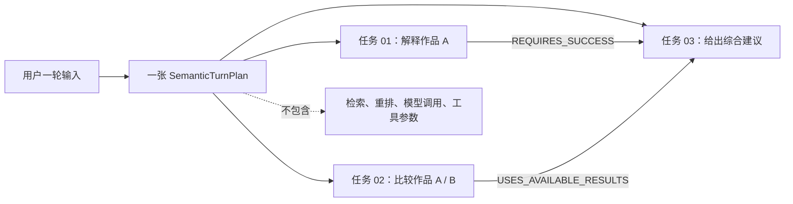

## 1. 统一术语

| 术语 | 定义 | 非定义 |
|---|---|---|
| 语义任务 | 用户可感知、可单独判断完成与否的目标 | 检索、工具调用、Prompt 步骤 |
| 轮次计划 | 当前一轮输入的任务集合、依赖、约束和输出范围 | 跨轮长期工作流 |
| 计划候选 | 规则或模型提出、尚未通过后端校验的结构 | 可执行计划 |
| 已验证计划 | 通过闭集、主体、依赖、边界和一致性校验的可信计划 | 模型原始 JSON |
| 计划确认 | 计划已成型，但需要用户批准后执行 | 因缺信息无法规划的澄清 |
| 澄清 | 缺少关键参数或存在冲突，需要用户补充或选择 | 对现成计划的审批 |
| 部分成功 | 至少一个任务安全地产生结果，同时至少一个任务未完成或无结果 | 给失败任务生成占位正文 |
| 结构化结果引用 | 指向已完成任务结果的受控引用 | 从历史答案自由文本推断 |

## 2. 信任边界与总体架构

阶段二采用分阶段语义管线。模型只能提供候选结构，不能直接决定可执行计划、主体身份、能力边界或确认策略。

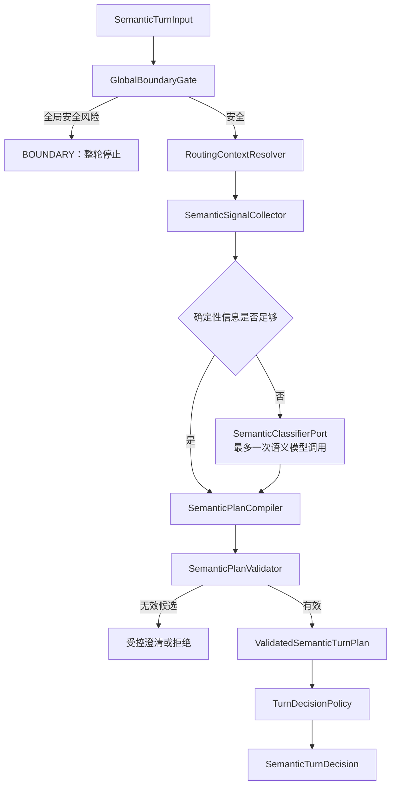

### 2.1 组件职责

| 组件 | 负责 | 不负责 |
|---|---|---|
| `GlobalBoundaryGate` | 在模型前识别整轮安全边界 | 节点级公开数据不足 |
| `RoutingContextResolver` | 解析结构化上下文、主体引用、上下文冲突 | 从历史回答文本猜主体 |
| `SemanticSignalCollector` | 收集规则命中、显式任务连接词、约束、输出要求 | 生成最终计划 |
| `SemanticClassifierPort` | 在确定性信号不足时提出闭集候选 | 创造任务类型或主体 ID |
| `SemanticPlanCompiler` | 合并确定性信号与候选，生成计划候选 | 宣布候选可信 |
| `SemanticPlanValidator` | 校验闭集、类型参数、主体、依赖、环、上限、边界 | 执行任务 |
| `TurnDecisionPolicy` | 生成互斥的 disposition 与确认/澄清策略 | 修改已验证计划 |

### 2.2 模型调用上限

- 初始路由正常路径：最多一次语义模型调用；
- 完全确定性的输入：零次；
- `CONFIRM_PLAN`：零次，不得重新路由；
- 全局边界：零次，必须在模型前停止；
- 不允许“模型自我修正循环”；候选无效时按可确定部分继续，未知维度进入受控澄清或拒绝，禁止回退为任意默认任务。

## 3. 顶层接口

```text
TurnRouter.route(SemanticTurnInput) -> SemanticTurnDecision
```

### 3.1 `SemanticTurnInput`

| 字段 | 类型 | 必填规则 | 说明 |
|---|---|---|---|
| `turnId` | String | 必填 | 当前轮次标识 |
| `action` | `TurnAction` | 缺省为 `ASK` | ASK / CONFIRM_PLAN / REGENERATE_PLAN |
| `question` | String | ASK、REGENERATE_PLAN 必填 | 原始用户表达；日志和 `toString()` 必须脱敏 |
| `messages` | List | 可选，最多 40 | 可供通用表达生成使用；主体解析不得扫描历史答案自由文本 |
| `semanticContext` | `SemanticContext` | 可选 | 阶段二权威结构化上下文 |
| `legacyContext` | 现有 context DTO | 可选 | 迁移期兼容输入 |
| `planConfirmation` | `PlanConfirmationSubmission` | CONFIRM_PLAN 必填 | 完整已签名计划与确认身份 |
| `requestToken` | String | 可选 | 请求幂等/追踪用途，不等于计划完整性令牌 |
| `agentTurnContract` | String | 可选 | 阶段二语义轮次契约版本；首版固定为 `stp-v1` |
| `contractVersion` | String | 可选 | 保留现有 Preset 合同版本语义（`pcv1-...`），不得用于阶段二版本协商 |

`TurnAction`：

```text
ASK
CONFIRM_PLAN
REGENERATE_PLAN
```

### 3.2 `SemanticTurnDecision`

`disposition` 必须且只能为下列之一：

```text
READY
PARTIAL_READY
CONFIRMATION_REQUIRED
CLARIFICATION_REQUIRED
BOUNDARY
REJECTED
```

| disposition | 是否带可信计划 | 是否可执行 | 必备载荷 |
|---|---:|---:|---|
| `READY` | 是 | 是 | `validatedPlan` |
| `PARTIAL_READY` | 是 | 可执行安全子图 | `validatedPlan`、`executionSelection`、`clarification` 或节点边界摘要 |
| `CONFIRMATION_REQUIRED` | 是 | 否 | `validatedPlan`、`planConfirmation` |
| `CLARIFICATION_REQUIRED` | 可带不可执行草案，不得冒充可信计划 | 否 | `clarification` |
| `BOUNDARY` | 否 | 否 | 受控 `reasonCodes`、安全文案码 |
| `REJECTED` | 否 | 否 | 受控 `reasonCodes` |

不变量：

- 顶层 disposition 互斥，不能同时返回“需要确认”和“需要澄清”；
- `PARTIAL_READY` 只在至少一个独立安全任务可以继续时使用；
- `CLARIFICATION_REQUIRED` 不得携带可执行任务；
- `BOUNDARY` 不泄露安全规则、检测细节、Prompt 或异常信息。

`ExecutionSelection` 是后端内部的可信执行选择，至少包含 `executableTaskIds`、`deferredTaskIds`、`blockedTaskIds` 与每个非执行节点的受控原因码。三个集合必须互斥，合并后等于当前计划的全部任务；执行器只能消费 `executableTaskIds` 所诱导的闭合安全子图。公开 DTO 只投影数量、目标名与用户可理解状态，不返回这些内部 ID。

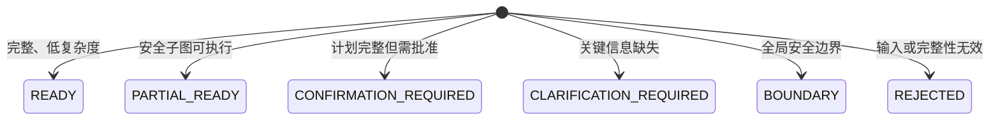

## 4. `SemanticTurnPlan` 契约

### 4.1 字段

| 字段 | 类型 | 说明 |
|---|---|---|
| `planId` | String | 一次计划实体的标识；不得展示给终端用户 |
| `contentVersion` | String | 公开快照版本 |
| `source` | `PlanSource` | RULE / MODEL_ASSISTED / REFERENCE |
| `tasks` | List&lt;SemanticTask&gt; | 1–6 个已验证语义任务 |
| `dependencies` | List&lt;TaskDependency&gt; | 任务依赖边 |
| `exclusions` | List&lt;PlanExclusion&gt; | 用户明确否定或排除项 |
| `requestedOutputs` | Set&lt;RequestedOutput&gt; | 轮次级输出维度 |
| `confirmationPolicy` | `PlanConfirmationPolicy` | 是否确认及原因 |
| `planFingerprint` | String | 规范化计划内容摘要，不包含确认实例时间 |

### 4.2 计划来源

```text
RULE
MODEL_ASSISTED
REFERENCE
```

`MODEL_ASSISTED` 只表示模型参与了候选分类，不表示模型候选绕过后端校验。

### 4.3 计划身份与确认身份分离

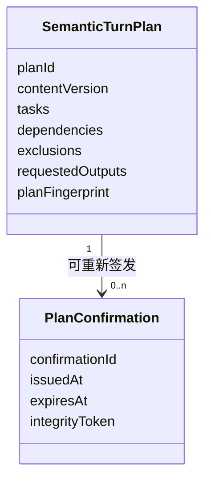

- 同一计划因确认过期而重新签发时，`planId` 和 `planFingerprint` 可以保持不变；
- 每次签发必须产生新的 `confirmationId`、`issuedAt`、`expiresAt` 和 `integrityToken`；
- 内容、主体、依赖或能力变化导致重规划时，必须产生新 `planId` 与新指纹。

### 4.4 指纹规范化

`planFingerprint` 使用 `SHA-256` 计算规范化计划内容。规范化输入必须包含：`agentTurnContract`、`contentVersion`、任务类型与来源、强类型参数、主体引用、请求输出、置信字段状态、依赖边、排除项和确认策略。集合按受控稳定键排序，字符串按统一 Unicode 规范化，禁止依赖普通对象序列化顺序。

`planId`、`confirmationId`、签发/过期时间、完整性令牌不进入内容指纹；它们由完整性令牌单独绑定。面向用户的 `goalLabel` 必须进入签名绑定的数据，防止展示计划与执行计划被替换。任何具备执行语义或影响用户确认理解的字段变化都必须导致校验失败或新指纹。

## 5. 语义任务与强类型参数

### 5.1 任务公共字段

| 字段 | 类型 | 说明 |
|---|---|---|
| `taskId` | String | 仅计划内部引用，不向用户暴露 |
| `type` | `SemanticTaskType` | 闭集任务类型 |
| `sourceDomain` | `TaskSourceDomain` | PORTFOLIO / GENERAL / SYNTHESIS |
| `goalLabel` | String | 面向用户的短目标名，不含内部实现细节 |
| `parameters` | 类型对应参数对象 | 禁止使用通用 `Map<String,Object>` |
| `requestedOutputs` | Set&lt;RequestedOutput&gt; | 当前任务输出维度 |
| `confidence` | `TaskConfidence` | 结构化置信信息 |
| `subjectReferences` | List&lt;SubjectReference&gt; | 已验证主体引用 |

### 5.2 任务类型闭集

```text
PORTFOLIO_FACT
PORTFOLIO_COMPARE
PORTFOLIO_RECOMMEND
PORTFOLIO_REFINE_RECOMMENDATION
GENERAL_EXPLANATION
GENERAL_COMPARISON
SYNTHESIS
```

澄清、边界、检索和工具调用不是任务类型。

### 5.3 类型与来源约束

| 任务类型 | 允许 sourceDomain | 参数对象 |
|---|---|---|
| `PORTFOLIO_FACT` | PORTFOLIO | `PortfolioFactParameters` |
| `PORTFOLIO_COMPARE` | PORTFOLIO | `PortfolioCompareParameters` |
| `PORTFOLIO_RECOMMEND` | PORTFOLIO | `PortfolioRecommendParameters` |
| `PORTFOLIO_REFINE_RECOMMENDATION` | PORTFOLIO | `PortfolioRefinementParameters` |
| `GENERAL_EXPLANATION` | GENERAL | `GeneralExplanationParameters` |
| `GENERAL_COMPARISON` | GENERAL | `GeneralComparisonParameters` |
| `SYNTHESIS` | SYNTHESIS | `SynthesisParameters` |

建议的最小参数字段：

```text
PortfolioFactParameters(subject, facets, audienceRole)
PortfolioCompareParameters(subjects[2..3], dimensions, audienceRole)
PortfolioRecommendParameters(candidateSubjects, careerTrack, capabilityCodes,
    goal, requestedSize, audienceRole)
PortfolioRefinementParameters(baseResultReference, addedConstraints, removedSubjects)
GeneralExplanationParameters(topic, depth, audienceRole)
GeneralComparisonParameters(subjects[2..3], dimensions, depth, audienceRole)
SynthesisParameters(sourceTaskIds[2..n], synthesisGoal, dimensions)
```

约束：

- 枚举、能力码、facet、输出维度必须来自后端闭集；
- 模型只能提出闭集值，不能创造主体 ID、能力码或字段名；
- 自由文本字段只保存完成任务所需的最小内容；
- 所有集合在 Java 实现中必须防御性复制并具备值语义；
- 生产和测试 Java 均不得使用 `var`、`record`、Lombok。

### 5.4 输出维度

`RequestedOutput` 使用闭集，初始值为：

```text
SUMMARY
EVIDENCE
COMPARISON
RECOMMENDATION
RISKS
NEXT_STEPS
DETAILED
```

“大输出范围”的判定见第 8 节，不由模型自行估算成本。

### 5.5 排除项

`PlanExclusion` 必须是强类型值对象，不得保存为任意字符串 Map：

```text
scope: PLAN | TASK
type: SUBJECT | OUTPUT | DIMENSION | CONSTRAINT
taskId: scope=TASK 时必填
controlledValue: 已规范化主体引用、输出枚举、维度枚举或约束码
```

用户原始否定表达可以在请求生命周期内用于解析，但不得原样写入可观察日志。排除项必须进入指纹；执行器和综合任务都不能重新引入被排除的主体、维度或输出。

## 6. 主体解析契约

主体解析必须按以下优先级执行：

1. 当前请求中的显式结构化结果引用；
2. 当前问题文本中的唯一显式主体；
3. 当前待确认/待澄清计划中的主体；
4. 最近一次结构化任务结果引用；
5. 页面结构化上下文；
6. 会话中唯一活动主体；
7. 模型提出且通过后端词典验证的候选。

任何同优先级冲突、跨来源冲突或多候选无法唯一确定的情况都必须澄清。禁止从历史答案自由文本中抽取或猜测主体。

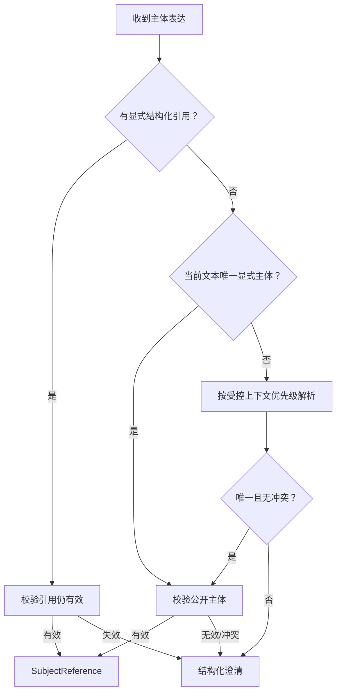

### 6.1 `SubjectReference`

至少包含：

```text
subjectType: PROJECT | CASE | RESULT
subjectId: 公开稳定 ID 或受控结果引用
resolutionSource: EXPLICIT_REFERENCE | EXPLICIT_TEXT | PENDING_PLAN |
                  STRUCTURED_RESULT | PAGE_CONTEXT | ACTIVE_SUBJECT |
                  VALIDATED_MODEL_CANDIDATE
contentVersion: 对公开内容主体必填
```

## 7. 依赖图契约

### 7.1 依赖类型

```text
REQUIRES_SUCCESS
USES_AVAILABLE_RESULTS
ORDER_AFTER
```

| 类型 | 上游失败时下游行为 | 适用语义 |
|---|---|---|
| `REQUIRES_SUCCESS` | 下游 `BLOCKED` | 下游没有上游成功结果就无法成立 |
| `USES_AVAILABLE_RESULTS` | 使用已成功输入继续；无可用输入则 `BLOCKED` | 允许部分输入的综合任务 |
| `ORDER_AFTER` | 仅保证顺序，不传播失败 | 展示或执行先后约束 |

每条 `TaskDependency` 还必须携带内部 `origin`：`USER_EXPLICIT` 或 `COMPILER_INFERRED`。存在 `COMPILER_INFERRED` 依赖时触发 `INFERRED_DEPENDENCY` 确认；公开 UI 只展示自然语言顺序，不展示该枚举。

### 7.2 图不变量

- 每轮 1–6 个任务；超过 6 个不截断、不静默合并，进入澄清并建议拆分；
- `taskId` 在计划内唯一；
- 每条边的起点、终点必须存在且不能相同；
- 图必须无环；
- 重复边规范化后去重；
- 用户明确顺序与编译器推断顺序冲突时，不得静默覆盖，进入确认或澄清；
- `SYNTHESIS.sourceTaskIds` 必须与依赖边一致；
- 不允许使用依赖边表达用户排除项；排除项进入 `exclusions`。

### 7.3 跨轮关系

每轮只有一张独立计划。跨轮只能通过 `RESULT` 类型 `SubjectReference` 或 `baseResultReference` 复用上一轮的结构化结果；不得把多轮计划合并为持续增长的会话图。

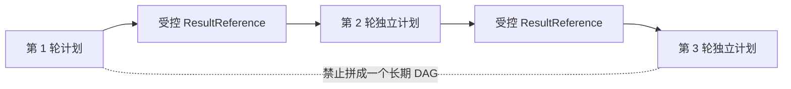

## 8. 自动执行与确认策略

### 8.1 规则结论

确认策略采用可解释规则，不采用不可审计的综合分数：

- 1–3 个任务，且没有确认触发项：自动执行；
- 4–6 个任务：必须确认；
- 超过 6 个任务：不生成截断计划，进入结构化澄清/拆分；
- 任意任务数，只要存在确认触发项：必须确认；
- 关键参数缺失不是确认，而是澄清。

`PARTIAL_EXECUTION` 专指系统在信息完整的情况下，计划主动省略、降级或延后用户原本要求的可规划任务。它必须让用户确认范围变化。因局部字段缺失而暂时阻塞相关节点、同时执行完全独立的安全任务，属于 `PARTIAL_READY + LOCAL clarification`，不使用该触发码；这保证原型 D 可以继续，而不会与确认策略冲突。

### 8.2 确认触发码

```text
TASK_COUNT_REQUIRES_CONFIRMATION
MEDIUM_CONFIDENCE_FIELD
MIXED_SOURCE_DOMAINS
INFERRED_DEPENDENCY
BROAD_SUBJECT_SCOPE
LARGE_OUTPUT_SCOPE
PARTIAL_EXECUTION
ORDER_ADJUSTED
NODE_CAPABILITY_BOUNDARY
```

### 8.3 可计算定义

`BROAD_SUBJECT_SCOPE` 满足任一条件：

- 任一任务包含超过 3 个主体；
- 整张计划包含超过 5 个不同主体；
- 用户使用“全部、所有、这些、都比较”等集合表达且未形成闭集主体列表。

`LARGE_OUTPUT_SCOPE` 满足任一条件：

- `DETAILED` 同时作用于超过 2 个主体；
- 一个综合任务依赖超过 3 个上游任务；
- 同时请求至少 3 个彼此独立的输出维度。

阶段二不估算工具调用次数和执行 token。执行预算属于阶段三。初始阈值必须由后端配置和 Eval 共同管理，模型不得修改。

### 8.4 置信结构

禁止仅用一个浮点数隐藏多个不确定维度。`TaskConfidence` 至少包含：

```text
overall: HIGH | MEDIUM | LOW
fieldStates: Map<受控字段名, HIGH | MEDIUM | LOW>
source: RULE | MODEL_ASSISTED | REFERENCE
```

实现时 `fieldStates` 的键必须由任务类型的字段闭集校验。行为规则：

- 关键字段 `LOW` 或缺失：澄清；
- 非关键字段 `MEDIUM`：计划可成型，但触发确认；
- 只要确定性安全任务与不确定任务无依赖，可生成 `PARTIAL_READY`。

## 9. 澄清契约

### 9.1 `ClarificationRequest`

```text
clarificationId
scope: LOCAL | CRITICAL
promptCode
prompt
fields[]
blockedTaskCount
continuingTaskCount
```

每个 `ClarificationField`：

```text
fieldKey: 受控字段键
inputMode: SINGLE_CHOICE | MULTI_CHOICE | SHORT_TEXT
options: 受控候选；SHORT_TEXT 时为空
required: boolean
affectedGoalLabels: 面向用户的目标名，不暴露 taskId
```

### 9.2 局部与关键澄清

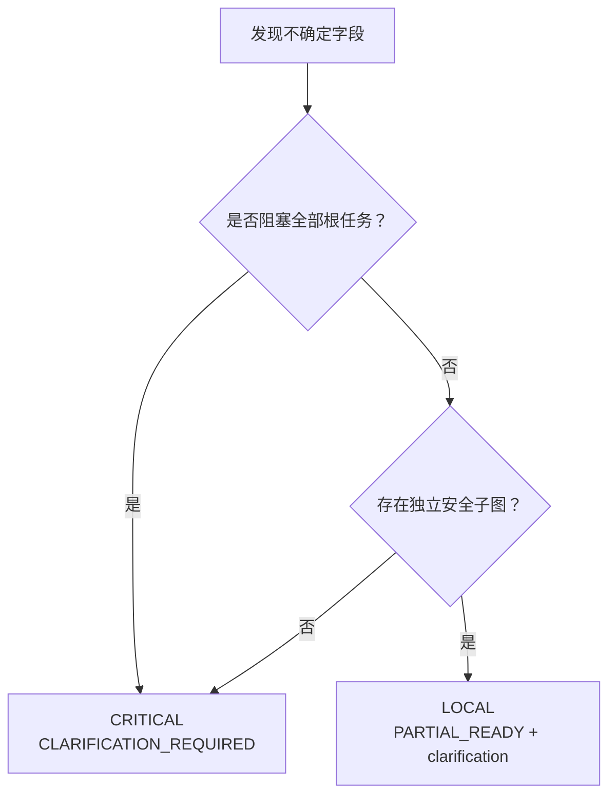

- `LOCAL`：独立任务继续，受影响任务及其 `REQUIRES_SUCCESS` 下游不执行；
- `CRITICAL`：不执行任何任务，先补齐关键信息；
- 澄清选项必须是后端验证后的主体/枚举，不得把模型自由文本直接作为权威选项；
- API 不返回内部任务 ID、依赖类型或路由置信分数给终端 UI。

## 10. 计划确认协议

### 10.1 服务端签发

`CONFIRMATION_REQUIRED` 返回：

```text
PlanConfirmationChallenge
  confirmationId
  issuedAt
  expiresAt              // issuedAt + 10 minutes
  integrityToken
  confirmationPlan     // 包含完整规范化计划的不可展示、不透明传输信封
  planFingerprint
  displayPlan          // 仅含序号、目标、约束与用户可理解依赖的展示 DTO
  userSummary          // 面向用户的任务/约束/顺序摘要
  triggerCodes         // 受控、可公开的确认原因
```

`confirmationPlan` 必须是经过认证加密的 canonical plan envelope，不能只是可逆的 Base64 明文 JSON。它必须包含服务端重新验证完整计划所需的数据，但对前端业务代码表现为不透明字符串；前端只负责原样回传，不能解析、编辑、写入 DOM 或日志。这样同时满足“无服务端会话状态也能确认原计划”和“不向用户暴露 taskId / 依赖枚举”。`displayPlan` 才是渲染来源。`integrityToken` 作为分离的完整性凭据，至少绑定密文摘要与第 10.1 节列出的身份/版本字段。

完整性令牌至少绑定：

```text
planId
planFingerprint
contentVersion
confirmationId
issuedAt
expiresAt
agentTurnContract / schema version
capability-set version
```

### 10.2 客户端提交

`CONFIRM_PLAN` 必须回传承载完整计划的 `confirmationPlan`、`planFingerprint`、`confirmationId`、`integrityToken`。后端解封并按原计划重新校验后执行，不得重新运行语义路由。这里的“完整计划”是确认协议的不可变传输状态，不是供 UI 读取或编辑的 JSON。

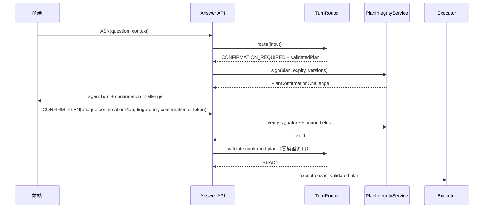

### 10.3 用户操作

前端三选一映射为：

| 用户操作 | API 行为 |
|---|---|
| 按此计划继续 | `CONFIRM_PLAN` |
| 调整计划 | 新 `ASK`，携带用户的自然语言调整与受控上下文；不直接编辑内部 DAG |
| 取消 | 客户端结束本次确认；如需服务端记录，使用现有取消语义，不增加可执行任务 |

## 11. 计划失效与重新生成

计划校验没有单一“主信号”，必须按以下顺序短路执行：

1. 签名与 `planFingerprint`；
2. schema / contract version；
3. `expiresAt`；
4. `contentVersion`；
5. 主体引用；
6. capability-set version。

### 11.1 失效原因码与行为

| 原因码 | 结果 | 后续动作 |
|---|---|---|
| `PLAN_INTEGRITY_INVALID` | `REJECTED` | 丢弃传入计划；如需继续，重新提交原始 `ASK` |
| `PLAN_SCHEMA_UNSUPPORTED` | 计划失效 | 用原问题和当前上下文完全重规划 |
| `PLAN_CONFIRMATION_EXPIRED` | 计划暂不可执行 | 其他条件不变时重验同一计划并签发新确认实例 |
| `CONTENT_VERSION_CHANGED` | 计划失效 | 完全重规划并重新确认 |
| `SUBJECT_REFERENCE_INVALIDATED` | 计划失效 | 完全重规划并重新确认/澄清 |
| `CAPABILITY_SET_CHANGED` | 计划失效 | 完全重规划并重新确认 |

仅确认过期且其他绑定条件完全不变时，可以保留同一 `planId`/`planFingerprint`，但必须让用户再次确认。不得静默执行。

内容、schema、主体或能力变化时，旧签名计划只能作为非权威提示；必须用原问题与当前上下文完全重规划。若新计划与旧计划不同，返回：

```text
PlanChange
  changeTypes[]
  userSummary
```

`changeTypes` 闭集：

```text
TASKS_CHANGED
SUBJECTS_CHANGED
DEPENDENCIES_CHANGED
CONSTRAINTS_CHANGED
OUTPUT_SCOPE_CHANGED
CAPABILITIES_CHANGED
```

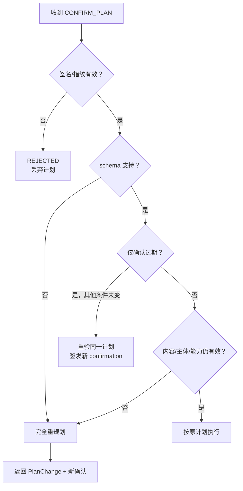

`REGENERATE_PLAN` 用于计划失效提示中的“重新生成”。它必须携带原问题或后端可验证的原始请求引用以及当前结构化上下文；不能只提交旧计划让模型改写。

## 12. 执行结果、答案结论与证据状态

三套状态必须分离：

### 12.1 执行状态 `TaskExecutionStatus`

```text
NOT_STARTED
RUNNING
SUCCEEDED
FAILED
BLOCKED
CANCELLED
```

### 12.2 任务结论 `TaskResolution`

```text
ANSWERED
NOT_SUPPORTED
EMPTY
REJECTED
CAPABILITY_UNAVAILABLE
BOUNDARY
NOT_APPLICABLE
```

### 12.3 证据状态 `TaskEvidenceState`

```text
SUFFICIENT
PARTIAL
INSUFFICIENT
NOT_APPLICABLE
```

### 12.4 `TaskOutcome`

```text
taskId
executionStatus
resolution
evidenceState
degraded
reasonCodes[]
resultReference
resultPayload
sourceDomain
provenance
```

这是领域/执行层对象。公开响应使用不含 `taskId` 的 `TaskSummaryItem` 投影，通过稳定展示序号和 `goalLabel` 关联正文与状态。

`resultPayload` 必须是强类型联合概念，Java 使用显式不可变类表达，不能用通用 Map：

```text
SectionResultPayload
  blocks[]
  summary?

RecommendationResultPayload
  recommendation
  supportingBlocks[]

SynthesisResultPayload
  blocks[]
  provenance
```

只有 `SUCCEEDED + ANSWERED` 可以携带可渲染 payload。公开 `agentTurn.completedTasks[]` 以显示序号、goalLabel、sourceDomain 和对应 payload 组织多任务正文，不返回 taskId。现有顶层 `blocks` 聚合所有安全 Section/Synthesis Block，供兼容客户端读取；现有顶层 `portfolioRecommendation` 只在整轮恰好有一个可兼容推荐结果时投影，多于一个时必须为空，不能任意选一个。

不变量示例：

- `SUCCEEDED + ANSWERED` 才能产生该任务的正常正文；
- `SUCCEEDED + NOT_SUPPORTED` 可以产生“证据不足”状态说明，但不能产生伪事实正文；
- `BLOCKED` 必须使用 `NOT_APPLICABLE` 证据状态且不生成正文；
- `FAILED` 不得伪装为 `EMPTY`；
- `degraded` 是额外维度，不替代 execution/resolution/evidence；
- 每个 `TaskOutcome.sourceDomain` 必须与计划任务一致。

### 12.5 计划级结果

```text
SUCCEEDED
PARTIAL
NO_RESULT
FAILED
CANCELLED
```

| 计划结果 | 判定 |
|---|---|
| `SUCCEEDED` | 所有应执行任务均安全完成并回答 |
| `PARTIAL` | 至少一个任务回答，且至少一个任务未回答/失败/阻塞 |
| `NO_RESULT` | 任务安全执行，但没有任何可回答结果 |
| `FAILED` | 无安全结果且发生执行失败 |
| `CANCELLED` | 用户取消或计划在执行前取消 |

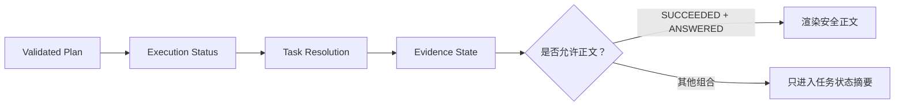

## 13. 原因码分层

原因码属于受控诊断，不允许把异常信息原样透传：

```text
ROUTING_*
PLAN_*
EXECUTION_*
EVIDENCE_*
CAPABILITY_*
SAFETY_*
```

公开 API 只允许白名单原因码；内部日志可以记录关联 ID 和白名单码，但不得记录原始问题、签名令牌、Prompt、模型思维链、私有路径、凭证或堆栈给客户端。

## 14. `SYNTHESIS` 来源与溯源

`SYNTHESIS` 必须保留为独立来源域，不能归入 `GENERAL`。综合结论并不是新的事实源，而是对已验证输入结果的受控推导。

### 14.1 `TaskResultProvenance`

```text
derivationType: DIRECT | SYNTHESIZED
originDomains: Set<PORTFOLIO | GENERAL>
sourceTaskIds: List<String>
claimIds: List<String>
evidenceIds: List<String>
```

规则：

- 非综合任务使用 `DIRECT`；
- 综合任务使用 `SYNTHESIZED`，`sourceTaskIds` 至少 2 个；
- `originDomains` 从已成功上游任务计算，不由模型声明；
- 综合任务只能复用已验证上游的 claim/evidence 引用，不能创造新的证据 ID；
- 上游证据不足的陈述不能在综合结果中升级为已验证事实；
- UI 标签使用“综合结论”，并注明“基于作品集事实”“基于通用知识”或两者；不得标成“已核验作品集事实”。

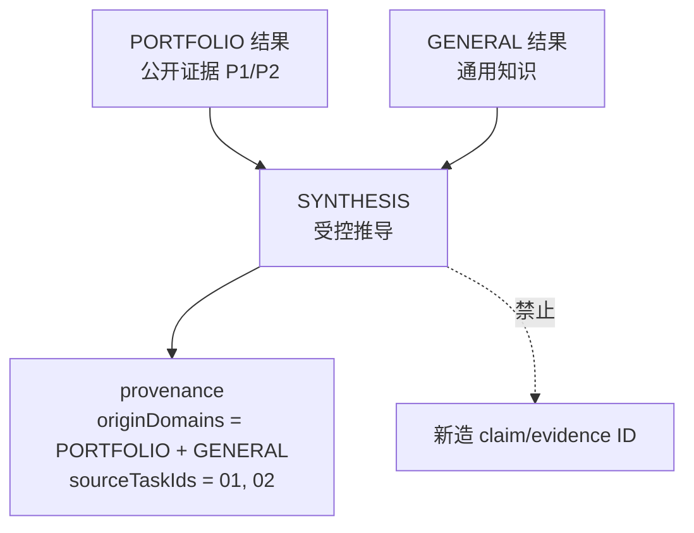

## 15. 任务状态摘要与显示密度

后端提供事实计数和推荐显示模式，前端负责最终响应式渲染。

### 15.1 `TaskSummary`

```text
planOutcome
displayMode: HIDDEN | COLLAPSED | EXPANDED
totalCount
answeredCount
notSupportedCount
emptyCount
blockedCount
failedCount
cancelledCount
degradedCount
items[]
```

计数不变量：

```text
totalCount = answeredCount
           + notSupportedCount
           + emptyCount
           + blockedCount
           + failedCount
           + cancelledCount
```

`degradedCount` 是可与上述分类重叠的额外维度，不参与总数求和。

### 15.2 显示策略

| 场景 | 首次显示 |
|---|---|
| 单任务成功 | `HIDDEN` |
| 多任务全部成功 | `COLLAPSED` |
| 部分成功 | `EXPANDED`，用户可折叠 |
| 无结果/失败 | `EXPANDED`，不得整体隐藏 |
| 计划确认 | 独立确认卡完整展开 |

部分成功折叠后仍必须显示信息密度，例如：

```text
2/5 完成 · 1 证据不足 · 2 阻塞
```

正文与状态摘要分离：只有安全完成的任务进入正文；失败、证据不足、阻塞任务只进入状态矩阵，不生成“看起来像回答”的占位段落。

## 16. 公开 HTTP 契约修订建议

继续使用 `POST /api/v2/answers`，通过 `action` 区分阶段二动作。`agentTurn` 是阶段二权威结构；现有 `intent`、`answerScope`、`resolution` 等字段在迁移期保留为兼容投影。

### 16.1 ASK 请求

```json
{
  "turnId": "turn-20260810-001",
  "action": "ASK",
  "question": "比较项目 A 和项目 B，再结合后端岗位给我推荐。",
  "messages": [],
  "semanticContext": {
    "activeSubjects": [
      {"subjectType": "PROJECT", "subjectId": "project-a"},
      {"subjectType": "PROJECT", "subjectId": "project-b"}
    ],
    "audienceRole": "INTERVIEWER",
    "resultReferences": []
  },
  "agentTurnContract": "stp-v1"
}
```

### 16.2 确认响应

```json
{
  "turnId": "turn-20260810-001",
  "contentVersion": "public-2026-08-10",
  "agentTurn": {
    "contractVersion": "stp-v1",
    "disposition": "CONFIRMATION_REQUIRED",
    "plan": {
      "planId": "plan-01",
      "contentVersion": "public-2026-08-10",
      "source": "MODEL_ASSISTED",
      "tasks": [
        {
          "type": "PORTFOLIO_FACT",
          "sourceDomain": "PORTFOLIO",
          "goalLabel": "了解项目 A"
        },
        {
          "type": "PORTFOLIO_FACT",
          "sourceDomain": "PORTFOLIO",
          "goalLabel": "了解项目 B"
        },
        {
          "type": "PORTFOLIO_COMPARE",
          "sourceDomain": "PORTFOLIO",
          "goalLabel": "比较两个项目"
        },
        {
          "type": "PORTFOLIO_RECOMMEND",
          "sourceDomain": "PORTFOLIO",
          "goalLabel": "面向后端岗位推荐"
        },
        {
          "type": "SYNTHESIS",
          "sourceDomain": "SYNTHESIS",
          "goalLabel": "形成综合结论"
        }
      ],
      "exclusions": [],
      "requestedOutputs": ["COMPARISON", "RECOMMENDATION"],
      "planFingerprint": "sha256:..."
    },
    "planConfirmation": {
      "confirmationId": "confirm-01",
      "issuedAt": "2026-08-10T08:00:00Z",
      "expiresAt": "2026-08-10T08:10:00Z",
      "confirmationPlan": "opaque-canonical-plan-envelope",
      "planFingerprint": "sha256:...",
      "integrityToken": "opaque-signed-token",
      "triggerCodes": ["TASK_COUNT_REQUIRES_CONFIRMATION"]
    }
  },
  "resolution": "AWAITING_CONFIRMATION",
  "blocks": []
}
```

`agentTurn.plan` 是展示 DTO，可以包含面向 UI 的序号和自然语言依赖摘要，但不能包含内部 `taskId`、依赖枚举、模型置信分数、完整性令牌或工具参数。承载完整计划的 `confirmationPlan` 与 `integrityToken` 只存在于确认协议字段中，必须按敏感不透明状态处理，不能解析、直接展示或记录。

### 16.3 CONFIRM_PLAN 请求

```json
{
  "turnId": "turn-20260810-002",
  "action": "CONFIRM_PLAN",
  "planConfirmation": {
    "confirmationId": "confirm-01",
    "confirmationPlan": "opaque-canonical-plan-envelope",
    "planFingerprint": "sha256:...",
    "integrityToken": "opaque-signed-token"
  },
  "agentTurnContract": "stp-v1"
}
```

`confirmationPlan` 必须是服务端签发且承载完整计划的原始信封，不允许客户端重建。此动作允许 `question` 为空，因此现有 `question @NotBlank` 必须改为 action-aware 校验；ASK 的长度与非空约束保持不变。

### 16.4 局部澄清响应

```json
{
  "agentTurn": {
    "disposition": "PARTIAL_READY",
    "plan": {
      "taskCount": 2,
      "executableTaskCount": 1
    },
    "clarification": {
      "scope": "LOCAL",
      "promptCode": "ROUTING_COMPARISON_SUBJECT_MISSING",
      "prompt": "你希望项目 A 与哪个项目比较？",
      "fields": [
        {
          "fieldKey": "comparisonSubject",
          "inputMode": "SINGLE_CHOICE",
          "options": [
            {"value": "project-b", "label": "项目 B"},
            {"value": "project-c", "label": "项目 C"}
          ],
          "required": true,
          "affectedGoalLabels": ["比较两个项目"]
        }
      ],
      "blockedTaskCount": 1,
      "continuingTaskCount": 1
    }
  }
}
```

### 16.5 部分成功响应

```json
{
  "agentTurn": {
    "disposition": "READY",
    "outcome": {
      "planOutcome": "PARTIAL",
      "taskSummary": {
        "displayMode": "EXPANDED",
        "totalCount": 3,
        "answeredCount": 1,
        "notSupportedCount": 1,
        "emptyCount": 0,
        "blockedCount": 1,
        "failedCount": 0,
        "cancelledCount": 0,
        "degradedCount": 0,
        "items": [
          {"goalLabel": "审阅 SQL 项目", "status": "已完成"},
          {"goalLabel": "比较两个项目", "status": "证据不足"},
          {"goalLabel": "形成综合建议", "status": "被阻塞"}
        ]
      }
    },
    "completedTasks": [
      {
        "displayIndex": "01",
        "goalLabel": "审阅 SQL 项目",
        "sourceDomain": "PORTFOLIO",
        "resultPayload": {
          "kind": "SECTION_RESULT",
          "blocks": [
            {
              "sectionType": "ANALYSIS",
              "title": "SQL 项目审阅",
              "content": "这里只包含安全完成任务的正文。"
            }
          ]
        }
      }
    ]
  },
  "blocks": [
    {
      "sectionType": "ANALYSIS",
      "title": "SQL 项目审阅",
      "content": "这里只包含安全完成任务的正文。"
    }
  ]
}
```

注意：执行完成后的顶层路由 disposition 仍可为 `READY`；是否部分成功由 `outcome.planOutcome=PARTIAL` 表达，避免把“路由是否可执行”和“执行结果是否完整”混为一套状态。

### 16.6 REGENERATE_PLAN 请求

```json
{
  "turnId": "turn-20260810-003",
  "action": "REGENERATE_PLAN",
  "question": "比较项目 A 和项目 B，再结合后端岗位给我推荐。",
  "semanticContext": {
    "activeSubjects": [
      {"subjectType": "PROJECT", "subjectId": "project-a"},
      {"subjectType": "PROJECT", "subjectId": "project-b"}
    ]
  },
  "invalidatedPlanReference": {
    "planId": "plan-01",
    "planFingerprint": "sha256:..."
  }
}
```

## 17. 现有契约迁移映射

### 17.1 当前实现事实

当前代码仍以单任务为中心：

- `ConversationRoute` 只有一个 intent/scope、一个 project/case 主体和一个 `clarificationRequired`；
- `PortfolioTask` 只有一个 `PortfolioTaskMode` 和一个可选 `subjectId`；
- `PortfolioTaskMode.CLARIFICATION_REQUIRED` 把澄清误建模为任务模式；
- `PortfolioClarification` 只有问题与缺失条件，不能表达候选、影响任务和局部继续；
- `ConversationAnswerResult` / `ConversationAnswerResponse` 是单答案聚合，未表达计划、任务结果矩阵和确认实例；
- `ConversationAnswerResponseMapper` 会把内部 `BOUNDARY` 投影为 `NEEDS_CLARIFICATION`。

阶段二不能在 `PortfolioTask` 上继续堆叠多个可选字段，应新增独立语义层并通过适配器调用既有作品集能力。

### 17.2 迁移关系

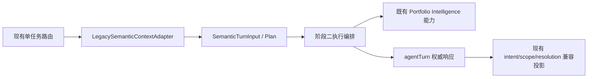

| 现有概念 | 阶段二目标概念 | 迁移规则 |
|---|---|---|
| `ConversationRoute` | `SemanticTurnDecision` | 旧 route 仅作单任务兼容输入/投影，不再作为权威多任务计划 |
| `PortfolioTask` | `SemanticTask` 的 PORTFOLIO 子类型 | 通过 adapter 映射；不让 answer core 依赖 portfolio 实现包 |
| `PortfolioTaskMode.FACT_LOOKUP` | `PORTFOLIO_FACT` | 一对一 |
| `COMPARISON` | `PORTFOLIO_COMPARE` | 一对一，主体必须为已验证列表 |
| `RECOMMENDATION` | `PORTFOLIO_RECOMMEND` | 一对一 |
| `REFINE_RECOMMENDATION` | `PORTFOLIO_REFINE_RECOMMENDATION` | 必须使用结构化 `baseResultReference` |
| `CLARIFICATION_REQUIRED` | `ClarificationRequest` | 从任务类型移除 |
| `PortfolioConditions` | 对应 typed parameters | 分发到推荐参数，不使用通用条件袋 |
| `AnswerResolution` | 顶层兼容投影 + task resolution | 新增 `AWAITING_CONFIRMATION` 作为公开等待状态 |
| `degraded` | task-level + aggregate projection | 聚合值为任一可见任务 degraded；不得在 mapper 链路丢失 |

### 17.3 请求上下文迁移

新增可选 `semanticContext`。迁移期规则：

1. 仅有现有 `context`：`LegacySemanticContextAdapter` 转换 `projectSlug`、`caseSlug`、`recommendationContext`、`referenceContext`；
2. 仅有 `semanticContext`：直接使用并严格校验；
3. 两者同时存在且一致：允许；
4. 两者同时存在且冲突：返回 `INVALID_INPUT`，不能静默决定优先级。

`messages` 仍可服务于通用语言生成，但 `TurnRouter` 不得通过历史文本推断主体。结构化 `resultReferences` 才是跨轮复用入口。

### 17.4 响应兼容投影

`agentTurn` 是权威来源；现有字段由它投影：

| agentTurn 状态 | 现有 `resolution` 投影 |
|---|---|
| `CONFIRMATION_REQUIRED` | 新增 `AWAITING_CONFIRMATION` |
| `CLARIFICATION_REQUIRED` | `NEEDS_CLARIFICATION` |
| 全局 `BOUNDARY` | 保持现有公开安全投影策略，但 agentTurn 必须保留可区分的受控状态 |
| 已执行且有答案 | `ANSWERED` |
| 无支持证据 | `NOT_SUPPORTED` |
| 输入/完整性拒绝 | `REJECTED` 或 `INVALID_INPUT` |

正式 Spec 必须规定旧客户端忽略 `agentTurn` 时仍得到安全响应，但旧字段不得反过来覆盖 `agentTurn`。

为了避免旧客户端遇到未知枚举值：请求明确声明 `agentTurnContract=stp-v1` 时，投影为 `AWAITING_CONFIRMATION`；未声明该字段时，兼容投影仍为 `NEEDS_CLARIFICATION`，并使用白名单 `noticeCode=PLAN_CONFIRMATION_REQUIRED`。两种投影都不得产生答案正文。现有 `contractVersion=pcv1-...` 继续只表达 Preset 合同身份，绝不参与这项判断。

## 18. 公开数据与安全边界

### 18.1 两级边界

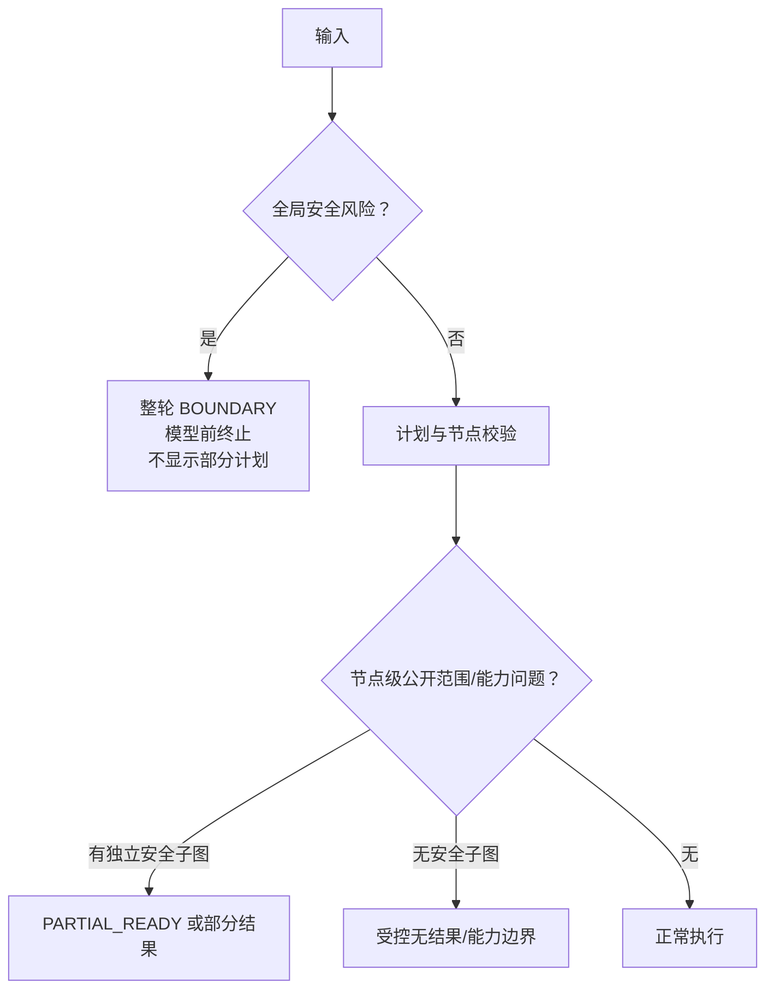

- 运行时只能读取 `backend/src/main/resources/public-data/` 下已审核公开快照及其受控导入结果；
- 语义任务不能扩大该数据边界；
- 全局安全风险必须在模型调用前终止，且不展示部分计划；
- 节点级时间敏感、能力不可用或公开证据不足可以形成安全的部分结果；
- API 只返回 DTO，不返回堆栈、路径、凭证、检索分数、安全规则或内部令牌内容。

## 19. Java 领域实现约束

正式 Spec 和后续实现必须满足：

- 值对象使用显式 `final class`，构造时校验不变量；
- 集合使用 `List.copyOf` / `Set.copyOf` 等防御性复制，测试覆盖源集合修改与 getter 返回值不可修改；
- 实现 `equals` / `hashCode`，并测试值语义；
- `toString()` 不输出问题、自由文本约束、完整性令牌或用户消息；
- 禁用 `var`、`record`、Lombok；
- answer core 不直接 import portfolio 实现包，通过端口/适配器隔离；
- DTO 与领域对象分离；外部 DTO 不暴露内部 ID 和依赖枚举；
- 不用约 20 个并行构造参数继续复制单答案聚合，应使用有内聚的深模块和值对象收拢 `agentTurn` 契约；
- 任务分类、章节映射和顺序规则必须各有单一权威来源，避免在 Composer、Mapper、Eval 中重复维护。

## 20. 测试与 Eval 验收矩阵

后续实现必须按 RED / GREEN / REFACTOR 分批落地。最低矩阵如下。

### 20.1 领域契约测试

| 编号 | 场景 | 断言 |
|---|---|---|
| D-01 | `SemanticTurnPlan` 源集合随后被修改 | 计划内容不变 |
| D-02 | getter 集合被修改 | 抛出不可修改异常或无法修改 |
| D-03 | 相同字段构造两个值对象 | `equals/hashCode` 相等 |
| D-04 | taskId 重复、边引用不存在、自环、环路 | 构造/验证失败 |
| D-05 | 类型与参数对象不匹配 | 验证失败 |
| D-06 | Synthesis 来源非 SYNTHESIS 或少于两个输入 | 验证失败 |
| D-07 | 任务超过 6 | 不截断，产生拆分澄清 |
| D-08 | exclusions 改变 | planFingerprint 改变 |

### 20.2 路由与信任边界测试

| 编号 | 场景 | 断言 |
|---|---|---|
| R-01 | 单一明确事实任务 | 零模型调用、READY |
| R-02 | 2–3 个明确低风险任务 | 自动执行 |
| R-03 | 4–6 个任务 | CONFIRMATION_REQUIRED |
| R-04 | 模型提出未知类型/主体/字段 | 候选被拒，不能变成默认任务 |
| R-05 | 全局边界 | 模型零调用、BOUNDARY、无计划 |
| R-06 | 局部主体缺失且有独立任务 | PARTIAL_READY + LOCAL clarification |
| R-07 | 上游主体缺失阻塞全部链路 | CLARIFICATION_REQUIRED，零任务执行 |
| R-08 | 两种上下文冲突 | INVALID_INPUT，不静默优先 |
| R-09 | 历史答案提及多个主体 | 不从自由文本选择主体 |
| R-10 | 普通初始路由 | 语义模型调用不超过一次 |

### 20.3 确认与失效测试

| 编号 | 场景 | 断言 |
|---|---|---|
| C-01 | 有效确认 | 零路由模型调用，执行同一计划 |
| C-02 | 改写 task/exclusion 后复用 token | PLAN_INTEGRITY_INVALID |
| C-03 | 仅过期，版本均未变 | 同计划重新签发确认，不执行 |
| C-04 | contentVersion 改变 | 完全重规划 + PlanChange + 再确认 |
| C-05 | 主体失效 | 重规划或澄清，不静默替换 |
| C-06 | schema 不支持 | 完全重规划 |
| C-07 | capability set 改变 | 完全重规划 |

### 20.4 执行与响应测试

| 编号 | 场景 | 断言 |
|---|---|---|
| E-01 | 全任务成功 | SUCCEEDED，多任务摘要折叠 |
| E-02 | 一个回答、一个证据不足、一个阻塞 | PARTIAL，只有一个正文块 |
| E-03 | `REQUIRES_SUCCESS` 上游失败 | 下游 BLOCKED |
| E-04 | `USES_AVAILABLE_RESULTS` 部分上游成功 | 有可用输入时继续并保留 provenance |
| E-05 | 所有任务无支持证据 | NO_RESULT，无伪正文 |
| E-06 | degraded 任务经 domain→DTO→JSON | degradedCount 和聚合 degraded 不丢失 |
| E-07 | Synthesis 混合来源 | sourceDomain=SYNTHESIS，originDomains 两项均在 |
| E-08 | 响应序列化 | 展示 DTO 不含 taskId、依赖枚举、Prompt、分数、堆栈；确认信封和 token 只在专用字段出现且不进入日志/DOM |

### 20.5 原型 A–H 契约验收

| 原型状态 | 后端契约映射 |
|---|---|
| A 单任务 | READY；成功后 `TaskSummary.HIDDEN` |
| B ≤3 多任务自动执行 | READY；成功后 `TaskSummary.COLLAPSED` |
| C 复杂计划确认 | CONFIRMATION_REQUIRED + challenge |
| D 局部澄清 | PARTIAL_READY + LOCAL clarification |
| E 关键澄清 | CLARIFICATION_REQUIRED + CRITICAL clarification |
| F 部分成功 | `planOutcome=PARTIAL` + expanded task summary |
| G 计划失效 | 受控 reasonCode + REGENERATE_PLAN/重新确认 |
| H 安全边界 | BOUNDARY；无计划、无模型调用、无部分正文 |

## 21. 实施切片建议（供正式 Spec 使用）

本文不授权编码；正式 Spec 可按以下顺序拆分：

1. 语义领域值对象、闭集与不变量；
2. `SemanticContext`、旧 context adapter 与主体解析；
3. 分阶段 `TurnRouter` 与模型候选信任边界；
4. 确认策略、签名、过期和计划失效；
5. 任务执行结果矩阵与来源 provenance；
6. `/api/v2/answers` action-aware 请求和 `agentTurn` 响应；
7. 既有 Portfolio Intelligence adapter；
8. 前端正式组件接入与 A–H E2E；
9. Eval 数据集、指标和阈值固化。

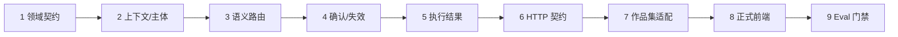

## 22. 本稿已关闭的四个原型议题

| 原型反馈 | 最终契约结论 |
|---|---|
| 任务上限/确认阈值 | 1–3 无触发项自动；4–6 确认；>6 澄清拆分；再叠加九类规则触发项 |
| 部分成功折叠密度 | 首屏展开；用户折叠后仍显示完成/证据不足/阻塞计数 |
| `SYNTHESIS` 来源粒度 | 保留独立来源域，以 provenance 记录 PORTFOLIO/GENERAL 上游 |
| 计划失效主信号 | 无单一主信号；按完整性→schema→过期→内容→主体→能力顺序校验，并区分重签与完全重规划 |

## 23. 审核结论要求

本稿经用户审核通过后，下一步才是编写阶段二正式 Spec。正式 Spec 必须引用本文和原型设计文档，并把第 20 节测试矩阵转为可追踪的验收项。未进入正式 Spec 前，不应修改生产代码，也不应在 `docs/08-当前实现状态.md` 或 `docs/11-项目演进日志.md` 中宣称阶段二能力已完成。
