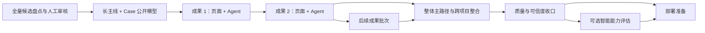

# 求职作品集功能完善路线设计

> **状态：** 已确认，内容资产实施计划已建立
> **日期：** 2026-07-22（知识库盘点于 2026-07-23 补充）
> **目标用户：** 技术面试官与招聘方
> **产品目标：** 在暂不部署的前提下，把当前公开 Portfolio Agent 完善为内容可信、主路径清晰、问答可核验、随时可以进入部署阶段的求职作品集。
> **当前基线：** `docs/08-current-implementation-status.md`

## 1. 决策摘要

后续采用“全量候选盘点、内容先行、按成果纵向交付”的推进方式，不把真实经历压缩为两三个项目，也不把所有日报平铺成同等重要的项目卡。作品集同时容纳长主线、单体功能、故障案例、工程评测和知识产出；首页只做精选，完整成果库保留全部已审核内容。

不优先扩展通用 Agent 平台，也不先投入部署。实施顺序固定为：

1. 全量候选内容盘点、分类、贡献分级与脱敏治理；
2. 每个已审核成果同时完成页面视觉呈现与 Agent 问答；
3. 作品集整体主路径与跨项目能力整合；
4. 质量与可信度收口；
5. 可选智能能力评估；
6. 云服务器部署与求职交付。

内容准备完成后，不把“全部前端”和“全部 Agent”拆成两个长期分支。每个代表性成果作为一个纵向批次，在同一批次内交付公开数据、详情页面、视觉呈现、QuestionPreset、Agent 回答、追问和证据链，再进入下一个成果。长主线可包含多个子案例；单体功能、故障和评测可独立发布，也可关联到长主线。

前一阶段未达到验收标准时，不提前用后续阶段掩盖内容或可信度缺口；不得用模型生成、视觉包装或动态 Agent 抽象替代真实成果、职责边界和公开证据。

## 2. 成功标准

完成本路线后，一名不了解候选人的技术面试官应当能够：

- 在 90 秒内理解候选人的目标方向、核心能力和代表项目；
- 通过完整成果库继续查看非首页精选的单体功能、故障、评测和知识产出；
- 在不使用 Agent 的情况下，从项目页面判断问题背景、个人职责、关键决策、实现方式、验证结果和当前状态；
- 使用 Agent 深挖项目取舍、故障过程、证据、复盘和跨项目能力，而不会得到无依据扩写；
- 从回答直接定位公开 Claim、Evidence、项目和时间线；
- 清楚区分独立交付、协作参与、方案设计、观察记录和未上线工作；
- 在桌面端和移动端稳定访问，并可使用键盘和主流读屏方式完成主要路径；
- 相信网站不会保存访客问题、会话或私有资料。

工程侧应当满足：公开内容通过人工 Approval 和 bundle 门禁；前后端自动化测试、隐私检查、构建、单 JAR 联调和浏览器验收通过；部署前不存在必须依赖人工临时修复的阻塞项。

## 3. 方案选择

### 3.1 采用：内容先行、逐成果纵向交付

先完成真实长主线、Case、Claim、Evidence 和候选问题的筛选与审核。之后按成果逐个同时完善前端页面和 Agent，而不是先做完全部页面再补 Agent，或反过来。该方案能让每个批次形成可演示、可验证的完整案例，并及时发现公开数据、视觉结构和回答契约之间的问题。

### 3.2 未采用：Agent 能力优先

当前只有一个项目和一个可执行问题。先增加模型、编排或通用工具会造成技术复杂度明显高于内容价值，也无法证明这些抽象解决了真实访问问题。

### 3.3 未采用：视觉包装优先

现有前端已经具备完整壳层。脱离真实项目优先增加动画或装饰无法弥补案例数量、证据和职责说明不足。但视觉体验不是部署前一次性补做的尾项；真实内容进入后，每个项目批次都必须同步完成信息层级、排版、交互和响应式呈现。

## 4. 总体架构原则

### 4.0 分层成果模型

- `ProjectProfile` 只表示持续迭代的长主线，不再承担所有内容形态。
- 新增 `CaseStudy`，表示 `FEATURE`、`INCIDENT`、`EVALUATION` 和 `KNOWLEDGE_OUTPUT`；可选关联一个长主线。
- `Claim.subjectType` 增加 `CASE`，Claim/Evidence/QuestionPreset 继续是事实与回答的唯一权威，不为 Case 另建一套证据系统。
- 完成状态使用既有 `AchievementStatus`，个人贡献使用 `ContributionType`；需要表达“已实现未发布”时使用 `IMPLEMENTED_TESTED` 并在 limitation Claim 中明确未发布。
- 学习计划、占位文档和跟进他人工作不自动进入公开 Case；只有完成的知识产出才可进入 `KNOWLEDGE_OUTPUT`。

### 4.1 内容是事实源

所有线上事实继续来自审核后的公开 bundle。私有知识库只作为仓库外候选材料来源，必须经过筛选、脱敏、Claim 拆分、Evidence 关联和人工 Approval，不能被运行时代码直接读取。

### 4.2 页面负责快速判断，Agent 负责继续深挖

首页、项目页、时间线和证据页必须独立构成完整作品集。Agent 不能成为理解项目的必经入口，只负责回答页面不适合完整展开的追问。

### 4.3 每个成果形成纵向闭环

一个成果只有在公开内容、详情页面、视觉体验、QuestionPreset、Agent 回答、引用追问和 Evidence 导航全部通过验收后，才算完成。页面和 Agent 共用同一公开事实源和稳定 ID，不能各自维护重复文案或不一致的能力承诺。

### 4.4 能力随内容增长

项目比较、自由检索、角色化推荐和模型表达只有在真实内容规模足以支撑时才启用。当前封闭工具、引用式上下文和失败关闭契约保持不变。

### 4.5 部署后置但保持可部署

功能阶段不配置正式服务器，但每个阶段都必须保持前端可构建、后端可测试、单 JAR 可打包、Docker 定义有效和 release verification 可执行，避免最后集中偿还交付债务。

## 5. 阶段一：真实内容扩充与治理

### 5.1 输入

用户完成本地知识库同步后，在仓库外私有工作区提供候选项目、日报、设计记录、验证结果和允许审阅的证据。同步本身不代表允许公开。

### 5.2 功能

- 建立全量候选清单，每条先分类为长主线、单体功能、故障案例、工程评测、知识产出或仅学习，再按求职相关度、技术深度、证据完整度和公开风险排序。
- 候选数量不设两三个上限；首页首轮精选 3 至 5 个高价值成果，其他已审核内容继续存在于完整成果库。
- 为每个候选成果整理背景、问题、约束、职责、关键决策、实现方案、验证、结果、限制和当前状态。
- 明确 `AchievementStatus` 与 `ContributionType`，不得把已实现未发布、方案、协作任务、辅助排查或观察记录描述为独立交付。
- 把公开陈述拆成最小可审核 Claim；为每个重要 Claim 建立 Evidence 关联和验证依据。
- 对公司、人员、域名、IP、账号、客户、真实业务量、原始日志、截图和凭据进行脱敏或排除。
- 为首页精选成果设计 3 至 5 个技术面试官会真实提出的 QuestionPreset；非精选条目可先提供 1 个可执行概览问题，之后按证据完整度扩充。
- 使用既有治理 CLI、人工 Approval、bundle 构建、dry-run、发布和回滚流程生成新公开版本。

### 5.3 验收

- 全量候选清单已经覆盖已发现的长主线、功能、故障、评测和知识产出，并明确标记不适合公开的内容。
- 首批形成至少 3 个高质量成果的审核后内容包，且至少包含一个长主线和一个非项目型 Case；不以数量牺牲真实性。
- 每个已批准成果至少准备一条可批准 Evidence，关键成果 Claim 具备直接支持关系。
- 首批每个成果的页面信息结构、核心问题和追问意图已经明确，可进入独立纵向交付批次。
- 私有原文与拟公开内容有清晰边界，脱敏结果经过用户确认。
- 候选 bundle 通过隐私检查、schema 校验和发布 dry-run；正式公开版本可以按项目批次发布。

## 6. 阶段二：逐成果交付页面视觉与 Agent

### 6.1 纵向批次

- 每次只选择一个已经审核的代表性成果进入开发批次。
- 批次输入包括 Project 或 CaseStudy、Claim、Evidence、TimelineEvent、QuestionPreset、页面信息结构和视觉重点。
- 批次输出必须同时包含成果详情页面、证据导航、Agent 核心回答、引用式追问和相应自动化测试。
- 一个成果验收完成后再开始下一个成果，避免前端和 Agent 长期处于不同内容版本。

### 6.2 页面与视觉体验

- 项目详情使用稳定的信息顺序：背景与约束、职责边界、架构/方案、关键取舍、实现、验证、结果、复盘、证据。
- Case 详情根据类型使用更短的信息顺序：功能为问题→实现→验证，故障为现象→定位→处置→验证，评测为方法→数据→反例→结论，知识产出为主题→结构→可复用价值。
- 支持从 Claim 或关键段落直接定位关联 Evidence。
- 对未上线、部分验证或协作完成的内容使用明确状态语言。
- 根据项目内容选择合适的架构图、流程图、数据对比或证据摘要，不为统一模板强行制造无意义图表。
- 同步完成信息层级、字体与间距、状态标识、交互反馈、移动端布局和 reduced-motion 表现。
- 视觉调整必须复用既有设计系统；只有真实内容暴露出表达问题时才增加新组件或 token。

### 6.3 Agent 问答与追问

- 为当前成果发布与证据丰富度相匹配的面试官 QuestionPreset；长主线通常为 3 至 5 个，较小 Case 先保证 1 个可执行概览问题。
- 为核心回答建立“展开决策”“查看证据”“解释验证”“当前状态”和“相关问题”等封闭追问。
- 回答展示处理结果、事实来源、生成方式、验证状态和证据引用，并可返回对应项目或 Evidence。
- 无证据、未批准、越权或超出当前项目边界的问题继续安全返回 `BOUNDARY` 或 `REJECTED`。

### 6.4 验收

- 面试官不使用 Agent，也能从该成果页面回答“为什么做、我做了什么、怎么验证、结果如何”。
- 使用 Agent 可以继续追问取舍和证据，且所有事实与页面一致。
- 页面完全由公开 API 数据驱动，不包含硬编码虚构项目、数字或重复事实源。
- 桌面端与移动端的视觉、交互、loading、失败和未知资源状态通过测试与人工走查。
- 当前成果的后端回答测试、前端组件测试和浏览器主路径全部通过。

## 7. 阶段三：整体主路径与跨项目整合

### 7.1 首页与项目目录

- 首屏清晰表达目标岗位或技术方向、核心能力和作品集性质。
- 提供一个 90 秒快速了解入口，展示代表项目、核心技术和可信度边界。
- 优先展示 2 至 3 个已经完成纵向验收的代表项目，项目卡呈现问题类型、个人贡献、技术栈和验证状态。
- 新增完整成果库，统一浏览长主线、功能、故障、评测和知识产出；首页精选不决定成果是否存在。
- 成果库在数据规模足够时支持按内容类型、技术、状态和贡献类型筛选；不展示空洞筛选控件。
- 保留角色化入口，但默认聚焦技术面试官，不让角色选择阻断浏览。

### 7.2 时间线、证据与跨项目能力

- 时间线突出能力变化、决策和验证节点，而不是只罗列日期。
- Evidence 支持按项目、类型和 Claim 关系浏览；项目、Evidence 和时间线保持交叉导航。
- 为多项目内容增加能力主题问题和真实跨项目比较问题。
- 多项目后启用 `COMPARE_PROJECTS` 的真实成功路径；比较必须引用双方公开 Claim/Evidence，样本不足时失败关闭。
- 推荐问题只来自服务端已发布 QuestionPreset，避免首页、项目页和 Agent 的能力承诺不一致。

### 7.3 全局交互一致性

- 统一首页、目录、项目、时间线、Evidence 和 Agent 的导航、状态语言、卡片层级和响应式规则。
- 增加从回答复制摘要、打开相关项目和定位 Evidence 的操作；复制内容保留状态与证据语义。
- 继续只传稳定 ID、内容版本、bundle hash、section 类型和 `FollowUpIntent`，不传历史问答正文。
- 内容版本变化时重新验证稳定引用并提示；网络失败和超时可重试，但不重复消息或持久化失败会话。
- 未知 ID 不回退到第一条内容，无法解析或证据不足时不得猜测。

### 7.4 验收

- 首次访问者不使用 Agent，也能在 90 秒内完成候选人和代表项目判断。
- 首页至项目、项目至证据、时间线至项目/证据、Agent 回答至来源均有明确路径。
- 多项目比较能返回有证据的差异；未知、单项目或证据不足时安全失败关闭。
- 全站视觉层级和 Agent 回答体验一致，桌面端与移动端不存在明显断裂。
- 刷新页面后会话消失，问题和回答不进入 URL、浏览器存储、服务器日志或外部 Provider。

## 8. 阶段四：质量与可信度收口

### 8.1 无障碍

- 完成键盘导航顺序、焦点可见性、抽屉焦点管理、对话更新播报、表单标签和错误关联。
- 人工核对读屏语义、颜色对比度、缩放和 reduced-motion。
- 分栏拖动继续支持键盘调整和重置。

### 8.2 响应式与可靠性

- 覆盖手机、平板、普通笔记本和宽屏，不允许关键内容被遮挡或出现页面级横向滚动。
- 验证 loading、空内容、断网、超时、未知路由、未知项目、失效 Evidence、内容版本更新和 API 非预期错误。
- 对高延迟回答保持明确 pending 状态，阻止重复提交，并保证组件卸载后的迟到响应不污染新状态。

### 8.3 安全与发布质量

- 扫描公开 bundle、JAR、Docker context、source map、日志和错误响应，确认不包含私有材料或凭据。
- 为扩充后的真实内容建立检索 benchmark，包含应答、边界和拒绝样例。
- 执行后端测试、前端测试、前端构建、隐私检查、静态 bundle 检查、单 JAR 打包和 packaged-JAR Playwright。
- 邀请至少一名不了解项目的人按技术面试官任务走查，并记录阻塞点。

### 8.4 验收

- 所有自动化发布门禁通过。
- 关键访问路径完成键盘、移动端和人工可用性验收。
- 不声明超出实际证据的 WCAG 等级；未通过项必须进入明确清单。

## 9. 阶段五：可选智能能力评估

### 9.1 本地检索

内容扩充后先运行固定 benchmark，比较 `DISABLED`、`KEYWORD_ONLY` 和 `HYBRID`。只有 Hybrid 对自由问题的召回和 grounded answer 有明确提升，并且资源消耗适合目标服务器时，才建议线上启用本地 BGE。

### 9.2 外部模型表达

外部模型继续默认关闭。启用前必须同时满足数据条款审批、运行密钥、成本预算、超时与故障验证。Provider 仍只能接收公开白名单 AnswerPlan；访客问题、检索信息、历史会话和工具内部数据不得外发。

### 9.3 明确不做

本路线不实现动态 Tool Registry、通用 Hook、Orchestrator、多 Agent、DurableTask、长期记忆、向量数据库、私有 RAG、自动 Provider 故障转移或动态插件。只有真实重复实现和运行证据满足现有 C3 准入条件后，才能另立 ADR。

## 10. 阶段六：部署与求职交付

该阶段在功能完善后单独设计和实施，目标环境为云服务器、Docker 和独立域名。

### 10.1 基础部署能力

- 构建并运行单一 Docker 镜像。
- 配置独立域名、HTTPS、反向代理、健康检查和最小开放端口。
- 配置 CPU/内存限制、自动重启、只读文件边界和运行密钥注入。
- 建立发布前门禁、发布后冒烟、版本记录和上一版本回滚。

### 10.2 运营边界

- 默认不记录访客问题和回答；访问日志不得包含查询正文。
- 若启用匿名指标，只记录封闭枚举、耗时桶和成功/边界/拒绝结果。
- 不在首版加入账号、数据库、持久会话或管理后台。

### 10.3 求职材料

- README 说明产品定位、架构、隐私边界、运行方式和验证命令。
- 提供一张与实际代码一致的架构图，以及 60 至 90 秒演示视频。
- 准备面试讲解提纲：为什么做、最难问题、关键取舍、如何验证、还会怎样演进。

### 10.4 验收

- 公网 HTTPS 可访问，健康检查、核心页面、Answer API 和静态资源正常。
- 从全新环境可按文档完成构建、部署、升级和回滚。
- 公网端到端测试、隐私扫描和性能检查通过。

## 11. 阶段依赖

- 阶段二依赖阶段一的审核后内容和长主线/Case 公开模型，并按成果依次形成页面与 Agent 纵向闭环。
- 阶段三至少依赖两个已完成纵向验收的成果，且至少包含一个长主线；其他成果可以在不阻塞整合的情况下持续加入。
- 阶段四依赖整体主路径、项目页面和问答功能稳定，否则人工验收对象会持续变化。
- 阶段五不是部署前强制项；检索和模型保持关闭也可以进入部署。
- 阶段六只依赖阶段四，不得因为等待智能能力而阻塞一个稳定的确定性版本上线。

## 12. 实施拆分建议

后续实施计划应拆成独立子项目，而不是一个超大计划：

1. 私有知识库全量候选盘点、贡献分级、脱敏与首批审核包；
2. 长主线/CaseStudy 公开数据模型、Claim 主体扩展和兼容发布契约；
3. 代表成果一：公开数据、页面视觉、Agent 问答与证据闭环；
4. 代表成果二：公开数据、页面视觉、Agent 问答与证据闭环；
5. 后续成果批次：按价值与证据完整度迭代，数量不设三个上限；
6. 首页、完整成果库、时间线、Evidence 和跨成果 Agent 整合；
7. 无障碍、响应式、可靠性和发布门禁收口；
8. 本地检索/外部模型启用评估；
9. 云服务器 Docker 部署。

每个子项目必须单独完成设计复核、测试驱动实施和新鲜验证。成果纵向批次内部不得再把“前端”和“Agent”拆成相互等待的长期分支。知识库盘点已于 2026-07-23 完成首轮，下一步执行私有候选审核与首批脱敏；未经人工批准的内容不得进入公开 bundle。
