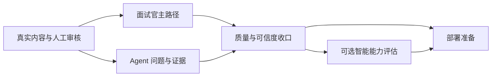

# 求职作品集功能完善路线设计

> **状态：** 已确认，待拆分实施计划
> **日期：** 2026-07-22
> **目标用户：** 技术面试官与招聘方
> **产品目标：** 在暂不部署的前提下，把当前公开 Portfolio Agent 完善为内容可信、主路径清晰、问答可核验、随时可以进入部署阶段的求职作品集。
> **当前基线：** `docs/08-current-implementation-status.md`

## 1. 决策摘要

后续采用“内容与可信度优先”的推进方式，不优先扩展通用 Agent 平台，也不先投入部署。实施顺序固定为：

1. 真实内容扩充与治理；
2. 技术面试官主路径；
3. Agent 面试问答体验；
4. 质量与可信度收口；
5. 可选智能能力评估；
6. 云服务器部署与求职交付。

前一阶段未达到验收标准时，不提前用后续阶段掩盖内容或可信度缺口。尤其不得用模型生成、视觉包装或动态 Agent 抽象替代真实项目、职责边界和公开证据。

## 2. 成功标准

完成本路线后，一名不了解候选人的技术面试官应当能够：

- 在 90 秒内理解候选人的目标方向、核心能力和代表项目；
- 在不使用 Agent 的情况下，从项目页面判断问题背景、个人职责、关键决策、实现方式、验证结果和当前状态；
- 使用 Agent 深挖项目取舍、故障过程、证据、复盘和跨项目能力，而不会得到无依据扩写；
- 从回答直接定位公开 Claim、Evidence、项目和时间线；
- 清楚区分独立交付、协作参与、方案设计、观察记录和未上线工作；
- 在桌面端和移动端稳定访问，并可使用键盘和主流读屏方式完成主要路径；
- 相信网站不会保存访客问题、会话或私有资料。

工程侧应当满足：公开内容通过人工 Approval 和 bundle 门禁；前后端自动化测试、隐私检查、构建、单 JAR 联调和浏览器验收通过；部署前不存在必须依赖人工临时修复的阻塞项。

## 3. 方案选择

### 3.1 采用：内容与可信度优先

先扩充真实项目、Claim、Evidence 和可执行问题，再优化面试官路径和 Agent。该方案直接改善求职说服力，也能用真实数据验证现有动态页面、检索、工具和多轮能力。

### 3.2 未采用：Agent 能力优先

当前只有一个项目和一个可执行问题。先增加模型、编排或通用工具会造成技术复杂度明显高于内容价值，也无法证明这些抽象解决了真实访问问题。

### 3.3 未采用：视觉包装优先

现有前端已经具备完整壳层。继续优先增加动画或装饰无法弥补案例数量、证据和职责说明不足。视觉工作只在真实内容进入页面后进行针对性收口。

## 4. 总体架构原则

### 4.1 内容是事实源

所有线上事实继续来自审核后的公开 bundle。私有知识库只作为仓库外候选材料来源，必须经过筛选、脱敏、Claim 拆分、Evidence 关联和人工 Approval，不能被运行时代码直接读取。

### 4.2 页面负责快速判断，Agent 负责继续深挖

首页、项目页、时间线和证据页必须独立构成完整作品集。Agent 不能成为理解项目的必经入口，只负责回答页面不适合完整展开的追问。

### 4.3 能力随内容增长

项目比较、自由检索、角色化推荐和模型表达只有在真实内容规模足以支撑时才启用。当前封闭工具、引用式上下文和失败关闭契约保持不变。

### 4.4 部署后置但保持可部署

功能阶段不配置正式服务器，但每个阶段都必须保持前端可构建、后端可测试、单 JAR 可打包、Docker 定义有效和 release verification 可执行，避免最后集中偿还交付债务。

## 5. 阶段一：真实内容扩充与治理

### 5.1 输入

用户完成本地知识库同步后，在仓库外私有工作区提供候选项目、日报、设计记录、验证结果和允许审阅的证据。同步本身不代表允许公开。

### 5.2 功能

- 建立候选项目清单，按求职相关度、技术深度、证据完整度和公开风险排序。
- 首轮选择 2 至 3 个代表项目，覆盖不同的问题类型或能力侧面。
- 为每个项目整理背景、问题、约束、职责、关键决策、实现方案、验证、结果、复盘和当前状态。
- 明确 `Project.status` 与 `contributionType`，不得把方案、协作任务或观察记录描述为独立交付。
- 把公开陈述拆成最小可审核 Claim；为每个重要 Claim 建立 Evidence 关联和验证依据。
- 对公司、人员、域名、IP、账号、客户、真实业务量、原始日志、截图和凭据进行脱敏或排除。
- 为每个项目设计 3 至 5 个技术面试官会真实提出的 QuestionPreset，并保证后端可以执行。
- 使用既有治理 CLI、人工 Approval、bundle 构建、dry-run、发布和回滚流程生成新公开版本。

### 5.3 验收

- 公开 bundle 至少包含 2 个高质量项目；目标为 3 个，但不以数量牺牲真实性。
- 每个项目至少有一条 APPROVED Evidence，关键成果 Claim 必须有直接支持关系。
- 每个项目页面均能回答“为什么做、我做了什么、怎么验证、结果处于什么状态”。
- 所有公开问题都能通过 Answer API 得到受支持答案；页面不展示不可执行推荐问题。
- 隐私检查、bundle 校验、后端测试和发布 dry-run 通过。

## 6. 阶段二：技术面试官主路径

### 6.1 首页

- 首屏清晰表达目标岗位或技术方向、核心能力和作品集性质。
- 提供一个 90 秒快速了解入口，展示代表项目、核心技术和可信度边界。
- 优先展示 2 至 3 个代表项目，项目卡直接呈现问题类型、个人贡献、技术栈和验证状态。
- 保留角色化入口，但默认聚焦技术面试官，不让角色选择阻断浏览。

### 6.2 项目目录与详情

- 项目目录支持按技术、问题类型、状态和贡献类型筛选；项目数量不足以形成有效筛选时不展示空洞控件。
- 项目详情使用稳定的信息顺序：背景与约束、职责边界、架构/方案、关键取舍、实现、验证、结果、复盘、证据。
- 支持从 Claim 或关键段落直接定位关联 Evidence。
- 对未上线、部分验证或协作完成的内容使用明确状态语言。

### 6.3 时间线与证据中心

- 时间线突出能力变化、决策和验证节点，而不是只罗列日期。
- Evidence 支持按项目、类型和 Claim 关系浏览。
- 项目、Evidence 和时间线保持双向或交叉导航，且未知 ID 不回退到第一条内容。

### 6.4 验收

- 首次访问者不使用 Agent，也能在 90 秒内完成候选人和代表项目判断。
- 首页至项目、项目至证据、时间线至项目/证据均有明确路径。
- 页面完全由公开 API 数据驱动，不引入硬编码虚构项目或数字。
- loading、失败、空状态和未知资源状态均可理解且可恢复。

## 7. 阶段三：Agent 面试问答体验

### 7.1 问题覆盖

- 将问题目录扩展到每个公开项目，覆盖概览、职责、架构、取舍、难点、验证、当前状态和复盘。
- 为多项目内容增加能力主题问题和真实跨项目比较问题。
- 推荐问题只来自服务端已发布 QuestionPreset，避免 UI 承诺与回答能力不一致。

### 7.2 追问与证据

- 完善“展开该决策”“查看证据”“解释验证”“当前状态”“相关问题”和“比较项目”等封闭追问。
- 继续只传稳定 ID、内容版本、bundle hash、section 类型和 `FollowUpIntent`，不传历史问答正文。
- 回答中稳定展示处理结果、事实来源、生成方式、验证状态和引用证据。
- 增加从回答复制摘要、打开相关项目、定位 Evidence 的操作；复制内容必须保留状态和证据语义。

### 7.3 边界与错误

- 无法解析项目、引用失效、证据不足、比较样本不足或超预算时返回 `BOUNDARY`，不得猜测。
- 凭据、私有资料和越权问题返回 `REJECTED`，响应不得泄露内部策略、路径或异常。
- 内容版本变化时基于新版本重新验证稳定引用，并向用户显示版本变化提示。
- 网络失败和超时允许针对同一问题重试，但不能重复插入用户消息或把失败会话写入持久化存储。

### 7.4 验收

- 每个公开项目的核心问题都有自动化回答测试和浏览器主路径覆盖。
- 多项目后 `COMPARE_PROJECTS` 能返回有证据的差异；单项目或证据不足时安全失败关闭。
- 刷新页面后会话消失，问题和回答不进入 URL、浏览器存储、服务器日志或外部 Provider。

## 8. 阶段四：质量与可信度收口

### 8.1 无障碍

- 完成键盘导航顺序、焦点可见性、抽屉焦点管理、对话更新播报、表单标签和错误关联。
- 人工核对读屏语义、颜色对比度、缩放和 reduced-motion。
- 分栏拖动继续支持键盘调整和重置。

### 8.2 响应式与可靠性

- 覆盖手机、平板、普通笔记本和宽屏，不允许关键内容被遮挡或出现页面级横向滚动。
- 验证 loading、空内容、断网、超时、未知路由、未知项目、失效 Evidence、内容版本更新和 API 非预期错误。
- 对高延迟回答保持明确 pending 状态，阻止重复提交，并保证组件卸载后的迟到响应不污染新状态。

### 8.3 安全与发布质量

- 扫描公开 bundle、JAR、Docker context、source map、日志和错误响应，确认不包含私有材料或凭据。
- 为扩充后的真实内容建立检索 benchmark，包含应答、边界和拒绝样例。
- 执行后端测试、前端测试、前端构建、隐私检查、静态 bundle 检查、单 JAR 打包和 packaged-JAR Playwright。
- 邀请至少一名不了解项目的人按技术面试官任务走查，并记录阻塞点。

### 8.4 验收

- 所有自动化发布门禁通过。
- 关键访问路径完成键盘、移动端和人工可用性验收。
- 不声明超出实际证据的 WCAG 等级；未通过项必须进入明确清单。

## 9. 阶段五：可选智能能力评估

### 9.1 本地检索

内容扩充后先运行固定 benchmark，比较 `DISABLED`、`KEYWORD_ONLY` 和 `HYBRID`。只有 Hybrid 对自由问题的召回和 grounded answer 有明确提升，并且资源消耗适合目标服务器时，才建议线上启用本地 BGE。

### 9.2 外部模型表达

外部模型继续默认关闭。启用前必须同时满足数据条款审批、运行密钥、成本预算、超时与故障验证。Provider 仍只能接收公开白名单 AnswerPlan；访客问题、检索信息、历史会话和工具内部数据不得外发。

### 9.3 明确不做

本路线不实现动态 Tool Registry、通用 Hook、Orchestrator、多 Agent、DurableTask、长期记忆、向量数据库、私有 RAG、自动 Provider 故障转移或动态插件。只有真实重复实现和运行证据满足现有 C3 准入条件后，才能另立 ADR。

## 10. 阶段六：部署与求职交付

该阶段在功能完善后单独设计和实施，目标环境为云服务器、Docker 和独立域名。

### 10.1 基础部署能力

- 构建并运行单一 Docker 镜像。
- 配置独立域名、HTTPS、反向代理、健康检查和最小开放端口。
- 配置 CPU/内存限制、自动重启、只读文件边界和运行密钥注入。
- 建立发布前门禁、发布后冒烟、版本记录和上一版本回滚。

### 10.2 运营边界

- 默认不记录访客问题和回答；访问日志不得包含查询正文。
- 若启用匿名指标，只记录封闭枚举、耗时桶和成功/边界/拒绝结果。
- 不在首版加入账号、数据库、持久会话或管理后台。

### 10.3 求职材料

- README 说明产品定位、架构、隐私边界、运行方式和验证命令。
- 提供一张与实际代码一致的架构图，以及 60 至 90 秒演示视频。
- 准备面试讲解提纲：为什么做、最难问题、关键取舍、如何验证、还会怎样演进。

### 10.4 验收

- 公网 HTTPS 可访问，健康检查、核心页面、Answer API 和静态资源正常。
- 从全新环境可按文档完成构建、部署、升级和回滚。
- 公网端到端测试、隐私扫描和性能检查通过。

## 11. 阶段依赖

- 阶段二和阶段三都依赖阶段一的真实公开内容。
- 阶段四依赖主路径和问答功能稳定，否则人工验收对象会持续变化。
- 阶段五不是部署前强制项；检索和模型保持关闭也可以进入部署。
- 阶段六只依赖阶段四，不得因为等待智能能力而阻塞一个稳定的确定性版本上线。

## 12. 实施拆分建议

后续实施计划应拆成独立子项目，而不是一个超大计划：

1. 私有知识库候选内容盘点与公开 bundle 扩充；
2. 技术面试官首页与项目信息架构；
3. 多项目 QuestionPreset、工具追问与比较；
4. 无障碍、响应式、可靠性和发布门禁收口；
5. 本地检索/外部模型启用评估；
6. 云服务器 Docker 部署。

每个子项目必须单独完成设计复核、测试驱动实施和新鲜验证。第一项应在用户完成本地知识库同步后启动；在此之前可以准备内容抽取模板和审核标准，但不能虚构候选项目或公开材料。
