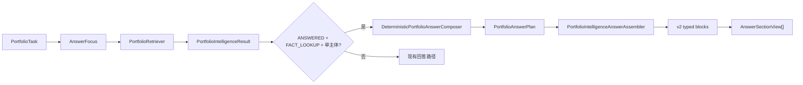

# Agent 回答结构化编排设计

> **日期：** 2026-08-06
> **讨论确认：** 2026-08-07
> **状态：** 讨论确认，待书面复核
> **对应路线图：** `docs/13-Agent对话体验与智能编排改造路线图.md` 阶段 1
> **目标入口：** `POST /api/v2/answers` 的单主体作品集事实回答

## 1. 结论

阶段 1 首个交付面只处理 `ANSWERED + FACT_LOOKUP + 单主体`。检索器负责选择公开、已验证的 Claim 及其顺序，确定性 Composer 负责把 Claim 组织成背景、职责、方案、验证、状态和边界章节。检索 Passage 不再一对一成为最终 UI Block。

主链路为：

```text
PortfolioTask
→ AnswerFocus
→ PortfolioRetriever
→ PortfolioIntelligenceResult
→ DeterministicPortfolioAnswerComposer
→ PortfolioAnswerPlan
→ PortfolioIntelligenceAnswerAssembler
→ v2 typed blocks
→ mapAnswerResponse
→ AnswerSectionView[]
```

本阶段不调用大模型，不改变意图路由，不接入工具循环。Comparison、Recommendation、澄清和失败响应继续使用现有路径。确定性 Plan seam 为后续模型表达提供 fallback，但本阶段不提前建设双 Adapter 注册表。

## 2. 已确认范围

### 2.1 包含

1. `PortfolioRetrievedPassage` 携带完整、已验证的 `AnswerClaimProjection`；
2. Bundle 与 PostgreSQL Retriever 产生语义一致的 Claim Projection；
3. `PortfolioIntelligenceResult` 携带不含用户原文的 `AnswerFocus`；
4. 定义不可变 `PortfolioAnswerPlan` 与 `PortfolioAnswerSection`；
5. 实现确定性分组、排序、精确去重、预算、摘要和缺口表达；
6. Assembler 只对单主体 `FACT_LOOKUP` 调用 Composer；
7. v2 Block 增加可选 `sectionType` 与 `title`，新事实章节必须填写；
8. `ConversationAnswerResult/Response` 增加可选 `summary`；
9. 前端把 v2 Blocks 和 legacy Sections 映射为唯一的 `AnswerSectionView[]`；
10. 回答级只展示一次作品集范围，引用按章节聚合；
11. 修正 Eval 对“语义章节”的定义并增加纯结构指标；
12. 补齐后端、前端、E2E、架构、隐私和评测门禁。

### 2.2 不包含

- 不改变 `PortfolioTaskResolver` 的关键词或模型路由；
- 不为 `COMPARISON` 设计扁平章节之外的多主体结构；
- 不改变 Recommendation/Refine Recommendation 卡片与回答结构；
- 不接入 `ConversationToolService`；
- 不实现 `MODEL_GROUNDED`、`HYBRID` 或 `MIXED`；
- 不默认启用 Provider、ONNX 或 PostgreSQL；
- 不扩大 Bundle、Claim、Evidence 或公开资产范围；
- 不删除前端 legacy Section 读取兼容；
- 不做与回答呈现无关的前端重构。

## 3. 问题定义

当前 `PortfolioIntelligenceAnswerAssembler.materialBlocks()` 对 `PortfolioIntelligenceResult.getEvidence()` 逐 Passage 映射：

```text
PortfolioRetrievedPassage
→ ConversationAnswerBlock
→ 前端逐 Block 展示“作品集资料”与引用
```

这保留了 Claim/Evidence 身份，却把检索颗粒度直接暴露成回答颗粒度，导致来源标签重复、短句割裂、章节缺失和引用分散。根因是检索结果与 HTTP 回答之间没有稳定的语义编排模块。

另一个已核实的问题是：Claim Category 已存在于 Bundle Claim 与 PostgreSQL Row，但进入 `PortfolioRetrievedPassage` 时丢失；现有 `grounding()` 还把 Claim 临时硬编码为 `IMPLEMENTATION / UNKNOWN / PRIMARY`。P1 必须以真实 Claim Projection 取代该临时投影，不能靠正文关键词猜分类。

## 4. 设计原则

1. **检索选择事实，Composer 组织事实。** Retriever 决定选中哪些 Claim；Composer 不重新检索或打分。
2. **Claim 是正文权威语义源。** 正文来自 `statement + detail`，不从带主体前缀的检索文本反推事实。
3. **请求焦点结构化传递。** Composer 不读取用户原文，只读取 `AnswerFocus`。
4. **确定性是完整能力。** 模型关闭时仍返回连贯、可引用的回答。
5. **章节是用户语义。** 一个章节可包含多个 Claim 与 Evidence。
6. **失败关闭。** 身份或不变量损坏时丢弃整个 Plan，不输出半可信结果。
7. **合法缺口允许部分回答。** 有证据的章节照常回答，缺失章节明确说明。
8. **唯一生产契约。** 后端只发布增强后的 v2 Blocks；legacy Sections 仅由前端映射层读取。

## 5. 总体数据流与适用条件



Composer 必须再次校验适用条件。多主体、非 `FACT_LOOKUP`、主体/Passage 不一致或空事实集合都不能静默编排。

## 6. 输入语义

### 6.1 `AnswerFocus`

`AnswerFocus` 是不可变值对象：

```text
AnswerFocus
├── mode: OVERVIEW | FOCUSED
└── requestedClaimCategories[]
```

不变量：

- `OVERVIEW` 的请求类别为空；
- `FOCUSED` 至少有一个请求类别；
- 类别去重并保留第一次出现顺序；
- 不保存问题正文、关键词、Prompt 或用户标识。

普通详细介绍与 Contract Claim 集合使用 `OVERVIEW`。显式章节追问、Preset facet 和 Reference follow-up 使用 `FOCUSED`。上游继续使用 Claim Category 表达请求，Composer 通过唯一映射表转换成用户章节，避免上下游各维护一张 Section 映射表。

### 6.2 `PortfolioRetrievedPassage`

Passage 保留检索身份和顺序，同时携带：

- `passageId`；
- `subjectId`；
- 检索文本，仅用于兼容和检索诊断，不进入最终正文；
- 完整 `AnswerClaimProjection`；
- 已批准的 Evidence References。

构造时必须校验：

1. Claim ID 非空，且 Passage 对外 Claim 身份只来自该 Projection；
2. Claim 为 `VERIFIED`；
3. Claim 的直接 Evidence ID 与 Reference ID 完全一致；
4. Evidence 状态全部为 `APPROVED`；
5. Claim 的 Category、statement、detail、achievement status、contribution type、verification basis 和 materiality 非空；
6. 对外兼容的 `getClaimId()` 委托给 Claim Projection。

Bundle 已持有完整 Projection。PostgreSQL 公共投影必须补齐数据库字段、Importer 和查询列，不能用默认 `IMPLEMENTATION` 或主体级默认值伪造 Claim 语义。

## 7. `PortfolioAnswerPlan`

```text
PortfolioAnswerPlan
├── title
├── summary?
└── sections[]
    ├── sectionType
    ├── title
    ├── content
    ├── claimIds[]
    └── evidenceIds[]
```

Plan 是内部值对象，不直接成为 HTTP DTO。

不变量：

1. 标题非空；
2. 至少有一个非空章节；
3. 每个章节的类型、标题和正文非空；
4. 一个 Section Type 最多出现一次；
5. Claim/Evidence ID 去重并保持第一次出现顺序；
6. 所有 ID 必须来自输入 Result；
7. 除纯缺口 `BOUNDARY` 外，事实章节至少有一个 Evidence；
8. Summary 只能来自主体公开摘要或首条已选 Claim；
9. Plan 不携带检索分数、内部路径、用户原文或私有对象。

## 8. 确定性 Composer

P1 只有一个 implementation，不提前增加 interface：

```text
DeterministicPortfolioAnswerComposer.compose(PortfolioIntelligenceResult)
    -> PortfolioAnswerPlan
```

内部步骤固定为：

1. 校验单主体 `FACT_LOOKUP` 与所有输入身份；
2. 按 Claim ID 去重；
3. 将 Category 映射为 Section Type；
4. 按固定章节顺序分组；
5. 保留 Retriever 的相关性顺序；
6. 按规范化后的 `statement + detail` 精确去重；
7. 合并同正文的 Claim/Evidence ID；
8. 应用集中预算；
9. 使用受控标点与连接词形成段落；
10. 生成 Summary 与缺口 Boundary；
11. 构造并验证 Plan。

### 8.1 章节映射

| Claim Category | Section Type | 默认标题 |
|---|---|---|
| `BACKGROUND` | `BACKGROUND` | 项目背景 |
| `RESPONSIBILITY` | `RESPONSIBILITY` | 我的职责 |
| `TECHNICAL_DECISION`、`IMPLEMENTATION` | `SOLUTION` | 技术方案与实现 |
| `VERIFICATION` | `VERIFICATION` | 验证过程 |
| `OUTCOME` | `STATUS` | 结果与当前状态 |
| `LIMITATION`、`LEARNING`、`REFLECTION` | `BOUNDARY` | 边界与复盘 |

固定顺序为：

```text
BACKGROUND → RESPONSIBILITY → SOLUTION → VERIFICATION → STATUS → BOUNDARY
```

### 8.2 正文规则

- 正文只使用 Claim 的 `statement + detail`；
- 允许统一中文标点、删除完全重复的主体标题前缀和加入有限连接词；
- 不删除“计划”“原型”“观察”“部分”“尚未”等限定词；
- 不把协作贡献改写成个人独立完成；
- 不做模糊相似度去重；
- 不从主体 Summary 推导生产效果或完成状态。

### 8.3 预算

- `OVERVIEW` 每章默认选择 1–3 条事实；
- `FOCUSED` 允许目标章节使用更高预算；
- 详细介绍最多输出六种 Section Type；
- 预算常量只存在于 Composer；
- 预算不截断 Claim/Evidence ID；
- 具体字符阈值由实施阶段根据当前公开样本与移动视口测试确定。

### 8.4 直接回答

- `OVERVIEW` 必须生成 lead Summary；
- 优先使用主体公开 Summary；
- 主体 Summary 不可用时使用首条已选 Claim；
- `FOCUSED` 不生成 Summary，直接进入目标章节；
- Summary 不复制章节引用，引用仍跟随具体章节。

### 8.5 合法缺口

Composer 将 `AnswerFocus` 请求类别映射为目标 Section Type，并与实际章节比较：

- 部分目标章节存在：输出已有事实章节，并把缺失项汇总到唯一 `BOUNDARY`；
- 已有边界事实与缺口文案共用同一个 Boundary Section；
- 缺口句使用受控文案，例如“当前公开材料未覆盖最终状态。”；
- 缺口句不伪造 Evidence；
- 全部目标章节无证据时，不进入普通 Composer，由现有 `NOT_SUPPORTED + INSUFFICIENT` 语义处理。

## 9. Assembler 职责

`PortfolioIntelligenceAnswerAssembler` 负责：

- 映射 `PortfolioDisposition`、Resolution、Scope 和运行元数据；
- 仅对 `ANSWERED + FACT_LOOKUP + 单主体` 调用 Composer；
- 将 Plan 映射为 v2 Blocks；
- 将 Plan Summary 写入 Result；
- 保留 contentVersion、Contract、Intent、Source、EvidenceState 和 contextVersionUpdated；
- 保持 Comparison、Recommendation、澄清、无效输入和 Contract 失败的现有响应。

它不再拥有 P1 路径的 Passage 遍历、章节分组、去重、预算或段落组织规则。

## 10. v2 HTTP 契约

后端继续只发布 `blocks`：

```json
{
  "sourceScope": "PORTFOLIO",
  "sectionType": "SOLUTION",
  "title": "技术方案与实现",
  "content": "……",
  "claimIds": ["claim-a"],
  "evidenceIds": ["evidence-a"]
}
```

约束：

- `sectionType` 与 `title` 对新单主体事实章节必填；
- 其他尚未迁移的 v2 Block 允许字段为空；
- 顶层 `summary` 可选；
- `sourceScope`、`content`、`claimIds`、`evidenceIds` 保持现有语义；
- 不向新客户端同时发送内容不同的 `sections` 与 `blocks`；
- DTO 对可选字段使用加法式演进，不恢复 v1 HTTP 入口。

## 11. 前端统一视图

`mapAnswerResponse` 是唯一协议兼容边界。它输出：

```text
AnswerSectionView
├── type
├── title
├── sourceScope
├── content
├── claimIds[]
└── evidenceIds[]
```

映射优先级：

1. 响应存在 v2 Blocks 时映射 Blocks；
2. Blocks 不存在时才读取 legacy Sections；
3. 无类型旧 Block 使用兼容类型与空标题，不丢失正文或引用；
4. 业务组件不再读取原始 Blocks。

`ConversationThread` 与 Evidence Desk 只消费 `AnswerSectionView[]`。单一 Portfolio 回答在回答级显示一次范围标签，不在每章重复“作品集资料”。未来 `MIXED` 真正实现时，再在 `sourceScope` 变化处显示来源分区。

同一章节内 Evidence ID 稳定去重。Claim ID 不作为访客主视觉标签，但继续服务引用上下文、追问和诊断。

## 12. 错误、降级与缺口语义

### 12.1 合法证据缺口

| 场景 | Resolution | EvidenceState | degraded |
|---|---|---|---|
| 部分目标章节有证据 | `ANSWERED` | `VERIFIED` | `false` |
| 全部目标章节无证据 | `NOT_SUPPORTED` | `INSUFFICIENT` | `false` |

部分回答中的事实章节正常带引用，缺失项只用 Boundary 受控文案表达。

### 12.2 数据或 Plan 不变量损坏

Claim/Evidence 身份不一致、未知 Category、非单主体输入、Plan 越界引用或其他不变量失败时：

- 丢弃整个 Plan；
- 返回 `CAPABILITY_UNAVAILABLE + INSUFFICIENT`；
- 使用短 `TEMPLATE`：“当前公开材料暂时无法形成可靠回答。”；
- `degraded=true`；
- notice 为固定枚举 `ANSWER_COMPOSITION_INVALID`；
- 不泄露异常、正文、Claim ID 或内部路径。

### 12.3 既有专用响应

- 澄清继续返回单一直接问题；
- Preset Contract 过期继续提示刷新；
- Contract Evidence 不可用继续返回能力不可用；
- Comparison/Recommendation 不进入 Composer；
- 相同输入必须得到相同章节、正文、引用顺序和 notice。

日志只记录模式、章节数、Claim/Evidence 数量和失败枚举。

## 13. Eval 调整

P0 已提供 `EvalAnswerShape`，但当前 `semanticSectionCount` 只是非空 Block 数。P1 后必须改为真实 typed section 计数，并增加：

- `typedSectionCount`；
- `untypedBlockCount`；
- `sectionOrderValid`；
- `summaryPresent`。

这些指标只保存计数和布尔值，不保存正文、问题、ID 或 hash。

`repeatedSourceScopeCount` 继续作为结构观察值，但不能证明 UI 是否重复显示来源标签。来源标签只显示一次由前端组件测试和桌面/移动 E2E 验证。

`ANSWER_QUALITY` 至少检查：直接回答存在、正文非空、无完全重复正文、typed section 顺序合法。评测不锁定完整中文措辞。

## 14. 测试设计

### 14.1 Retriever 与领域测试

- Passage 拒绝不完整、未验证或 Evidence 不一致的 Claim Projection；
- Bundle 与 PostgreSQL 保留同一 Category、statement、detail、状态、贡献和 Evidence；
- PostgreSQL schema、Importer、查询和 Row 映射不使用默认 Category；
- `AnswerFocus` 模式与类别不变量；
- `PortfolioIntelligenceResult` 的复制方法不丢失 Focus。

### 14.2 Composer 测试

- 单 Claim 生成正确章节；
- 多 Claim 按权威顺序分组；
- 同 Claim、同正文与 Evidence 精确去重；
- `OVERVIEW` 生成 Summary；
- `FOCUSED` 不生成 Summary，并提高目标预算；
- 部分缺口生成 Boundary；
- 状态、贡献和限制词保持不变；
- 多主体、越界 ID 和非法 Evidence 整轮失败；
- 相同输入重复执行得到相同对象值。

### 14.3 Assembler 与契约测试

- 单主体 Fact Lookup 返回 typed Blocks；
- Comparison/Recommendation 保持旧路径；
- constructionMode 仍为 `EVIDENCE_COMPOSITION`；
- contentVersion、Contract、intentSource、notice 和 context 更新不丢失；
- Composer 异常映射为安全响应；
- JSON 暴露可选 Summary、sectionType 与 title。

### 14.4 前端测试

- v2 Blocks 优先于 legacy Sections；
- 无 Blocks 时 legacy 仍可展示；
- ConversationThread 只消费统一 Sections；
- 作品集范围只显示一次；
- 章节标题、正文和引用按权威顺序展示；
- Evidence Desk 可定位全部章节引用；
- 空正文、非法 typed Block 产生脱敏诊断。

### 14.5 E2E

至少覆盖：

1. 单主体详细介绍；
2. 单章节 Focused 追问；
3. 多目标中的部分证据缺口；
4. Comparison/Recommendation 回归。

桌面与移动端都必须验证无重复范围标签、引用可打开、内容不溢出。

## 15. 迁移顺序

1. 补齐 PostgreSQL Claim 语义列和 Importer；
2. 为 Passage 增加完整 Projection，锁定 Bundle/PostgreSQL 一致性；
3. 引入 `AnswerFocus` 并贯穿 Intelligence Result；
4. 以 TDD 实现 Plan 和 Composer；
5. 接入 Assembler、Summary 和 typed v2 Blocks；
6. 前端建立统一 Section View 并切换 ConversationThread/Evidence Desk；
7. 更新 Eval Shape、Grader、报告与目标数据集；
8. 运行后端、前端、类型、Lint、构建、架构、隐私和桌面/移动 E2E；
9. 同步 `docs/08-当前实现状态.md`、`docs/11-项目演进日志.md`、路线图和状态索引；
10. legacy 读取分支在确认无调用后单独删除。

## 16. 验收标准

1. 单主体 Fact Lookup Passage 不再一对一成为最终 UI Block；
2. `OVERVIEW` 按稳定语义章节组织并含直接 Summary；
3. `FOCUSED` 直接回答目标章节且不重复 Summary；
4. 前端只显示一次作品集范围；
5. 引用按章节聚合且全部来自输入 Result；
6. Bundle/PostgreSQL 的 Claim Projection 语义一致；
7. Composer 不读取问题、不调用模型、网络、数据库或工具；
8. 项目状态、贡献类型、限制和验证边界保持不变；
9. 部分缺口可回答，全缺口失败关闭；
10. 不变量损坏时不输出部分 Plan；
11. Comparison、Recommendation、澄清和 Contract 专用响应无行为回归；
12. Eval 能测量真实 typed section、顺序、摘要、重复和引用完整性；
13. 后端、前端、构建、架构、隐私和目标 E2E 全部通过；
14. 权威状态文档与真实代码同步。

## 17. 后续关系

本设计建立“结构化已验证 Claim → AnswerPlan → 确定性章节”的 seam。后续独立设计：

- Comparison Plan：表达多主体配对与缺失项，不复用本阶段扁平单主体 Plan；
- TurnRouter：改善任务、主体、范围和置信度决策；
- PortfolioExecutionPlanner：按问题获得最小必要 EvidenceBundle；
- Model-grounded Composer：消费同一受控 Plan 输入并通过 GroundingValidator；
- HYBRID/MIXED：扩展多来源章节，但继续复用 v2 typed Block 与前端 Section View。

任何后续能力都不得绕过本阶段的 Claim/Evidence 身份、不变量和确定性 fallback。
