# Agent 统一语义路由与多任务轮次编排设计

> **日期：** 2026-08-10
> **讨论确认：** 2026-08-10
> **状态：** 讨论确认，待实施
> **对应路线图：** `docs/13-Agent对话体验与智能编排改造路线图.md` 阶段 2
> **目标入口：** `POST /api/v2/answers`
> **上游契约：** `docs/superpowers/prototypes/2026-08-10-semantic-turn-routing-backend-contract.md`
> **交互基线：** `docs/superpowers/prototypes/2026-08-10-semantic-turn-routing-prototype-design.md`

## 1. 结论

阶段 2 将当前“单一意图 + 单一 `PortfolioTask`”路由替换为一轮一张、最多六个用户语义任务的 `SemanticTurnPlan`。计划可以同时包含作品集事实、通用知识和受控综合任务，并用显式依赖表达顺序与失败传播。语义任务只代表用户可感知目标，不代表检索、模型调用或工具步骤。

系统采用分阶段可信管线：确定性边界与上下文先行，可选模型只提出闭集候选，后端编译器和验证器生成唯一可信的 `ValidatedSemanticTurnPlan`，决策策略再选择自动执行、计划确认、局部执行加澄清、关键澄清、边界或拒绝。

本阶段提供真正可运行的多任务轮次协调，但只调用现有受控回答能力；不建设阶段 3 的工具规划器、动态工具选择、并发调度或重试补偿。多任务执行结果必须逐任务表达执行状态、任务结论、证据状态和溯源，正文只包含安全完成的任务。

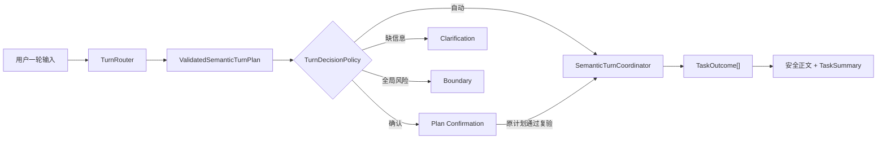

## 2. 已确认范围

### 2.1 包含

1. 新建 answer 自有的 `routing` 深模块，以 `TurnRouter.route(SemanticTurnInput)` 作为唯一语义路由入口；
2. 一轮生成一张 `SemanticTurnPlan`，包含 1–6 个语义任务、依赖、排除项和输出范围；
3. 支持七种闭集任务类型：作品集事实、比较、推荐、推荐细化、通用解释、通用比较和综合；
4. 支持 `REQUIRES_SUCCESS`、`USES_AVAILABLE_RESULTS`、`ORDER_AFTER` 三类依赖；
5. 结构化解析主体、结果引用、否定、约束、输出范围和置信字段；
6. 确定性高精度快速路径与最多一次可选语义模型分类；
7. 模型候选 fail-closed 校验，禁止未知任务、主体、字段和枚举进入可信计划；
8. 1–3 个简单任务自动执行，4–6 个任务或任一确认触发项要求确认，超过六个任务要求拆分；
9. 支持局部澄清、关键澄清、安全子图执行与依赖阻塞传播；
10. 支持无状态、认证加密的计划确认，区分重签、重规划与完整性拒绝；
11. 使用现有作品集智能、通用回答与受控综合能力顺序执行语义任务；
12. 支持部分成功、任务状态摘要和 `PORTFOLIO / GENERAL / SYNTHESIS` 来源溯源；
13. 在 `/api/v2/answers` 增加 action-aware 请求和权威 `agentTurn` 响应；
14. 保留现有 intent/scope/resolution 作为兼容投影，不保留第二套权威路由；
15. 正式前端按已验收原型实现 A–H 八种状态与五个统一组件；
16. 补齐领域、路由、确认、执行、DTO、前端、E2E、架构、隐私与 Eval 门禁。

### 2.2 不包含

- 不建设跨轮持续增长的任务图、长期任务持久化或通用工作流 DSL；
- 不实现多 Agent 协作、Agent 间委派或自主循环；
- 不实现阶段 3 的 `PortfolioExecutionPlanner`、动态工具发现、工具调用图、执行预算、并发、重试和补偿；
- 不实现阶段 4 的自由模型证据表达或绕过现有 Draft/Grounding 校验的生成链路；
- 不从历史答案自由文本推断主体或约束；
- 不新增模型供应商、Provider 注册表层级或默认开启真实 Provider；
- 不扩大公开数据事实、Claim、Evidence、资产或发布边界；
- 不改变 `public-data/` 之外的运行时读取规则；
- 不把计划 UI 做成 DAG 编辑器，不向访客展示 JSON、taskId、依赖枚举、令牌或模型置信分数；
- 不顺带重构与语义轮次无关的 Composer、Retriever、Evidence Desk 或全站视觉。

## 3. 问题定义

当前运行时在 `ConversationalAgentRuntime.answerInternal()` 中顺序执行：

```text
ConversationIntentRouter.routeBoundary()
→ PortfolioIntelligence.tryResolve()
→ 若非作品集则 answerGeneral()
```

该结构在一轮只能选择一个主分支。`ConversationRoute` 只有一个 intent/scope、一个 project/case 主体和一个 `clarificationRequired`；`PortfolioTask` 只有一个 `PortfolioTaskMode` 和一个可选 subject；`PortfolioTaskMode.CLARIFICATION_REQUIRED` 还把“缺信息”误建模为任务类型。

因此以下表达不能被真实建模：

```text
“先解释项目 A，再和项目 B 比较，最后按后端岗位给我推荐，
但不要包含纯前端项目。”
```

当前实现只能选择一个主任务，其余目标被丢弃、降为模糊条件或进入单答案自由生成。系统无法表示：

- 用户到底提出了几个可验收目标；
- 比较和推荐依赖哪些上游结果；
- 哪个任务缺主体、哪个任务仍可安全执行；
- 哪个任务失败、证据不足或被阻塞；
- 综合结论使用了作品集事实还是通用知识；
- 用户确认的计划是否仍是服务端即将执行的原计划。

问题根因不是关键词数量不足，而是缺少独立、可信、可验证的轮次语义模型。

## 4. 设计原则

1. **一轮一图。** 每轮只有一张独立计划，跨轮只通过受控结构化结果引用连接。
2. **任务是用户目标。** 检索、工具、模型和验证步骤不能成为语义任务。
3. **候选不等于计划。** 模型输出永远先经过后端闭集和不变量验证。
4. **确定性优先。** 显式主体、任务、顺序、否定和安全边界不依赖模型。
5. **缺信息不猜。** 关键字段未知时澄清；禁止降级成任意默认任务。
6. **确认与澄清分离。** 确认审批已成型计划；澄清补齐无法成型的信息。
7. **部分成功可见。** 安全任务可以继续，失败任务不生成伪正文。
8. **三态分离。** 执行状态、任务结论和证据状态各自表达不同事实。
9. **来源可追溯。** 综合结论不伪装成作品集直接事实。
10. **无状态确认。** 服务端不持久化访客计划，确认状态通过认证加密信封往返。
11. **边界前置。** 全局安全边界必须在模型前终止；节点级能力问题允许安全部分结果。
12. **单一权威。** `agentTurn` 是阶段 2 权威契约，旧字段只能由它投影。

## 5. 总体架构与包边界

阶段 2 在 `answer` 模块内增加 `routing` 子系统。它拥有语义计划，不依赖 Portfolio Domain。Portfolio 任务仍通过现有 Answer→Portfolio 适配边界执行。

```text
com.portfolio.agent.answer
├── routing
│   ├── domain       # 输入、任务、计划、决策、澄清、确认、Outcome 值对象
│   ├── service      # TurnRouter、内部编译/验证/策略、轮次协调
│   ├── gateway      # SemanticClassifierPort、PlanCryptographyPort
│   └── adapter      # 现有模型注册表适配、JDK 加密适配
├── dto
│   ├── request      # action / semanticContext / confirmation DTO
│   └── response     # agentTurn / displayPlan / taskSummary DTO
├── service          # ProductionConversationService / Runtime 接入
├── mapper           # DTO ↔ routing domain；domain → response
└── intelligence     # 既有 Portfolio Intelligence，不拥有全局计划
```

只允许以下依赖：

```text
answer.controller
  → answer.service
  → answer.routing.service / answer.routing.domain

answer.routing.service
  → answer.routing.domain
  → answer.routing.gateway
  → 既有 Answer 服务端口

answer.routing.adapter.model
  → answer.routing.gateway
  → 既有 Provider 基础设施

answer.routing.adapter.crypto
  → answer.routing.gateway
  → JDK Crypto
```

禁止：

```text
answer.routing.domain → portfolio.domain
answer.routing.service → portfolio.repository
answer.dto → portfolio.dto
TurnRouter → 具体模型 Provider
SemanticTask → 检索请求或工具参数
```

### 5.1 深模块接口

对外只暴露两个主要应用接口：

```text
TurnRouter.route(SemanticTurnInput) -> SemanticTurnDecision
SemanticTurnCoordinator.execute(ValidatedSemanticTurnPlan, ExecutionSelection)
    -> SemanticTurnOutcome
```

`GlobalBoundaryGate`、`RoutingContextResolver`、`SemanticSignalCollector`、`SemanticPlanCompiler`、`SemanticPlanValidator` 和 `TurnDecisionPolicy` 是路由模块内部协作对象。除非测试替身或外部适配边界需要，不为每一步提前建立公共接口或 Spring Bean。

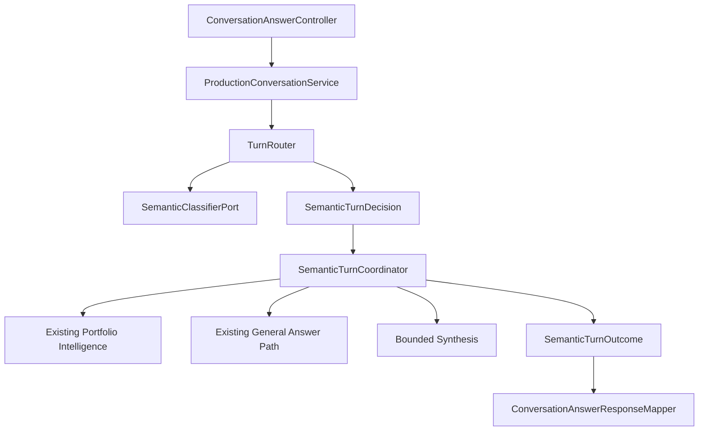

## 6. 领域模型

### 6.1 `SemanticTurnInput`

```text
SemanticTurnInput
├── turnId
├── action: ASK | CONFIRM_PLAN | REGENERATE_PLAN
├── question?
├── semanticContext?
├── legacyContext?
├── confirmationSubmission?
├── requestToken?
├── agentTurnContract?
├── questionPresetId?
└── presetContractVersion?
```

校验规则：

- `ASK`、`REGENERATE_PLAN` 必须有 1–2000 字符 question；
- `CONFIRM_PLAN` 可以没有 question，但必须有完整确认提交；
- `agentTurnContract` 首版只接受 `stp-v1`；
- JSON 字段 `contractVersion` 保留为现有 Preset 合同版本 `pcv1-...`，领域映射后命名为 `presetContractVersion`；
- `agentTurnContract` 与现有 `contractVersion` 不得复用或相互推断；
- `messages` 继续最多 40 条并保持角色交替，但不进入主体自由文本解析。

### 6.2 `SemanticTurnPlan`

```text
SemanticTurnPlan
├── planId
├── contentVersion
├── source: RULE | MODEL_ASSISTED | REFERENCE
├── tasks[1..6]
├── dependencies[]
├── exclusions[]
├── requestedOutputs[]
├── confirmationPolicy
└── planFingerprint
```

`ValidatedSemanticTurnPlan` 只能由 `SemanticPlanValidator` 成功结果产生。不能提供接收任意候选并跳过验证的公共构造器或 `validated=true` 布尔开关。

### 6.3 语义任务

```text
SemanticTask
├── taskId                  # 内部 ID
├── type
├── sourceDomain
├── goalLabel               # 受控用户可见目标
├── parameters              # 与 type 对应的强类型参数
├── requestedOutputs[]
├── confidence
└── subjectReferences[]
```

任务类型闭集：

| 类型 | 来源域 | 参数 |
|---|---|---|
| `PORTFOLIO_FACT` | PORTFOLIO | 单/少量主体、facet、受众 |
| `PORTFOLIO_COMPARE` | PORTFOLIO | 2–3 个主体、比较维度、受众 |
| `PORTFOLIO_RECOMMEND` | PORTFOLIO | 候选、职业方向、能力码、目标、数量、受众 |
| `PORTFOLIO_REFINE_RECOMMENDATION` | PORTFOLIO | 结构化基准结果引用、新增约束、排除主体 |
| `GENERAL_EXPLANATION` | GENERAL | 主题、深度、受众 |
| `GENERAL_COMPARISON` | GENERAL | 2–3 个主题、比较维度、深度、受众 |
| `SYNTHESIS` | SYNTHESIS | 至少两个上游任务、综合目标、维度 |

不得使用通用 `Map<String,Object>` 保存任务参数。参数对象、集合和嵌套值对象全部不可变、构造时校验、实现值语义和防御性复制。

### 6.4 依赖与排除

```text
TaskDependency
├── fromTaskId
├── toTaskId
├── type: REQUIRES_SUCCESS | USES_AVAILABLE_RESULTS | ORDER_AFTER
└── origin: USER_EXPLICIT | COMPILER_INFERRED
```

```text
PlanExclusion
├── scope: PLAN | TASK
├── type: SUBJECT | OUTPUT | DIMENSION | CONSTRAINT
├── taskId?
└── controlledValue
```

排除项进入指纹，执行和综合都不能重新引入排除内容。依赖图必须无环、引用存在、无自环、无重复语义边。

### 6.5 决策与执行选择

```text
SemanticTurnDecision.disposition
  READY
  PARTIAL_READY
  CONFIRMATION_REQUIRED
  CLARIFICATION_REQUIRED
  BOUNDARY
  REJECTED
```

`PARTIAL_READY` 必须带 `ExecutionSelection`：

```text
ExecutionSelection
├── executableTaskIds[]
├── deferredTaskIds[]
├── blockedTaskIds[]
└── reasonCodesByTask
```

三个集合互斥且并集等于计划全部任务。执行器只能执行 `executableTaskIds` 所诱导出的依赖闭合安全子图。

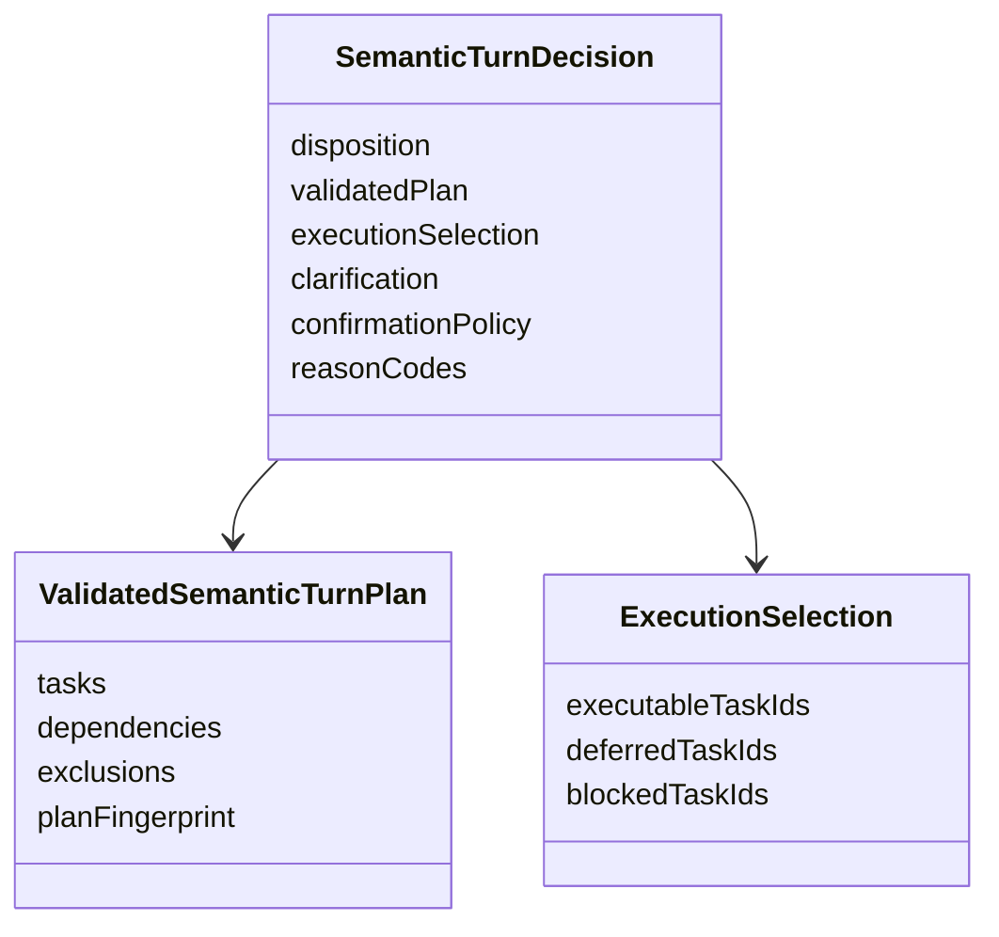

## 7. 上下文与主体解析

### 7.1 `SemanticContext`

首版只包含阶段 2 必要的结构化状态：

```text
SemanticContext
├── activeSubjects[]
├── resultReferences[]
├── pendingPlanReference?
├── audienceRole
├── requestSource
└── coveredTopics[]
```

不保存访客问题、完整答案正文、模型输出、Prompt、检索分数或私有对象。浏览器中的上下文仍然只存在于 tab memory，刷新或关闭后消失。

### 7.2 解析优先级

主体解析固定为：

1. 当前请求显式结构化结果引用；
2. 当前问题文本唯一显式主体；
3. 当前待确认/待澄清计划主体；
4. 最近结构化任务结果引用；
5. 页面结构化上下文；
6. 唯一活动主体；
7. 通过公开词典验证的模型候选。

同级冲突、显式文本与结构化上下文冲突、多候选无法唯一确定时都必须澄清。不得扫描历史 Assistant 消息自由文本选择主体。

### 7.3 旧上下文适配

`LegacySemanticContextAdapter` 转换现有：

- `projectSlug` / `caseSlug`；
- `recommendationContext`；
- `referenceContext`；
- `audienceRole`、`source`、`coveredTopics`。

迁移期规则：

| 输入情况 | 行为 |
|---|---|
| 只有 legacy context | 转换为 SemanticContext |
| 只有 semanticContext | 严格验证后使用 |
| 两者存在且一致 | 允许 |
| 两者存在且冲突 | `INVALID_INPUT`，不设静默优先级 |

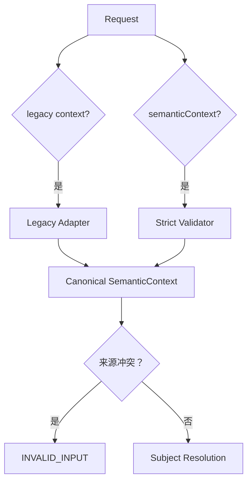

## 8. 语义路由管线

### 8.1 固定顺序

```text
GlobalBoundaryGate
→ RoutingContextResolver
→ SemanticSignalCollector
→ optional SemanticClassifierPort
→ SemanticPlanCompiler
→ SemanticPlanValidator
→ TurnDecisionPolicy
```

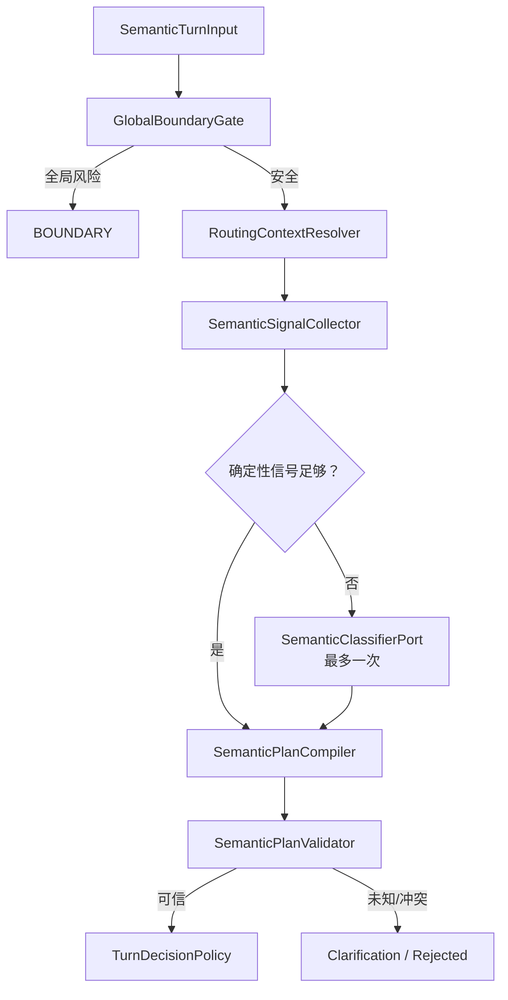

### 8.2 模型边界

- 确定性快速路径：零次语义模型调用；
- 普通 ASK：最多一次语义模型调用；
- `CONFIRM_PLAN`：零次语义模型调用；
- 全局边界：模型前终止；
- 不允许把无效候选再次提交模型自我修复；
- Provider 不可用时，已确定任务照常编译，未知维度澄清；
- 模型只能返回任务类型、闭集枚举、文本跨度和公开主体候选；
- 服务端重新从原始输入解析并验证主体、约束和依赖，不信任模型生成 ID。

### 8.3 决策优先级

优先级从高到低：

1. 全局安全边界；
2. 请求/确认完整性与 schema；
3. Preset Contract 专用校验；
4. 显式结构化结果引用；
5. 显式主体与约束；
6. 待确认/待澄清计划上下文；
7. 页面结构化上下文；
8. 高精度规则；
9. 可选模型候选；
10. 澄清或拒绝。

后序来源不能覆盖前序来源；冲突必须显式进入澄清或无效输入。

## 9. 计划编译与验证

### 9.1 编译

`SemanticPlanCompiler` 负责：

1. 将显式并列/顺序表达拆成用户语义目标；
2. 把修饰目标的条件放入对应强类型参数；
3. 把否定表达写入 `PlanExclusion`；
4. 建立用户显式和编译器推断依赖；
5. 生成受控 `goalLabel`；
6. 合并语义完全相同的重复目标；
7. 保留不同输出目标，不降成主任务约束；
8. 生成候选计划，不宣布其可信。

### 9.2 验证

`SemanticPlanValidator` 至少校验：

- 任务数 1–6；
- taskId 唯一；
- 任务类型与参数对象匹配；
- sourceDomain 与任务类型匹配；
- 主体引用存在、公开、版本一致；
- 枚举和能力码属于后端闭集；
- 比较主体数为 2–3；
- 推荐数量和候选范围合法；
- Synthesis 至少两个来源任务；
- 依赖引用存在、无自环、无环；
- Synthesis 参数与依赖边一致；
- 排除项没有被任务重新引入；
- 输出范围和任务范围不冲突；
- 不包含工具参数、检索配置或私有数据。

超过六个任务不截断、不静默合并，返回结构化拆分澄清。

### 9.3 指纹

`planFingerprint` 使用 SHA-256 计算稳定规范化内容，包含：

- `agentTurnContract` 和 `contentVersion`；
- 任务类型、来源、强类型参数、主体引用和输出；
- 置信字段状态；
- 依赖、排除项和确认策略；
- 与用户确认理解相关的展示目标。

集合使用稳定排序，字符串使用统一 Unicode 规范化。planId、确认 ID、时间和令牌不进入内容指纹，由确认完整性协议单独绑定。

## 10. 自动执行、确认与澄清

### 10.1 自动执行规则

| 条件 | 决策 |
|---|---|
| 1–3 任务且无触发项 | READY，自动执行 |
| 4–6 任务 | CONFIRMATION_REQUIRED |
| 超过 6 任务 | CLARIFICATION_REQUIRED，要求拆分 |
| 关键字段缺失/LOW | CLARIFICATION_REQUIRED 或 PARTIAL_READY |
| 非关键字段 MEDIUM | CONFIRMATION_REQUIRED |
| 全局风险 | BOUNDARY |

确认触发码：

```text
TASK_COUNT_REQUIRES_CONFIRMATION
MEDIUM_CONFIDENCE_FIELD
MIXED_SOURCE_DOMAINS
INFERRED_DEPENDENCY
BROAD_SUBJECT_SCOPE
LARGE_OUTPUT_SCOPE
PARTIAL_EXECUTION
ORDER_ADJUSTED
NODE_CAPABILITY_BOUNDARY
```

初始范围阈值：

- 任一任务超过 3 个主体，或整轮超过 5 个不同主体：`BROAD_SUBJECT_SCOPE`；
- `DETAILED` 作用于超过 2 个主体、Synthesis 超过 3 个上游、或至少 3 个独立输出维度：`LARGE_OUTPUT_SCOPE`；
- 阈值集中在一个不可由模型修改的 `SemanticRoutingPolicy`；
- 阶段 2 不根据工具调用数或 token 估算成本。

`PARTIAL_EXECUTION` 只表示信息完整但系统主动省略、降级或延后用户原要求。局部缺字段导致相关节点暂缓、独立任务继续时，不触发确认。

### 10.2 澄清

```text
ClarificationRequest
├── clarificationId
├── scope: LOCAL | CRITICAL
├── promptCode
├── prompt
├── fields[]
├── blockedTaskCount
└── continuingTaskCount
```

候选字段只支持受控 `SINGLE_CHOICE`、`MULTI_CHOICE` 和必要的 `SHORT_TEXT`。公开 DTO 使用目标名描述受影响任务，不返回内部 taskId。

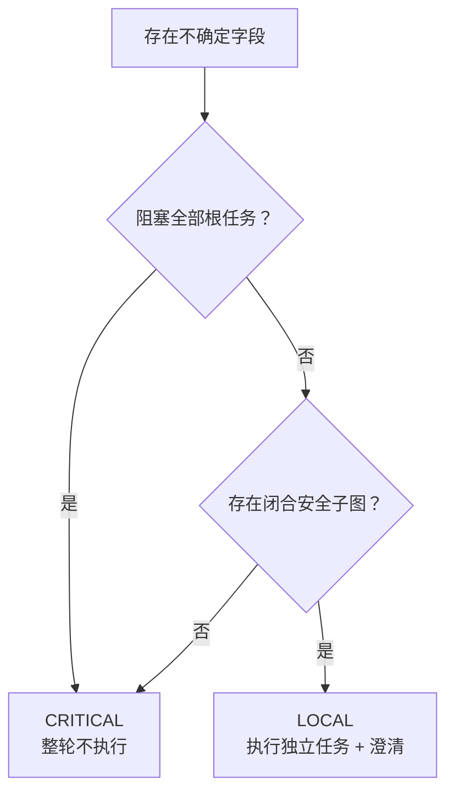

### 10.3 计划确认

确认挑战包含：

```text
confirmationId
issuedAt
expiresAt = issuedAt + 10 minutes
confirmationPlan          # 认证加密、不透明完整计划信封
planFingerprint
integrityToken
displayPlan
userSummary
triggerCodes[]
```

`confirmationPlan` 必须使用 JDK 支持的认证加密方案，不能是 Base64 明文 JSON。密钥来自受控配置/Secret，不进入仓库、响应日志或诊断事件。前端原样保存于 tab memory 并回传，不解析、不编辑、不展示。

`CONFIRM_PLAN` 只进行解封、完整性检查、版本/主体/能力复验和原计划执行，不重新调用语义模型。

“调整计划”提交新的 ASK 与自然语言调整，不允许前端直接编辑内部图；“取消”只清除 tab memory 中的确认信封和展示状态。由于确认协议无服务端会话状态，首版不增加 `CANCEL_PLAN` 请求动作。

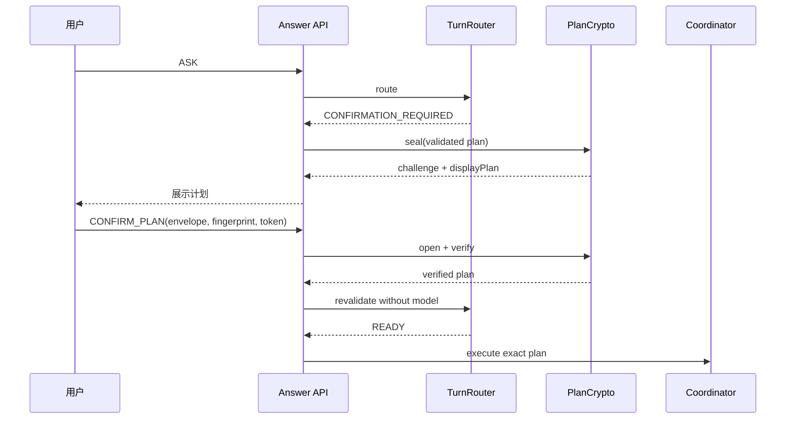

## 11. 计划失效与重新生成

确认时按固定顺序验证：

1. 签名/认证标签与 fingerprint；
2. `agentTurnContract` / schema；
3. `expiresAt`；
4. `contentVersion`；
5. 主体引用；
6. capability-set version。

| 原因码 | 行为 |
|---|---|
| `PLAN_INTEGRITY_INVALID` | REJECTED，丢弃计划，只能重新 ASK |
| `PLAN_SCHEMA_UNSUPPORTED` | 完全重规划并重新确认 |
| `PLAN_CONFIRMATION_EXPIRED` | 其他条件未变时重验同一计划并签发新确认 |
| `CONTENT_VERSION_CHANGED` | 完全重规划 |
| `SUBJECT_REFERENCE_INVALIDATED` | 完全重规划或澄清 |
| `CAPABILITY_SET_CHANGED` | 完全重规划 |

完整性失败不得使用旧计划作为模型提示。仅过期时 planId/fingerprint 可保持，confirmationId/token/时间必须更新。其他失效发生重规划，返回受控 `PlanChange`：

```text
TASKS_CHANGED
SUBJECTS_CHANGED
DEPENDENCIES_CHANGED
CONSTRAINTS_CHANGED
OUTPUT_SCOPE_CHANGED
CAPABILITIES_CHANGED
```

`REGENERATE_PLAN` 必须携带原问题或可验证原请求引用与当前结构化上下文；不能只提交旧计划要求模型改写。

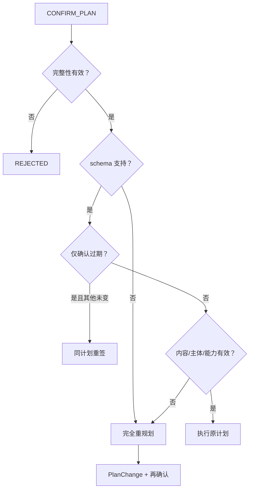

## 12. 多任务执行协调

### 12.1 执行边界

`SemanticTurnCoordinator` 负责把可信语义任务按拓扑顺序分发给现有能力，并聚合结果。它不选择检索器、不规划工具、不重写任务，也不修改计划。

内部执行端口按来源域收口：

```text
PortfolioSemanticTaskExecutor
GeneralSemanticTaskExecutor
SynthesisTaskExecutor
```

这些端口可以由适配器调用既有 `PortfolioIntelligence`、通用回答链路和受控综合器。不能让 Coordinator 直接依赖具体 Retriever、Provider 或 Portfolio Repository。

### 12.2 调度规则

阶段 2 采用确定性顺序调度：

1. 对计划做稳定拓扑排序；
2. 同层任务按计划原始顺序执行；
3. 执行前检查依赖结果；
4. `REQUIRES_SUCCESS` 上游未成功则阻塞下游；
5. `USES_AVAILABLE_RESULTS` 有至少一个安全上游结果即可继续，否则阻塞；
6. `ORDER_AFTER` 只控制顺序，不传播失败；
7. 一个任务异常被映射为受控失败，不中断无依赖安全任务；
8. 全局安全异常或计划不变量损坏立即终止剩余任务；
9. 阶段 2 不并发、不自动重试、不动态插入新任务。

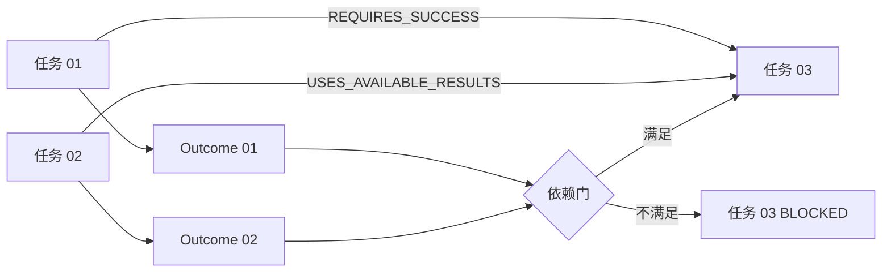

### 12.3 通用任务能力不可用

真实 Provider 仍遵守现有显式授权和默认关闭边界：

- Provider 可用且授权：调用现有受验证通用回答路径；
- Provider 不可用：任务结果为 `CAPABILITY_UNAVAILABLE`；
- 同计划的作品集任务仍可完成，计划结果为 PARTIAL；
- 不使用作品集事实模板伪造通用知识答案；
- 不因 Provider 不可用把 GENERAL 任务改写为 PORTFOLIO 任务。

### 12.4 综合任务

Synthesis 只能消费已成功上游的结构化结果与引用：

- `sourceDomain=SYNTHESIS`；
- `derivationType=SYNTHESIZED`；
- `originDomains` 由成功上游计算；
- 只能复用上游 claim/evidence IDs；
- 不能提升证据等级或创造证据；
- 没有足够输入时 BLOCKED；
- 首版使用受控确定性综合；可选模型表达属于后续阶段，不能在本阶段绕过 Grounding/Draft 校验。

## 13. 结果与溯源

### 13.1 三套状态

```text
TaskExecutionStatus
  NOT_STARTED | RUNNING | SUCCEEDED | FAILED | BLOCKED | CANCELLED

TaskResolution
  ANSWERED | NOT_SUPPORTED | EMPTY | REJECTED |
  CAPABILITY_UNAVAILABLE | BOUNDARY | NOT_APPLICABLE

TaskEvidenceState
  SUFFICIENT | PARTIAL | INSUFFICIENT | NOT_APPLICABLE
```

`TaskOutcome`：

```text
taskId
executionStatus
resolution
evidenceState
degraded
reasonCodes[]
resultReference?
sourceDomain
provenance
resultPayload?
```

`resultPayload` 使用显式不可变变体，不使用通用 Map：

```text
SectionResultPayload(blocks, summary?)
RecommendationResultPayload(recommendation, supportingBlocks)
SynthesisResultPayload(blocks, provenance)
```

正文规则：

- 只有 `SUCCEEDED + ANSWERED` 的安全 Block 进入正文；
- `NOT_SUPPORTED`、`EMPTY`、`FAILED`、`BLOCKED` 只进入任务状态摘要；
- `degraded` 是额外维度，不能替代其他状态；
- 异常不能被映射成 EMPTY；
- BLOCKED 使用 `NOT_APPLICABLE` 证据状态。

### 13.2 计划结果

```text
SUCCEEDED | PARTIAL | NO_RESULT | FAILED | CANCELLED
```

### 13.3 溯源

```text
TaskResultProvenance
├── derivationType: DIRECT | SYNTHESIZED
├── originDomains: PORTFOLIO | GENERAL
├── sourceTaskIds[]
├── claimIds[]
└── evidenceIds[]
```

公开 `TaskSummaryItem` 不返回内部 taskId，而使用稳定显示序号、goalLabel、用户状态与来源标签。

公开 `agentTurn.completedTasks[]` 承载多任务正文：

```text
CompletedTaskResponse
├── displayIndex
├── goalLabel
├── sourceDomain
└── resultPayload
```

现有顶层 `blocks` 聚合所有安全的 Section/Synthesis Block，作为兼容投影；现有顶层 `portfolioRecommendation` 只在整轮恰好存在一个可兼容推荐结果时投影。多个推荐结果不能任意选择一个进入旧字段，必须由 `completedTasks[]` 分别表达。

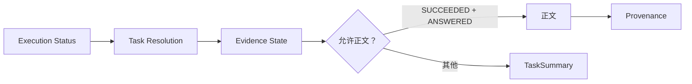

## 14. HTTP 契约

### 14.1 请求

继续使用 `POST /api/v2/answers`。新增：

```text
action: ASK | CONFIRM_PLAN | REGENERATE_PLAN
agentTurnContract: stp-v1
semanticContext?
planConfirmation?
invalidatedPlanReference?
```

兼容规则：

- 缺少 action 时按 ASK；
- 缺少 agentTurnContract 时按 legacy projection 返回；
- 现有 `questionPresetId` 与 `contractVersion=pcv1-...` 原样保留；
- `question` 从无条件 `@NotBlank` 改为 action-aware 类级校验；
- Controller 仍只接收 DTO，不解析计划信封。

### 14.2 响应

新增权威：

```text
agentTurn
├── contractVersion: stp-v1
├── disposition
├── displayPlan?
├── planConfirmation?
├── clarification?
├── planChange?
├── outcome?
├── completedTasks[]
└── reasonCodes[]
```

现有字段继续存在，但由 `agentTurn` 投影：

| agentTurn | legacy resolution |
|---|---|
| CONFIRMATION_REQUIRED + stp-v1 | `AWAITING_CONFIRMATION` |
| CONFIRMATION_REQUIRED + legacy client | `NEEDS_CLARIFICATION` + notice |
| CLARIFICATION_REQUIRED | `NEEDS_CLARIFICATION` |
| 执行有回答 | `ANSWERED` |
| 全部无支持证据 | `NOT_SUPPORTED` |
| 完整性拒绝 | `REJECTED` |

旧字段不能反向修改 `agentTurn`。确认和澄清响应不得生成普通答案 Blocks。

### 14.3 展示与确认数据分离

`displayPlan` 只含：

- 显示序号；
- 用户目标名；
- 约束摘要；
- 自然语言依赖摘要；
- 来源标签；
- 确认原因。

它不含 taskId、依赖枚举、模型分数、工具参数、Prompt 或令牌。

`confirmationPlan` 与 `integrityToken` 只在 `planConfirmation` 专用字段出现，前端不得写入 DOM、日志、浏览器持久化或 URL。

## 15. 前端正式交互

正式实现遵循已验收的“编号线性清单 + 折叠密度”，不重新设计视觉方向。

### 15.1 五个组件

```text
PlanConfirmation
CompactTaskSummary
Clarification
TaskStatusSummary
PlanInvalidatedNotice
```

组件只消费公开展示 DTO，不解析确认信封。

### 15.2 A–H 映射

| 状态 | 契约 | 首屏行为 |
|---|---|---|
| A 单任务 | READY → SUCCEEDED | 无计划 UI |
| B ≤3 多任务 | READY → SUCCEEDED | 折叠摘要条 |
| C 复杂计划 | CONFIRMATION_REQUIRED | 展开确认卡，继续/调整/取消 |
| D 局部澄清 | PARTIAL_READY + LOCAL | 独立任务继续，澄清受影响任务 |
| E 关键澄清 | CLARIFICATION_REQUIRED + CRITICAL | 不执行，展示被阻塞下游 |
| F 部分成功 | planOutcome=PARTIAL | 展开状态矩阵，正文只含安全结果 |
| G 计划失效 | PlanChange / invalid reason | 明确重新生成或再确认 |
| H 安全边界 | BOUNDARY | 整轮终止，不显示部分计划 |

### 15.3 状态摘要密度

```text
TaskSummary
├── displayMode: HIDDEN | COLLAPSED | EXPANDED
├── totalCount
├── answeredCount
├── notSupportedCount
├── emptyCount
├── blockedCount
├── failedCount
├── cancelledCount
├── degradedCount
└── items[]
```

计数约束：

```text
total = answered + notSupported + empty + blocked + failed + cancelled
```

`degradedCount` 可与其他分类重叠，不参与求和。部分成功首屏展开；用户折叠后仍显示例如“2/5 完成 · 1 证据不足 · 2 阻塞”。

### 15.4 可访问性与隐私

- 展开控件使用真实 button 与 `aria-expanded`；
- 状态不只依赖颜色，使用形态与文字；
- 键盘可完成确认、调整、取消、选项选择与折叠；
- 动态状态使用克制的 live region；
- 不持久化问题、答案、计划信封或确认令牌；
- 刷新/关闭后会话与待确认计划消失。

## 16. 错误、降级与原因码

原因码分层：

```text
ROUTING_*
PLAN_*
EXECUTION_*
EVIDENCE_*
CAPABILITY_*
SAFETY_*
```

公开 API 只返回白名单码。不得把异常消息、类名、堆栈、路径、Provider 内部错误、Prompt、安全规则或模型原始输出写入响应。

| 场景 | 行为 |
|---|---|
| 模型分类不可用 | 确定任务继续，未知维度澄清 |
| 单任务执行异常 | 该任务 FAILED，无依赖任务继续 |
| 作品集证据不足 | NOT_SUPPORTED + INSUFFICIENT |
| 通用 Provider 未授权 | CAPABILITY_UNAVAILABLE |
| Synthesis 输入不足 | BLOCKED |
| 计划不变量损坏 | 整轮拒绝执行，安全模板 |
| 全局安全边界 | 模型前 BOUNDARY，无计划 |

## 17. 可观测性与隐私

允许的结构化诊断字段：

- `route.source`；
- `plan.task.count`、`plan.dependency.count`；
- `plan.source.domain.count`；
- `decision.disposition`；
- `confirmation.trigger.count`；
- 各 Outcome 计数；
- `degraded.count`；
- 原因码；
- duration bucket；
- `agent.turn.contract`。

禁止记录：

- 原始 question/messages；
- goalLabel 和自由文本参数；
- 主体标题或用户输入的任意文本；
- planId/taskId/fingerprint/confirmationId；
- confirmationPlan/integrityToken；
- Prompt、模型原始候选、模型思维链；
- Claim/Evidence 正文、检索分数、路径和凭证。

诊断发布失败不能改变回答结果。

## 18. Eval 与质量门禁

阶段 2 在现有 Evaluation Harness 增加只含结构指标的 `EvalSemanticTurnShape`：

```text
disposition
taskCount
dependencyCount
sourceDomainCount
modelCallCount
clarificationScope?
confirmationRequired
planOutcome?
answeredCount
blockedCount
failedCount
degradedCount
planInvariantValid
provenanceValid
```

不保存问题、回答、主体 ID、任务 ID、指纹、令牌或文本 hash。

### 18.1 数据集覆盖

至少覆盖：

1. 单一明确作品集事实；
2. 两个独立作品集目标；
3. 事实→比较→推荐依赖链；
4. 混合 PORTFOLIO + GENERAL + SYNTHESIS；
5. 显式否定与排除主体；
6. 显式顺序与推断依赖；
7. 局部主体缺失；
8. 关键上游主体缺失；
9. 多于六个目标；
10. legacy/semantic context 一致与冲突；
11. 结构化结果引用与自由文本指代对照；
12. Provider 不可用的部分成功；
13. 全局边界；
14. 计划篡改、过期、内容版本变化、主体失效和能力变化。

### 18.2 质量门禁

阶段 2 完成前必须满足：

- 确定性显式用例路由准确率 100%；
- 全局边界模型调用数为 0；
- CONFIRM_PLAN 语义模型调用数为 0；
- 普通 ASK 语义分类调用数不超过 1；
- 所有可信计划图不变量通过率 100%；
- 未知任务/主体/枚举进入执行率 0；
- 计划篡改执行率 0；
- blocked/failed 任务产生正文率 0；
- Synthesis 新造证据 ID 数 0；
- legacy 单任务回归集无行为退化；
- A–H 桌面与移动 E2E 全部通过；
- 隐私检查无新增问题。

冻结的模型辅助路由集上，任务类型集合 exact match 不低于 90%，主体集合 exact match 不低于 95%，显式否定/排除召回率为 100%；未达门禁时模型辅助路由保持关闭，确定性路径仍可交付。低置信失败必须表现为澄清，不计作错误执行。

## 19. 测试设计

### 19.1 领域测试

- 每个值对象校验 null、空值、闭集、范围和值语义；
- 所有集合覆盖源集合修改和 getter 不可修改；
- 任务类型与参数对象不匹配失败；
- 依赖缺失、自环、环路、重复失败；
- 排除项重新引入失败；
- 指纹对语义变化敏感、对集合构造顺序稳定；
- `toString()` 不包含自由文本、主体、令牌或内部 ID。

### 19.2 路由测试

- 确定性单/多目标计划；
- 规则与模型候选合并；
- 模型未知类型/字段/主体 fail-closed；
- 最多一次模型调用；
- 全局边界前置；
- 主体解析优先级与冲突；
- local/critical clarification；
- 九类确认触发；
- >6 任务拆分。

### 19.3 确认测试

- 认证加密往返；
- 密文、fingerprint、planId、版本任一篡改拒绝；
- 10 分钟到期边界；
- 仅过期重签；
- 内容/主体/能力变化重规划；
- 确认路径不调用模型；
- 令牌和信封不进入日志、DOM、localStorage、sessionStorage、URL。

### 19.4 执行测试

- 稳定拓扑顺序；
- 三类依赖的失败传播；
- 无依赖任务在其他任务失败后继续；
- GENERAL 不可用产生部分成功；
- Synthesis 溯源与证据复用；
- blocked/failed 无正文；
- degraded 从任务到聚合 DTO 不丢失。

### 19.5 HTTP 与前端测试

- action-aware question 校验；
- Preset `contractVersion` 与 `agentTurnContract` 不混用；
- agentTurn 权威，legacy 投影一致；
- displayPlan 不泄露内部字段；
- A–H 组件状态和三档密度；
- 计划确认继续/调整/取消；
- 折叠 `aria-expanded`；
- 桌面、移动、键盘和 reduced motion；
- Evidence Desk 只展示安全正文引用。

### 19.6 架构与隐私测试

- routing domain/service 不导入 Portfolio Domain/Repository；
- TurnRouter 不依赖具体 Provider；
- Controller 不解析信封或访问 Repository；
- 生产/测试 Java 无 `var`、`record`、Lombok；
- 公共 DTO 不序列化 taskId、依赖枚举或模型分数；
- `scripts/privacy-check.ps1` 通过。

## 20. 迁移与实施顺序


1. 先以 TDD 建立 routing domain、闭集、指纹和图不变量；
2. 实现 SemanticContext、legacy adapter 与主体解析，不改变现有运行时入口；
3. 实现 TurnRouter 确定性路径、候选端口、编译器、验证器和决策策略；
4. 实现认证加密确认、过期和计划失效；
5. 实现顺序 Coordinator、三类执行适配与 Outcome 聚合；
6. 将 `/api/v2/answers` 切换为 action-aware 和 agentTurn 权威响应；
7. 按已验收原型实现五组件与 A–H 状态；
8. 扩充 Eval、架构、隐私、桌面/移动 E2E 并跑全量门禁；
9. 只有全部门禁通过后，才把旧 `ConversationIntentRouter` / `PortfolioTaskResolver` 的全局权威职责移除；
10. 同步 `docs/00`、`docs/08`、`docs/11` 和路线图，明确阶段 2 实际完成面。

迁移期可以通过 adapter 复用旧单任务能力，但不允许让旧路由与 TurnRouter 同时独立决定并择优。每个请求必须有唯一权威决策。

## 21. 验收标准

1. 一轮输入能够生成并执行包含多个用户目标的真实语义计划；
2. 任务、依赖、排除和输出范围都是强类型、可信且可验证的；
3. 1–3 个简单任务自动执行，4–6 个或规则触发项确认，超过六个请求拆分；
4. 局部澄清只阻塞受影响链路，关键澄清不执行任何任务；
5. 全局安全风险在模型前终止且不显示部分计划；
6. 普通初始路由最多一次语义模型调用，确定性/确认/全局边界为零次；
7. 模型不能创造可执行类型、主体、字段、枚举或依赖；
8. 确认执行的计划与用户看到的计划一致，篡改、过期和版本变化安全处理；
9. 多任务按稳定拓扑顺序执行，三类依赖行为符合契约；
10. 至少一个任务安全回答且其他任务未完成时返回 PARTIAL；
11. 失败、阻塞和证据不足任务不生成伪正文；
12. `SYNTHESIS` 保留独立来源和完整上游 provenance，不新造证据；
13. 现有 Preset contractVersion 语义不变，`agentTurnContract` 独立协商；
14. agentTurn 是唯一权威，legacy 字段只是安全兼容投影；
15. 前端 A–H 与五组件按原型实现，状态不依赖颜色且键盘可操作；
16. 问题、答案、计划信封和令牌不持久化、不进 URL、不进日志；
17. routing core 不依赖 Portfolio 内部模型或具体 Provider；
18. 单任务作品集、推荐、Preset、通用回答和阶段 1 Composer 无回归；
19. 后端、前端、构建、架构、隐私、Eval 和目标 E2E 全部通过；
20. 权威文档只在真实实现和门禁通过后宣称阶段 2 完成。

## 22. 后续关系

本阶段产出稳定的“用户输入 → 可信语义任务图 → 逐任务结果”接口，是后续能力的上游，不提前实现后续能力：

- 阶段 3 `PortfolioExecutionPlanner` 可在单个 Portfolio 语义任务内部选择最小必要 Evidence/只读工具；
- 阶段 4 Model-grounded Composer 可消费已验证 TaskResult，但必须保留 GroundingValidator；
- 阶段 5 可以扩展更丰富的跨轮结构化上下文，但仍不能从历史答案自由文本猜主体；
- 阶段 6 再处理真实环境容量、超时、可观测性收口和旧路由清理。

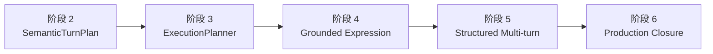

任何后续阶段都不得绕过阶段 2 的主体解析优先级、计划验证、排除项、确认完整性、任务状态分离和来源溯源。
