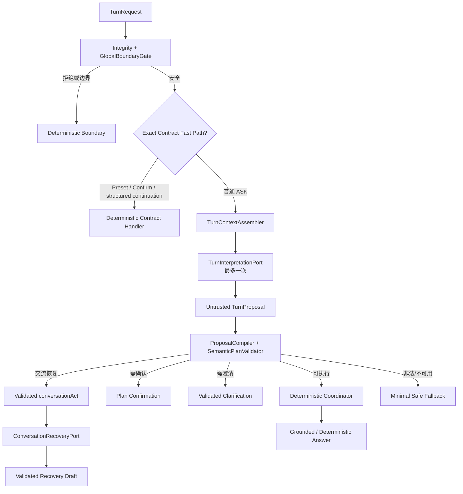

# Agent 模型主导语义理解与受控编排重构设计

> **日期：** 2026-08-16
> **状态：** 第二版已吸收独立架构评审，待复审；不构成生产代码实施授权
> **问题来源：** `docs/reports/agent-behavior-full-path-audit-2026-08-16.md`
> **拟取代范围：** `2026-08-10-semantic-turn-routing-design.md` §2.2、§7.2、§8、§16 中关于规则优先、路由不读取临时对话、Provider 不可用时继续规则编译的条款；其余计划验证、确认、执行和安全边界继续有效
> **保持有效：** 既有公开事实、安全、证据、确认、执行和 Provider fail-closed 边界

## 1. 决策结论

Agent 的默认语义理解入口改为受控模型，确定性代码不再通过不断扩充关键词和正则模拟完整自然语言理解。

目标职责分工为：

> 模型负责理解人、推动对话和提出候选行动方案；确定性系统负责事实、安全、能力、计划和执行边界。

单轮主链路固定为：

```text
用户输入
→ 请求完整性与安全硬门禁
→ 精确 Preset / 已签名确认等确定性契约快速路径
→ 受控模型提出 TurnProposal 或 conversationAct
→ 服务端重新绑定公开主体并编译候选计划
→ 服务端验证计划、事实边界和执行权限
→ CONVERSE 由独立轻量 Conversation Recovery 生成受控交流
→ 确定性能力执行
→ 受约束表达或确定性 Composer
→ 前端展示回答、澄清、确认或交流恢复
```

模型有三种合法提议：

1. `PROPOSE_EXECUTION`：提出一个到六个用户语义任务；
2. `ASK_CLARIFICATION`：指出缺失或冲突字段，并提出自然澄清文案；
3. `CONVERSE`：只提出闭集交流动作，不直接输出可展示回复。

模型不能直接作出 `BOUNDARY`、`REJECTED`、`CONFIRMED` 或“已执行”决定。这些状态只由后端产生。

## 2. 为什么需要重构

当前生产控制流是：

```text
DefaultTurnRouter
→ RoutingContextResolver
→ SemanticSignalCollector
→ 可选且进入很晚的 SemanticClassifierPort
→ SemanticPlanCompiler
→ SemanticPlanValidator
→ TurnDecisionPolicy
```

`SemanticSignalCollector` 先用关键词和正则决定介绍、比较、推荐、综合、Facet 等语义；`SemanticPlanCompiler` 再由规则生成任务、依赖和输出。模型通常只在主体未解析时参与，因此它并不是语义理解入口。

这会带来三个结构性问题：

- 新口语、错别字、Emoji、反问和省略表达需要继续追加 Java 规则；
- 规则在模型之前已经决定意图和计划，模型只能填补少数空位；
- 无意义输入也会被规则兜底成任务，产生 `112233 → NOT_SUPPORTED + Evidence` 这类错误体验。

问题不是词典不够大，而是自然语言理解与确定性裁决的职责放反了。

## 3. 目标与非目标

### 3.1 目标

- 让普通自然语言、口语、模糊输入和多目标表达默认进入受控模型理解；
- 让页面上下文成为可见、可关闭、低优先级 Hint，而不是隐藏强路由条件；
- 允许模型自然回答寒暄并把不明确交流引导回可继续的方向；
- 保持作品集主体、项目状态、贡献、Claim、Evidence 和执行能力由后端裁决；
- 保留 Preset、确认提交、安全门禁等需要绝对可重复的确定性契约；
- Provider 失败时诚实降级，不恢复成另一套大型关键词语义引擎；
- 用影子评测、灰度开关和可回滚迁移替换旧路由，不做一次性硬切换。

### 3.2 非目标

- 不引入开放式 ReAct、自主循环、多 Agent 或长期任务；
- 不允许模型自由选择工具名、URL、SQL、文件或外部系统；
- 不扩大 `public-data/`、APPROVED Evidence 或公开事实范围；
- 不持久化问题、答案、模型提议或完整会话；
- 不引入动态 Provider 发现、自动跨 Provider 故障转移或 Spring AI；
- 不把模型置信分数当作安全依据；
- 不在本设计审阅通过前修改生产实现。

## 4. 不可突破的不变量

以下既有约束继续有效：

1. 运行时只能读取审核后的公开快照；
2. `Project.status`、`contributionType`、Claim 和 Evidence 事实不得由模型扩大；
3. 只有 `publicStatus = APPROVED` 的 Evidence 可以进入回答；
4. 问题、答案和会话不得落盘、进入 URL、浏览器持久存储或日志；
5. 全局安全风险必须在任何模型调用前终止；
6. 模型提议永远是不可信输入，不能直接进入执行器；
7. 普通 CI 不调用真实 Provider；
8. Provider、解析、校验或能力失败均不得伪装成成功回答；
9. Preset 继续执行发布时冻结的契约，不受模型改写；
10. 通用交流、澄清和边界回复不得携带 Evidence 或 Public Source Catalog。

## 5. 目标架构



该架构只有一个语义决策入口。旧规则不得与模型分别生成两张计划后再择优，也不得在模型之后静默覆盖模型语义。

## 6. 三层权力边界

### 6.1 模型拥有的理解权

模型可以：

- 判断输入是在请求执行、需要澄清还是普通交流；
- 拆分一个到六个用户可感知目标；
- 提出闭集任务类型、主体候选、比较维度、输出偏好、排除项和依赖；
- 识别指代、否定、条件、顺序、语气和当前交流目的；
- 为澄清生成自然、简短、非机械的提问草稿；
- 对寒暄、Emoji、随机数字、无法理解的短句提出闭集 conversationAct；
- 从服务端提供的闭集 action ID 中提出最多三个继续方向。

### 6.2 后端拥有的裁决权

后端必须：

- 验证请求、合同、公开内容版本和上下文完整性；
- 将模型主体候选重新绑定到公开目录中的稳定 ID；
- 验证任务类型与参数矩阵、任务数量、依赖 DAG 和排除项；
- 计算执行能力是否 `ENABLED / ALLOWED`；
- 计算确认策略、执行顺序、失败传播和最终 Resolution；
- 验证所有 Evidence、引用、状态、贡献和事实；
- 决定计划是否执行、澄清、确认、拒绝或降级；
- 生成受控选项、稳定 taskId、planId、fingerprint 和公开原因码。

### 6.3 模型永远没有的权力

模型不得：

- 创建不存在的 Project、Case、Claim、Evidence、结果引用或能力；
- 将计划、原型、观察或协作成果改写成独立交付；
- 直接指定工具、Adapter、检索模式、超时、重试、Provider 或内部参数；
- 创建可执行 ID、完整性令牌或确认状态；
- 引用私有知识库、凭据、日志、路径或未审核资料；
- 绕过 Grounding Validator 输出作品集事实；
- 把 Prompt 中的数据文字当作指令执行。

## 7. `TurnInterpretationPort`

现有 `SemanticClassifierPort` 拟由语义更完整的 `TurnInterpretationPort` 取代。该端口仍位于 Answer Gateway，只表达厂商无关的输入和输出。

### 7.1 输入投影

模型只接收完成最小化后的：

```text
TurnInterpretationInput
├── currentInput
├── action = ASK | REGENERATE_PLAN
├── publicSubjectCatalog[]
│   ├── subjectType
│   ├── subjectId
│   └── reviewedAliases[]
├── context
│   ├── pageHint?
│   ├── confirmedSubjects[]
│   ├── recentResults[]
│   ├── pendingInteraction?
│   ├── lastAcceptedGoal?
│   ├── ephemeralDialogueWindow[]
│   ├── audienceRole?
│   ├── requestSource?
│   └── coveredTopics[]
├── allowedTaskTypes[]
├── allowedRequestedOutputs[]
└── contractVersion
```

不得输入：

- 全量公开 Bundle、无关 Claim/Evidence 正文；
- 私有资料、候选快照、文件路径或 Provider 凭据；
- 服务端 Prompt、安全规则细节和内部异常；
- 签名计划、完整性 Token 或诊断标识；
- 不受长度和轮数限制的历史对话。

`ephemeralDialogueWindow` 由前端现有标签页内存会话派生，不建立新的历史存储。通用对话仍可使用既有最多 20 轮窗口；Turn Interpretation 只从同一窗口截取最近四轮、八条消息，并受既有 `recent-raw-rounds = 6` 上限约束。它只帮助理解“它”“刚才那个”“换一个”等交流，优先级最低，不能成为事实或主体绑定来源。任何历史自由文本候选都必须回到结构化 recentResults 或公开目录验证。

`REGENERATE_PLAN` 不走确定性快速路径。它携带当前结构化调整指令、pendingInteraction 和仍有效的上下文重新调用一次 Turn Interpretation；旧问题正文不从服务端存储恢复，只能由本次请求的页面内存输入提供。

### 7.2 输出 Schema

```text
TurnProposal
├── schema = model-turn-proposal-v1
├── proposalKind
│   ├── PROPOSE_EXECUTION
│   ├── ASK_CLARIFICATION
│   └── CONVERSE
├── tasks[]                       # 仅 PROPOSE_EXECUTION
├── dependencies[]               # 仅 PROPOSE_EXECUTION
├── exclusions[]                 # 仅 PROPOSE_EXECUTION
├── clarification?               # 仅 ASK_CLARIFICATION
└── conversationAct?             # 仅 CONVERSE
```

未知字段、未知枚举、重复字段、超长字符串、数量超限、`PROPOSE_EXECUTION` 的 tasks 为空或不同 `proposalKind` 字段混用，均使整个提议无效。禁止宽松 Map、忽略未知字段或字符串转枚举兜底。

### 7.3 模型可提出的任务字段

每个 `TaskProposal` 只允许：

- `clientTaskKey`：本次输出内局部引用键，不是执行 ID；
- `taskType`：既有闭集任务类型；
- `inputSpan`：当前输入中的 `TextSpan`；
- `subjectCandidates[]`：每个候选分别携带公开 subjectId、basis、可选 evidenceSpan/resultPosition；
- `facets[]`：闭集作品集 Fact 维度；
- `dimensions[]`：闭集比较维度；
- `topicSpans[]`：通用解释/比较主题在 currentInput 中的原文跨度；
- `careerTrack?`：闭集岗位方向；
- `capabilityFilters[]`：闭集能力过滤条件；
- `requestedSize?`：服务端允许范围内的推荐数量；
- `requestedOutputs[]`：闭集输出类型；
- `constraints[]`：已批准的闭集约束；
- `sourceTaskKeys[]`：仅 Synthesis 使用的局部上游任务键；
- `responseMode`：`CONCISE / STANDARD / DETAILED`。

模型不得输出 taskId、fulfillmentRole、Evidence ID、工具名、检索参数、Provider 名、确认策略或执行状态。fulfillmentRole、sourceDomain 和强类型参数对象均由后端生成。

七类任务的字段映射固定为：

| 任务类型 | 模型必须/可以提出 | 后端生成或验证 |
|---|---|---|
| `PORTFOLIO_FACT` | 1 个公开主体候选、候选 basis、facets、requestedOutputs | `PortfolioFact`、audienceRole、contentVersion、默认 facet |
| `PORTFOLIO_COMPARE` | 2–3 个分别带 basis 的公开主体候选、dimensions | `PortfolioCompare`、主体顺序、默认维度 |
| `PORTFOLIO_RECOMMEND` | careerTrack、capabilityFilters、requestedSize、排除项 | `PortfolioRecommend`、候选范围、数量上限、audienceRole |
| `PORTFOLIO_REFINE_RECOMMENDATION` | 1 个 recentResult 候选、constraints、requestedSize | `PortfolioRefinement`、原结果完整性和新增/移除约束 |
| `GENERAL_EXPLANATION` | 1 个 topicSpan、requestedOutputs | 按原文跨度抽取 topic，禁止模型自由生成主题 |
| `GENERAL_COMPARISON` | 2–3 个 topicSpans、dimensions | 按原文跨度抽取 topics，验证数量与顺序 |
| `SYNTHESIS` | 2–6 个 sourceTaskKeys、dimensions、requestedOutputs | sourceTaskIds、依赖边、fulfillmentRole 和来源完整性 |

`TextSpan` 由 `startInclusive`、`endExclusive` 和 `text` 组成；服务端必须验证下标合法且 `currentInput.substring(start, end) == text`。`inputSpan`、`topicSpans` 和主体 evidenceSpan 均使用该结构。不同任务允许引用重叠跨度，但不能引用输入之外的文本。

### 7.4 澄清提议

模型可以提出：

- `missingField`：闭集字段，例如主体、比较对象、目标岗位或指代对象；
- `relatedTaskKeys[]`；
- `questionDraft`：不超过 160 个中文字符的自然提问；
- `candidateSubjectIds[]`：仅作候选，服务端重新过滤和排序。

后端决定澄清范围是 `LOCAL` 还是 `CRITICAL`，生成 clarificationId、fieldKey、promptCode 和正式选项。模型文案违反边界时使用服务端模板。

### 7.5 交流恢复

`CONVERSE` 用于：

- 寒暄、致谢、简短情绪表达；
- `112233`、单个 Emoji、无上下文缩写等无法形成任务的输入；
- 用户还没有提出问题，只是在试探 Agent。

模型只能提出以下 `conversationAct`：

- `SOCIAL_ACKNOWLEDGEMENT`；
- `UNINTERPRETABLE`；
- `EMOTIONAL_ACKNOWLEDGEMENT`；
- `CLOSING`。

能力不可用不属于 `CONVERSE`，必须由后端产生 `CAPABILITY_UNAVAILABLE`。规划模型也不得输出交流正文或自由文本建议。

后端验证 conversationAct 后，调用独立轻量 `ConversationRecoveryPort`。该操作只接收 currentInput、闭集 conversationAct 和后端验证过的 `allowedActionIds`，不接收 Portfolio Claim/Evidence、公开主体详情、历史答案正文或工具目录。输出只能包含：

```text
ConversationRecoveryDraft
├── acknowledgement?       # 最多 80 字符
├── clarifyingQuestion?    # UNINTERPRETABLE 时必填，最多 120 字符
└── suggestedActionIds[]   # 最多 3 个，必须来自输入闭集
```

Codec 机械拒绝 URL、Claim/Evidence/Preset ID 自由文本模式、未知 action ID、工具/联网/已执行自述、索要凭据以及 Schema 外字段。建议入口由服务端根据 action ID 渲染，模型不能自由创建能力名称。Recovery 失败或文案未通过校验时使用与 conversationAct 对应的服务端短模板。

Recovery 契约没有“回答正文”字段，任何实质知识问题都必须由 Turn Interpretation 提出 `GENERAL_EXPLANATION` 或 `GENERAL_COMPARISON`，再交给现有通用能力。系统不用问号、长度或关键词建立第二套路由；误分类风险由严格输出能力、冻结对抗集和切换门禁控制。

## 8. 上下文重构

现有 `SemanticContext.activeSubjects` 语义过强，容易把页面来源误当成用户意图。目标上下文拆为：

```text
TurnContext
├── pageHint?              # 页面可见、可关闭、低优先级
├── confirmedSubjects[]    # 用户显式确认或已完成任务主体
├── recentResults[]        # 带稳定位置的结构化结果引用，不含回答全文
├── pendingInteraction?    # 待澄清或待确认状态
├── lastAcceptedGoal?      # 最近一次被用户接受的结构化目标
├── ephemeralDialogueWindow[]
├── audienceRole?
├── requestSource?
└── coveredTopics[]
```

固定优先级为：

```text
本轮显式表达
> 本轮受控澄清/确认输入
> pendingInteraction
> confirmedSubjects
> recentResults
> lastAcceptedGoal
> pageHint
> ephemeralDialogueWindow（只作语言理解线索，不参与主体绑定）
```

规则如下：

1. 页面打开 Project/Case 只产生 Hint，不自动强制作品集路由；
2. 用户本轮明确切换主体时，旧主体和页面 Hint 不得覆盖；
3. 用户使用“这个项目”等明确指代表达时，模型可以提出 pageHint 主体，但后端验证指代跨度与公开主体；
4. 同级冲突或无法唯一绑定时澄清，不猜测；
5. 页面必须显示并允许清除 Hint；清除后本轮请求不得继续携带；
6. 首轮请求必须真实传递已构造的上下文，禁止只构造但不进入请求；
7. “第二个”等序数指代只绑定 recentResults 中经过服务端签发并复验的位置，不扫描回答正文；
8. 用户在 pendingInteraction 期间明确取消、结束或切换目标时，本轮输入优先，旧待办不得强制续接；
9. audienceRole、requestSource 和 coveredTopics 保持现有行为，仅作为受控元数据，不提升主体优先级；
10. 所有上下文只存在于当前标签页内存，刷新或关闭后消失，不同标签页互不共享。

## 9. 确定性快速路径

只有以下输入绕过默认模型理解：

1. 全局安全硬门禁命中；
2. 精确 Preset ID、版本和合同校验通过；
3. `CONFIRM_PLAN` 的已签名提交；
4. 前端生成且经签名/闭集验证的澄清选项提交；
5. 已验证计划的确定性取消；
6. 请求 schema、长度或完整性无效。

`REGENERATE_PLAN` 明确不在快速路径中：它必须按 §7.1 重新经过一次模型提议与完整后端验证。

“和某个 Preset 文案相似”不是快速路径。普通输入即使包含“比较”“推荐”“介绍”等词，也默认进入模型理解。

Preset 保持完全确定性执行。模型可以在后续自然回复中推荐用户点击某个 Preset，但不能伪造 Preset ID、改写 Preset 任务或替换合同版本。

## 10. 服务端编译与验证

`ProposalCompiler` 将模型提议转换成候选 `SemanticTurnPlan`，但不承担第二套自然语言理解。

### 10.1 必须重新计算或生成

- taskId、planId、planFingerprint；
- 公开主体的最终 `SubjectReference` 与 contentVersion；
- task sourceDomain；
- 任务类型与强类型参数对象的匹配；
- 执行能力状态与允许范围；
- 确认触发项与确认策略；
- LOCAL/CRITICAL 澄清范围；
- 依赖的安全传播语义；
- fulfillmentRole；
- 最终 disposition、Resolution、Evidence 状态和公开原因码；
- conversationAct 是否允许进入 Recovery，以及 Recovery Draft 的无来源投影。

### 10.2 可以接受但必须验证

- 闭集 taskType、facets、dimensions、careerTrack、capabilityFilters、requestedSize、requestedOutputs、constraints；
- 一到六个任务的拆分；
- 主体候选和来源依据；
- 依赖和排除项；
- responseMode；
- inputSpan/topicSpans、澄清文案和 conversationAct。

### 10.3 整体拒绝条件

- 未知 schema、枚举、字段或任务类型；
- `PROPOSE_EXECUTION` 任务为空或超过六个；
- 主体不存在、未公开或内容版本不一致；
- 依赖引用不存在、自环、有环或 Synthesis 来源不一致；
- 排除项被任务重新引入；
- 提议包含工具、URL、SQL、Provider、Evidence 或私有字段；
- 提议类型与字段不匹配；
- inputSpan/topicSpans 不是 currentInput 的精确子串或超过长度预算；
- 模型输出无法严格解析。

不能静默删除非法任务后执行剩余计划，因为用户看到的意图可能已经发生变化。语义缺失应澄清，结构或安全非法应进入安全降级。

### 10.4 主体绑定硬校验

每个 SubjectCandidate 的 basis 不是模型自证，必须与服务端可见证据逐项匹配：

| subjectBasis | 必须满足 | 不满足时 |
|---|---|---|
| `EXPLICIT_TEXT` | candidate.evidenceSpan 精确命中该主体一个 reviewedAlias | 主体冲突或澄清 |
| `CONFIRMED_CONTEXT` | 主体存在于 confirmedSubjects，contentVersion 仍有效 | 澄清或上下文过期 |
| `RECENT_RESULT` | candidate.resultPosition 对应 recentResults 中同一主体，引用签名和 contentVersion 有效 | 澄清或结果过期 |
| `PAGE_HINT` | 主体等于当前未清除的 pageHint，candidate.evidenceSpan 是明确指代表达 | 澄清，不因页面存在自动绑定 |
| `UNKNOWN` | 不允许绑定任何可执行主体 | 必须澄清 |

如果 currentInput 明确命中主体 X 的 reviewedAlias，而模型把同一任务绑定为 Y，且 X≠Y，则整项按主体冲突处理。该检查只做目录别名与跨度一致性，不重新推断用户的任务类型。

## 11. Provider 失败与降级

### 11.1 失败矩阵

| 场景 | 行为 |
|---|---|
| Provider 配置关闭 | 进入最小确定性 fallback |
| 超时、限流、5xx、网络失败 | 不重试当前访客请求；进入最小 fallback |
| 非法 JSON、未知字段、Schema 不符 | 整个提议作废；进入最小 fallback |
| 合法提议但主体缺失/冲突 | 生成受控澄清 |
| 合法提议但任务或能力未准入 | 返回能力边界，不伪装为语义误解 |
| 模型提出超过六个任务 | 要求用户拆分，不截断 |
| Conversation Recovery 失败或 Draft 未通过限制 | 使用 conversationAct 对应的服务端短模板 |
| 模型计划验证失败 | 不执行；按原因澄清或安全降级 |

路由阶段最多调用一次 Turn Interpretation，不使用“把非法 JSON 再交给模型修复”的递归链。只有合法 `CONVERSE` 可以再调用一次轻量 Conversation Recovery；它不执行任务、不接收作品集事实，也不与 Interpretation 互相重试。Provider Adapter 不得在一个访客请求中自动切换未经明确选择的 Provider。

### 11.2 最小确定性 fallback

fallback 不是旧规则引擎的永久副本，只允许：

- 继续执行精确 Preset；
- 处理已签名确认、澄清选项和取消；
- 处理前端结构化、主体已明确的固定动作；
- 当规范化输入只等于一个 reviewedAlias，或前端发送已验证的 `OVERVIEW` 结构化动作时，生成唯一主体的 `PORTFOLIO_FACT(OVERVIEW)`；
- 对无法可靠理解的普通 ASK 返回简短、诚实的能力暂不可用提示，并给出 Preset 或公开主题入口。

这是明确的产品取舍：MODEL_LED 启用后，Provider 不可用期间不会继续支持自然语言比较、推荐、多任务或通用问答；只保留上述精确合同和唯一别名概览。该取舍已经在第二版设计中采纳，实施后必须同步 `docs/08-当前实现状态.md`，不能把模型描述成可选而实际成为全部自然语言能力前提。

不保留“介绍/比较/推荐/综合/Facet 大词典”作为第二套完整路由。迁移期旧 `SemanticSignalCollector` 只通过显式开关用于回滚，稳定后删除或缩减为上述结构化 fallback。

## 12. 输出与 HTTP 契约

由于交流恢复不应伪装成 `GENERAL_EXPLANATION` 或 `NOT_SUPPORTED`，本重构引入 `agentTurnContract = stp-v3`。当前 active 仍为 `stp-v1`；已实现但未激活的 `stp-v2` 不再安排消费者激活，迁移直接从 v1 到 v3。

权威交互类型为：

```text
interaction.kind
├── ANSWER
├── CONVERSATIONAL
├── CLARIFICATION
├── CONFIRMATION
├── BOUNDARY
└── CAPABILITY_UNAVAILABLE
```

`interaction.kind` 是 stp-v3 唯一公开 UI 状态机。现有内部 TurnDecision/disposition 继续服务路由和执行，但不在 v3 作为第二个公共权威字段；兼容 Mapper 只能由最终 interaction.kind 和执行结果单向投影 legacy 字段，禁止反向推断。

| interaction.kind | 唯一合法载荷 | Evidence |
|---|---|---|
| `ANSWER` | answer sections、task summaries、执行结果 | 仅作品集/混合回答可有 |
| `CONVERSATIONAL` | recovery acknowledgement、clarifyingQuestion、闭集 action entries | 禁止 |
| `CLARIFICATION` | clarification、受影响目标、受控选项 | 禁止 |
| `CONFIRMATION` | 待确认计划展示与完整性提交字段 | 禁止 |
| `BOUNDARY` | 安全边界文案与公开原因码 | 禁止 |
| `CAPABILITY_UNAVAILABLE` | 服务端能力文案与公开原因码 | 禁止 |

约束：

- `CONVERSATIONAL` 只能包含短回复和推荐入口，不含 tasks、Evidence、Claim 或 Public Source Catalog；
- `CLARIFICATION` 只能包含问题、受控选项和受影响目标摘要，不含 Evidence；
- `BOUNDARY` 不展示计划或部分执行材料；
- `ANSWER` 的作品集事实继续经过现有执行、Composer 和 Grounding Validator；
- `stp-v1` 在迁移窗口只做安全兼容投影；`stp-v2` writer/reader 仅作为未激活历史实现处置，不形成第三条消费链；
- 前后端完成协商和 E2E 前不得把默认合同切到 `stp-v3`。

必须增加响应不变量：

```text
interaction.kind != ANSWER
→ evidenceIds = []
→ publicSourceCatalog = []
→ answerSections 不得包含 EVIDENCE 类型
```

该不变量不等待 stp-v3：审计缺陷热修必须先回补当前 v1 Mapper，使澄清、边界、能力不可用和噪声输入立即无 Evidence；v3 再把它固化为正式合同。

## 13. 配置与运行模式

新增一个独立语义操作开关，不与通用回答或作品集表达共用：

```text
agent.routing.mode = LEGACY | SHADOW | MODEL_LED
agent.model.operation.turn-interpretation.enabled
agent.model.operation.turn-interpretation.timeout
agent.model.operation.turn-interpretation.max-input
agent.model.operation.turn-interpretation.max-output
agent.model.operation.conversation-recovery.enabled
agent.model.operation.conversation-recovery.timeout
```

- `LEGACY`：仅迁移和紧急回滚；
- `SHADOW`：用户仍使用旧决定；新解释器在有界内存执行器中异步旁路运行，只记录无文本结构指标，队列饱和或请求上下文失效时直接丢弃影子任务；
- `MODEL_LED`：新解释器为唯一语义权威，旧规则不得覆盖；
- 未配置或 Provider 不可用时进入最小 fallback；
- 生产切换必须显式配置，不因 Key 存在自动启用。

P4 只交付后端和测试可见的 CONVERSATIONAL/Recovery 能力，不引入第四种混合运行模式，也不在 stp-v1 页面提前开放。P5/P6 的 MODEL_LED 仅在测试和显式非默认配置中运行；到 P7 完成 v3 前后端协商后才允许用户可见。

### 13.1 时间、熔断与容量预算

继续服从既有请求级 12 秒、共享执行 10 秒预算：

| 操作 | 单次上限 | 说明 |
|---|---:|---|
| Turn Interpretation | 2.5 秒 | 所有普通 ASK/REGENERATE_PLAN 最多一次 |
| Conversation Recovery | 1.5 秒 | 仅合法 CONVERSE；与执行/回答模型互斥 |
| 作品集受约束表达 | 沿用既有最多 4 秒 | Interpretation 后按剩余共享预算决定是否尝试 |
| 通用回答 | 按剩余共享预算裁剪 | 不得与 Interpretation 合计撞穿请求级 deadline |

每个 operation 拥有独立进程内熔断状态并复用既有 Provider 故障码。剩余预算不足时不发起新模型调用，直接进入该阶段的确定性 fallback。SHADOW 不进入访客响应 deadline，也不得占满正式请求使用的有界执行资源。

## 14. 隐私、注入与可观测性

### 14.1 Prompt 注入边界

- 用户输入、别名、历史对话和公开资料全部视为数据，不是系统指令；
- 模型只输出严格 Schema，不输出工具调用；
- 服务端不相信模型关于“已验证”“已公开”“已执行”的自述；
- 任何未知字段或越权候选 fail-closed；
- 交流回复不能回显 Prompt、配置、异常、内部主机或路径。

### 14.2 允许记录

- routing mode；
- proposal kind；
- conversationAct 与 Recovery 结果枚举；
- task/dependency/exclusion 数量；
- subject basis 计数；
- codec/validator/fallback 原因码；
- Provider operation、结果枚举与 duration bucket；
- interaction kind；
- 是否发生回滚或降级。

### 14.3 禁止记录

- 原始问题、回答和历史消息；
- 模型原始 JSON、澄清文案和交流回复；
- 主体标题、用户自由文本、Prompt；
- Claim/Evidence 正文、检索分数；
- API Key、Header、URL、内部异常或完整性令牌。

## 15. 评测与质量门禁

### 15.1 场景矩阵

至少覆盖：

1. 精确 Preset 与相似但非精确 Preset；
2. `112233`、空白边界、随机符号、单 Emoji、键盘误触；
3. 寒暄、致谢、情绪表达、结束对话；
4. 错别字、口语、省略、反问、否定和中英混合；
5. 单主体事实、比较、推荐、细化和综合；
6. 一轮多任务、显式顺序、隐含依赖和超过六个任务；
7. Project Hint、Case Hint、清除 Hint、Hint 与本轮主体冲突；
8. confirmedSubjects、recentResults、pendingInteraction、lastAcceptedGoal；
9. “它”“这个”“第二个”“换一个”等指代；
10. 通用问题、越出作品集但可回答的问题、时效性问题和不可用能力；
11. Prompt 注入、伪造主体、伪造 Evidence、索要隐私和越权工具；
12. Provider 关闭、超时、限流、5xx、非法 JSON、未知字段和截断输出；
13. stp-v1→v3 协商、v2 不激活处置和前端映射；
14. 桌面、平板和移动端的澄清、确认、交流恢复与 Evidence 展示；
15. `PROPOSE_EXECUTION` 空 tasks、非法/越界/重叠 span 和 Kind 字段混用；
16. subjectBasis 与文本、confirmedSubjects、recentResults、pageHint 的伪造或冲突；
17. 通用知识问题误判 CONVERSE、寒暄与真实任务混合；
18. 历史窗口 Prompt 注入、pendingInteraction 期间取消或切换目标；
19. 慢成功预算、SHADOW 字节级无影响、队列饱和和熔断隔离；
20. REGENERATE_PLAN、多标签页上下文隔离、序数结果指代和中英字符预算。

### 15.2 判定原则

模型输出不使用固定句子完全匹配，而按结构和行为判定：

- 是否选择正确 proposal kind；
- 任务集合、主体集合、否定和依赖是否正确；
- 是否错误执行、错误携带 Evidence 或扩大事实；
- 澄清是否能让用户明确知道下一步；
- 交流恢复是否自然、简短且不机械；
- 相同场景多次调用是否保持语义稳定；
- Provider 故障是否按矩阵降级。

### 15.3 强制门禁

- 全局边界前模型调用数为 0；
- 精确 Preset、确认和结构化 continuation 模型调用数为 0；
- 普通 ASK 的语义解释调用数不超过 1；
- 未知任务、主体、枚举、工具或 Evidence 进入执行率为 0；
- 非 `ANSWER` 交互携带 Evidence 的比例为 0；
- 模型计划图不变量通过率为 100%；
- 被阻塞、失败、澄清或交流任务生成事实正文的比例为 0；
- Hint 被本轮明确主体错误覆盖的比例为 0；
- Provider 故障误报成功率为 0；
- 隐私扫描新增问题为 0；
- 不少于 200 个冻结场景中，proposalKind 准确率不低于 95%；
- 可执行任务集合 exact match 不低于 90%，主体集合 exact match 不低于 95%；
- 显式否定/排除召回率、非法候选阻断率和 Provider 故障正确降级率均为 100%；
- 通用事实经 CONVERSE/Recovery 输出率、非 ANSWER Evidence 率和未知能力入口率均为 0；
- 至少 50 个关键场景进行三次真实 Provider 重复运行，以上安全指标三次均满足；
- 有真实流量时 SHADOW 至少运行 7 天并取得 200 个成功结构样本；尚未部署时允许以 200 场景三次显式回放替代，但 Verdict 必须标记为测试环境而非生产；
- 只有全部阈值满足，才允许从 `SHADOW` 切换 `MODEL_LED`。

## 16. 迁移与回滚

### 16.1 迁移阶段

1. 先在现有权威范围内热修 `112233` 无 Evidence 与首轮 semanticContext 漏传两个审计 P1；
2. 冻结当前审计案例和新增模型主导行为集；
3. 建立 `TurnInterpretationPort`、严格 Codec 和提议领域模型，不接生产主链路；
4. 建立 `ProposalCompiler`、主体硬校验、扩展 Validator 和最小 fallback；
5. 在授权环境运行异步 `SHADOW`，比较旧规则与冻结期望，不以旧行为一致率作为正确性；
6. 后端和测试中建立 CONVERSATIONAL、Conversation Recovery 与澄清，不对 stp-v1 用户开放；
7. 在显式非默认环境开放单任务，再开放多任务、依赖和 Context v2；
8. 前后端直接从 active stp-v1 切换到 stp-v3，interaction.kind 成为唯一公共状态；
9. 完成真实 Provider、预算、故障、浏览器和回滚验收后再默认启用 MODEL_LED；
10. 稳定窗口后移除旧规则默认权威，最终只保留最小 fallback 和有限回滚窗口。

### 16.2 回滚

- 任一阶段可通过 `agent.routing.mode=LEGACY` 回到冻结旧路由；
- 回滚不改变公开 Bundle、Preset 合同或 API 数据事实；
- `stp-v3` 客户端在服务端回滚时必须能收到明确的能力不可用或 v1 安全兼容响应，不回退到未激活的 v2 消费链；
- 回滚开关不允许长期掩盖缺陷，达到稳定门禁后应删除旧大型规则路径。

## 17. 对现有实现的预期影响

| 当前组件 | 目标处置 |
|---|---|
| `DefaultTurnRouter` | 保留唯一入口职责，内部改为硬门禁、快速路径、模型提议和后端验证编排 |
| `SemanticClassifierPort` | 由 `TurnInterpretationPort` 取代，不再只是主体补充分类器 |
| `SemanticSignalCollector` | 迁移期回滚使用；稳定后删除或缩减成结构化 fallback |
| `SemanticPlanCompiler` | 改为只编译严格模型提议，不再通过关键词推断完整语义 |
| `SemanticPlanValidator` | 保留并增强，成为模型计划进入执行前的核心可信边界 |
| `RoutingContextResolver` | 适配 pageHint/confirmedSubjects/recentResults 等新优先级 |
| `SemanticContext` | 版本化重构，消除 `activeSubjects` 对页面 Hint 的混淆；类注释同步说明临时窗口只作语言线索 |
| `ConversationRecoveryPort` | 新增轻量交流恢复 seam，只消费闭集 act 和 action ID，不接收作品集事实 |
| `ConversationAnswerResponseMapper` | 先热修 v1 非回答无 Evidence，再增加 stp-v3 唯一 interaction.kind |
| 前端 Agent Context | 首轮真实传入 Hint，显示、清除并按结构维护临时上下文 |

不预先创建通用 Orchestrator、Tool Registry 或多 Agent 抽象。所有改动限定在当前单轮受控语义编排。

## 18. 验收标准

1. 普通 ASK 默认由受控模型提出语义提议，旧关键词规则不再先决定意图；
2. 精确 Preset、安全门禁和签名 continuation 保持确定性；
3. `112233`、Emoji 和无明确目标表达经闭集 conversationAct 与独立 Recovery 得到自然交流，不返回 `NOT_SUPPORTED` 或 Evidence；
4. 通用事实问题进入通用任务，不通过交流恢复自由编造；
5. 页面 Hint 真实进入首轮请求，但其优先级低于用户本轮表达；
6. 模型提出的主体、任务和依赖全部经过后端闭集、公开目录和图不变量验证；
7. 任何模型失败都不会产生错误执行、伪成功或越权事实；
8. Provider 不可用时 Preset、结构化 continuation、精确唯一别名概览仍可用，其余自然语言 ASK 诚实降级；
9. `stp-v3` 清楚区分回答、交流、澄清、确认、边界和能力不可用；
10. 非回答交互永远不携带 Evidence 或 Public Source Catalog；
11. 对话和模型原文不持久化、不进 URL、不进日志；
12. SHADOW、MODEL_LED、故障注入、真实 Provider 和浏览器路径均有独立 Verdict；
13. 完成全量后端、前端、构建、架构、隐私和发布级 E2E 后才允许默认切换；
14. 文档准确区分“设计通过”“已实现”“真实 Provider 已验收”和“生产已启用”；
15. 本设计提前承接路线图阶段 5 的部分 CONTEXT-02 指代改进，但不宣称阶段 5 整体完成；
16. 当前 canary 中依赖 `intentSource=RULE` 的契约在 MODEL_LED 默认启用前完成修订和独立验收。

## 19. 后续审阅重点

后续独立模型应重点审查：

1. 独立 Conversation Recovery 的输出 Schema 是否足够窄且仍保持自然；
2. 七类任务字段映射是否完整覆盖现有 SemanticTaskParameters；
3. subjectBasis 硬校验是否仍有静默猜测入口；
4. v1→v3 直迁与 v2 不激活处置是否会留下长期兼容债务；
5. 唯一别名概览 fallback 是否过弱或意外扩大；
6. 四轮解释窗口、20 轮通用窗口和预算关系是否清楚；
7. SHADOW 数字门禁、异步资源隔离与真实 Provider 样本是否足够；
8. 现有 P4 Grounding、通用回答和新模型规划是否真正保持权力隔离。

## 20. 第一轮独立评审处置

| 评审项 | 第二版处置 |
|---|---|
| P1-1 七类任务参数不完整 | §7.3 补齐强类型字段、TextSpan 和七类映射表 |
| P1-2 subjectBasis 无硬校验 | 改为每个 SubjectCandidate 独立 basis，§10.4 增加证据源矩阵 |
| P1-3 CONVERSE 自由事实通道 | 移除规划模型 conversationReply，新增独立窄 Schema Recovery |
| P1-4 Provider 故障可用性变化 | §11.2 明确采纳产品取舍并保留精确唯一别名概览 |
| P2-1 v2/v3 与双状态机 | §12 决定 active v1 直接迁移 v3，interaction.kind 唯一公开权威 |
| P2-2 分阶段模式不兼容 | P4 只在后端/测试交付，不新增半权威模式 |
| P2-3 时间预算和 SHADOW | §13.1 固化 2.5s/1.5s 操作预算、独立熔断和异步有界旁路 |
| P2-4 权威条款与窗口冲突 | 头部声明具体取代范围，§7.1 统一 4/20/6 轮关系 |
| P2-5 Context 字段和优先级缺失 | §8 保留元数据并补 pendingInteraction、窗口和位置引用 |
| P2-6 门禁未量化 | §15.3 增加样本、准确率、安全零容忍与重复运行阈值 |
| P2-7 审计 P1 修复过晚 | 迁移第一步和实施计划 P-1 独立热修 |
| P2-8 REGENERATE_PLAN 未定义 | §7.1、§9 明确重新模型提议和完整验证 |
| P3 文档与边界细节 | 登记审计报告，收口能力不可用、Span、role、canary 和 CONTEXT-02 |
